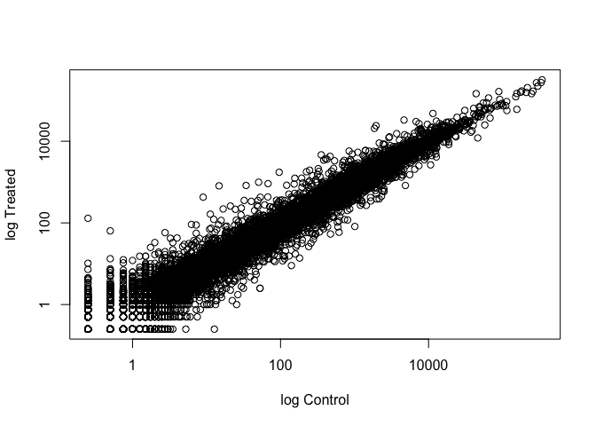
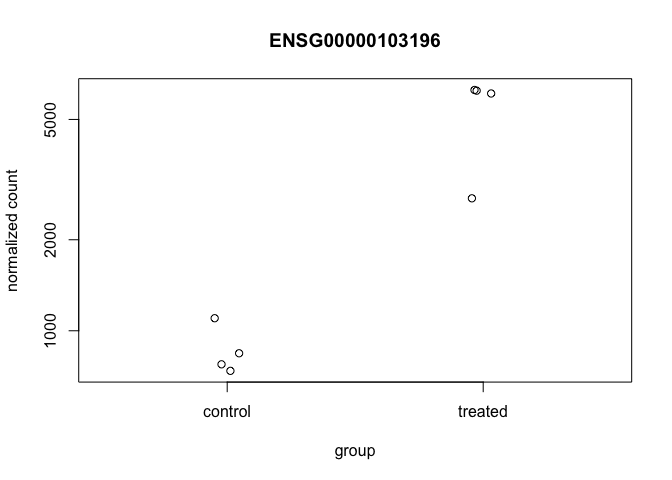
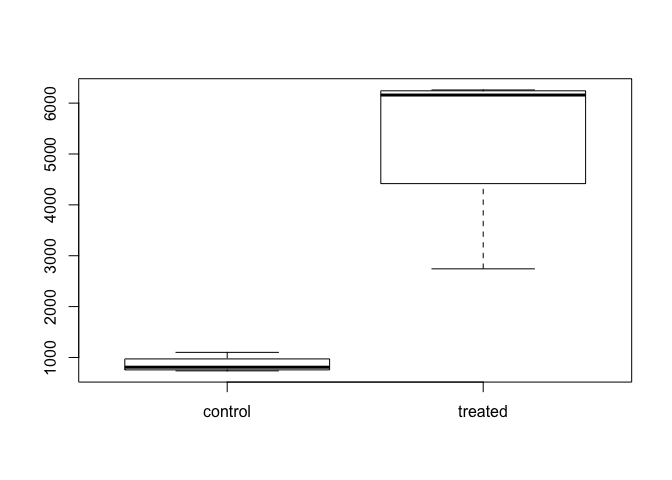
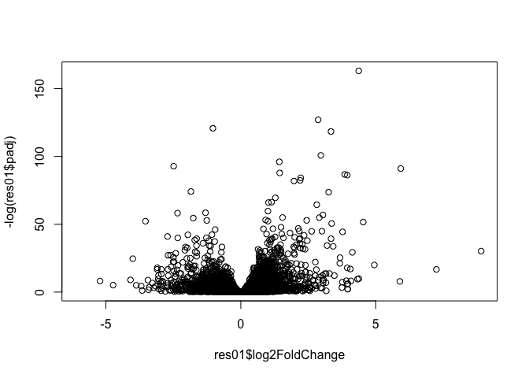
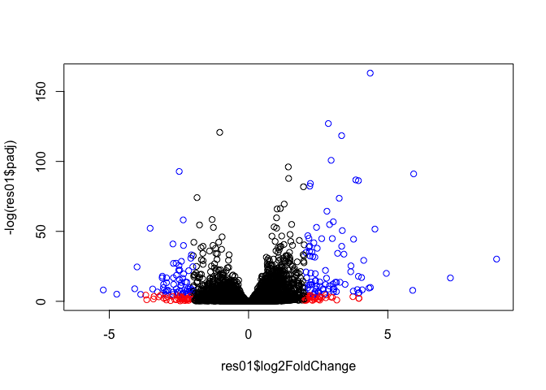

Class 15
================

RNA-Seq analysis
----------------

First step is to read our countData and colData (metadata) files that we will use with DESeq

``` r
counts <- read.csv("data/airway_scaledcounts.csv", stringsAsFactors = FALSE)
metadata <- read.csv("data/airway_metadata.csv", stringsAsFactors = FALSE)
```

stringsAsFactors: Should character vectors be converted to vectors?

``` r
head(counts)
```

    ##           ensgene SRR1039508 SRR1039509 SRR1039512 SRR1039513 SRR1039516
    ## 1 ENSG00000000003        723        486        904        445       1170
    ## 2 ENSG00000000005          0          0          0          0          0
    ## 3 ENSG00000000419        467        523        616        371        582
    ## 4 ENSG00000000457        347        258        364        237        318
    ## 5 ENSG00000000460         96         81         73         66        118
    ## 6 ENSG00000000938          0          0          1          0          2
    ##   SRR1039517 SRR1039520 SRR1039521
    ## 1       1097        806        604
    ## 2          0          0          0
    ## 3        781        417        509
    ## 4        447        330        324
    ## 5         94        102         74
    ## 6          0          0          0

``` r
head(metadata)
```

    ##           id     dex celltype     geo_id
    ## 1 SRR1039508 control   N61311 GSM1275862
    ## 2 SRR1039509 treated   N61311 GSM1275863
    ## 3 SRR1039512 control  N052611 GSM1275866
    ## 4 SRR1039513 treated  N052611 GSM1275867
    ## 5 SRR1039516 control  N080611 GSM1275870
    ## 6 SRR1039517 treated  N080611 GSM1275871

Looking at the counts data, there is quite a bit of variability between different gene expression.

Is there a significant change between the average control gene values and the average treatment gene values?

We are going to compare averages for each gene.

1.  Need to determine which counts are controls and which are treated. We need to use the metadata file to tdo this.

Lets examine the meadata file to find **control** and **treated** columns (cell-lines).

``` r
metadata$dex
```

    ## [1] "control" "treated" "control" "treated" "control" "treated" "control"
    ## [8] "treated"

``` r
metadata$dex == "control"
```

    ## [1]  TRUE FALSE  TRUE FALSE  TRUE FALSE  TRUE FALSE

``` r
control.inds <- metadata$dex == "control"
control <- metadata[control.inds,]
```

``` r
#control.mean <- rowSums( counts[ ,control$id])/4
# Having this hard coded "4" is not ideal coding. Instead you should use nrow.
control.mean <- rowSums( counts[ ,control$id])/nrow(control)
names(control.mean) <- counts$ensgene
head(control.mean)
```

    ## ENSG00000000003 ENSG00000000005 ENSG00000000419 ENSG00000000457 
    ##          900.75            0.00          520.50          339.75 
    ## ENSG00000000460 ENSG00000000938 
    ##           97.25            0.75

Now do the same for the treated data.

``` r
treated.inds <- metadata$dex == "treated"
treated <- metadata[treated.inds, ]
```

``` r
treated.mean <- rowSums( counts[ , treated$id])/nrow(treated)
names(treated.mean) <- counts$ensgene
head(treated.mean)
```

    ## ENSG00000000003 ENSG00000000005 ENSG00000000419 ENSG00000000457 
    ##          658.00            0.00          546.00          316.50 
    ## ENSG00000000460 ENSG00000000938 
    ##           78.75            0.00

We now have vectors for the mean value of control and treated samples. We now need to combine our meancount data for bookkeeping purposes

``` r
meancounts <- data.frame(control.mean, treated.mean)
colSums(meancounts)
```

    ## control.mean treated.mean 
    ##     23005324     22196524

``` r
plot(meancounts, xlab = "log Control", ylab = "log Treated", log = "xy")
```

    ## Warning in xy.coords(x, y, xlabel, ylabel, log): 15032 x values <= 0
    ## omitted from logarithmic plot

    ## Warning in xy.coords(x, y, xlabel, ylabel, log): 15281 y values <= 0
    ## omitted from logarithmic plot



``` r
# Plotting on a log scale allows us to see the low count data that is all clustered on top of eachother. 
```

We can find candidate differentially expressed genes by looking for genes with a large change between control and dex-treated samples. We usually look at the log2 of the fold change, because this has better mathematical properties.

Here we calculate the log2foldchange, add it to our meancounts data.dframe and inspect the results with the **head()** function

``` r
meancounts$log2fc <- log2(meancounts[, "treated.mean"]/meancounts[ , "control.mean"])
head(meancounts)
```

    ##                 control.mean treated.mean      log2fc
    ## ENSG00000000003       900.75       658.00 -0.45303916
    ## ENSG00000000005         0.00         0.00         NaN
    ## ENSG00000000419       520.50       546.00  0.06900279
    ## ENSG00000000457       339.75       316.50 -0.10226805
    ## ENSG00000000460        97.25        78.75 -0.30441833
    ## ENSG00000000938         0.75         0.00        -Inf

### Filter genes with zero expression

The NaN is returned when you divide by zero and try to take the log. The -Inf is returned when you try to take the log of zero. It turns out that there are a lot of genes with zero expression. Let’s filter our data to remove these genes.

``` r
zero.vals <- which(meancounts[,1:2] == 0, arr.ind = TRUE)
to.rm <- unique(zero.vals[,1])
# Define the rows we want to remove
mycounts <- meancounts[-to.rm,]
# Remove the rows with 0 expression from mycounts data.frame
head(mycounts)
```

    ##                 control.mean treated.mean      log2fc
    ## ENSG00000000003       900.75       658.00 -0.45303916
    ## ENSG00000000419       520.50       546.00  0.06900279
    ## ENSG00000000457       339.75       316.50 -0.10226805
    ## ENSG00000000460        97.25        78.75 -0.30441833
    ## ENSG00000000971      5219.00      6687.50  0.35769358
    ## ENSG00000001036      2327.00      1785.75 -0.38194109

A common threshold used for calling something differentially expressed is a log2(FoldChange) of greater than 2 or less than -2. Let’s filter the dataset both ways to see how many genes are up or down-regulated

``` r
up.ind <- mycounts$log2fc > 2
down.ind <- mycounts$log2fc < (-2)
```

Number of genes 'up' and 'down' Logical vectors are treated as 0 and 1. So summing the vector should give you the number of upregulate or downregulated

``` r
tot.up <- sum(up.ind)
tot.down <- sum(down.ind)
```

There are `tot.up` genes upregulated and `tot.down` genes downregulated. In total there are `tot.up + tot.down` genes differentially expressed in either direction

Adding annotation data
----------------------

Our mycounts result table so far only contains the Ensembl gene IDs. However, alternative gene names and extra annotation are usually required for informative for interpretation.

We can add annotation from a supplied CSV file, such as those available from ENSEMBLE or UCSC

``` r
anno <- read.csv("data/annotables_grch38.csv")
head(anno)
```

    ##           ensgene entrez   symbol chr     start       end strand
    ## 1 ENSG00000000003   7105   TSPAN6   X 100627109 100639991     -1
    ## 2 ENSG00000000005  64102     TNMD   X 100584802 100599885      1
    ## 3 ENSG00000000419   8813     DPM1  20  50934867  50958555     -1
    ## 4 ENSG00000000457  57147    SCYL3   1 169849631 169894267     -1
    ## 5 ENSG00000000460  55732 C1orf112   1 169662007 169854080      1
    ## 6 ENSG00000000938   2268      FGR   1  27612064  27635277     -1
    ##          biotype
    ## 1 protein_coding
    ## 2 protein_coding
    ## 3 protein_coding
    ## 4 protein_coding
    ## 5 protein_coding
    ## 6 protein_coding
    ##                                                                                                  description
    ## 1                                                          tetraspanin 6 [Source:HGNC Symbol;Acc:HGNC:11858]
    ## 2                                                            tenomodulin [Source:HGNC Symbol;Acc:HGNC:17757]
    ## 3 dolichyl-phosphate mannosyltransferase polypeptide 1, catalytic subunit [Source:HGNC Symbol;Acc:HGNC:3005]
    ## 4                                               SCY1-like, kinase-like 3 [Source:HGNC Symbol;Acc:HGNC:19285]
    ## 5                                    chromosome 1 open reading frame 112 [Source:HGNC Symbol;Acc:HGNC:25565]
    ## 6                          FGR proto-oncogene, Src family tyrosine kinase [Source:HGNC Symbol;Acc:HGNC:3697]

Ideally we want this annotation data mapped (or merged) with our mycounts data. In a previous class on writing R functions we introduced the merge() function, which is one common way to do this.

``` r
mycounts.anno <- merge(mycounts, anno, by.x = 0, by.y = "ensgene")
# We can use 0 or row.names to specify the rownmanes of meancounts to merge with "ensgene" column of anno
```

Another approach is to annotate with bioconductor annotation packages.

``` r
columns(org.Hs.eg.db)
```

    ##  [1] "ACCNUM"       "ALIAS"        "ENSEMBL"      "ENSEMBLPROT" 
    ##  [5] "ENSEMBLTRANS" "ENTREZID"     "ENZYME"       "EVIDENCE"    
    ##  [9] "EVIDENCEALL"  "GENENAME"     "GO"           "GOALL"       
    ## [13] "IPI"          "MAP"          "OMIM"         "ONTOLOGY"    
    ## [17] "ONTOLOGYALL"  "PATH"         "PFAM"         "PMID"        
    ## [21] "PROSITE"      "REFSEQ"       "SYMBOL"       "UCSCKG"      
    ## [25] "UNIGENE"      "UNIPROT"

``` r
mycounts$symbol <- mapIds(org.Hs.eg.db,
                     keys=row.names(mycounts),
                     column="SYMBOL",
                     keytype="ENSEMBL",
                     multiVals="first")
```

    ## 'select()' returned 1:many mapping between keys and columns

``` r
mycounts$entrezid <- mapIds(org.Hs.eg.db,
                     keys=row.names(mycounts),
                     column="ENTREZID",
                     keytype="ENSEMBL",
                     multiVals="first")
```

    ## 'select()' returned 1:many mapping between keys and columns

``` r
mycounts$uniprot <- mapIds(org.Hs.eg.db,
                     keys=row.names(mycounts),
                     column="UNIPROT",
                     keytype="ENSEMBL",
                     multiVals="first")
```

    ## 'select()' returned 1:many mapping between keys and columns

``` r
head(mycounts)
```

    ##                 control.mean treated.mean      log2fc   symbol entrezid
    ## ENSG00000000003       900.75       658.00 -0.45303916   TSPAN6     7105
    ## ENSG00000000419       520.50       546.00  0.06900279     DPM1     8813
    ## ENSG00000000457       339.75       316.50 -0.10226805    SCYL3    57147
    ## ENSG00000000460        97.25        78.75 -0.30441833 C1orf112    55732
    ## ENSG00000000971      5219.00      6687.50  0.35769358      CFH     3075
    ## ENSG00000001036      2327.00      1785.75 -0.38194109    FUCA2     2519
    ##                    uniprot
    ## ENSG00000000003 A0A024RCI0
    ## ENSG00000000419     O60762
    ## ENSG00000000457     Q8IZE3
    ## ENSG00000000460 A0A024R922
    ## ENSG00000000971 A0A024R962
    ## ENSG00000001036     Q9BTY2

Analyze the up and downregulated genes and annotations

``` r
head(mycounts[up.ind,])
```

    ##                 control.mean treated.mean   log2fc  symbol entrezid
    ## ENSG00000004799       270.50      1429.25 2.401558    PDK4     5166
    ## ENSG00000006788         2.75        19.75 2.844349   MYH13     8735
    ## ENSG00000008438         0.50         2.75 2.459432 PGLYRP1     8993
    ## ENSG00000011677         0.50         2.25 2.169925  GABRA3     2556
    ## ENSG00000015413         0.50         3.00 2.584963   DPEP1     1800
    ## ENSG00000015592         0.50         2.25 2.169925   STMN4    81551
    ##                    uniprot
    ## ENSG00000004799     A4D1H4
    ## ENSG00000006788     Q9UKX3
    ## ENSG00000008438     O75594
    ## ENSG00000011677     P34903
    ## ENSG00000015413 A0A140VJI3
    ## ENSG00000015592     Q9H169

``` r
head(mycounts[down.ind,])
```

    ##                 control.mean treated.mean    log2fc  symbol entrezid
    ## ENSG00000015520        32.00         6.00 -2.415037  NPC1L1    29881
    ## ENSG00000019186        26.50         1.75 -3.920566 CYP24A1     1591
    ## ENSG00000025423       295.00        54.25 -2.443020 HSD17B6     8630
    ## ENSG00000028277        88.25        22.00 -2.004093  POU2F2     5452
    ## ENSG00000029559         1.25         0.25 -2.321928    IBSP     3381
    ## ENSG00000049246       405.00        93.00 -2.122619    PER3     8863
    ##                    uniprot
    ## ENSG00000015520 A0A0C4DFX6
    ## ENSG00000019186     Q07973
    ## ENSG00000025423 A0A024RB43
    ## ENSG00000028277     P09086
    ## ENSG00000029559     P21815
    ## ENSG00000049246 A0A087WV69

DESeq2 analysis
---------------

``` r
library(DESeq2)
```

    ## Loading required package: GenomicRanges

    ## Loading required package: GenomeInfoDb

    ## Loading required package: SummarizedExperiment

    ## Loading required package: DelayedArray

    ## Loading required package: matrixStats

    ## 
    ## Attaching package: 'matrixStats'

    ## The following objects are masked from 'package:Biobase':
    ## 
    ##     anyMissing, rowMedians

    ## Loading required package: BiocParallel

    ## 
    ## Attaching package: 'DelayedArray'

    ## The following objects are masked from 'package:matrixStats':
    ## 
    ##     colMaxs, colMins, colRanges, rowMaxs, rowMins, rowRanges

    ## The following objects are masked from 'package:base':
    ## 
    ##     aperm, apply

``` r
citation("DESeq2")
```

    ## 
    ##   Love, M.I., Huber, W., Anders, S. Moderated estimation of fold
    ##   change and dispersion for RNA-seq data with DESeq2 Genome
    ##   Biology 15(12):550 (2014)
    ## 
    ## A BibTeX entry for LaTeX users is
    ## 
    ##   @Article{,
    ##     title = {Moderated estimation of fold change and dispersion for RNA-seq data with DESeq2},
    ##     author = {Michael I. Love and Wolfgang Huber and Simon Anders},
    ##     year = {2014},
    ##     journal = {Genome Biology},
    ##     doi = {10.1186/s13059-014-0550-8},
    ##     volume = {15},
    ##     issue = {12},
    ##     pages = {550},
    ##   }

``` r
dds <- DESeqDataSetFromMatrix(countData=counts, 
                              colData=metadata, 
                              design=~dex, 
                              tidy=TRUE)
```

    ## converting counts to integer mode

    ## Warning in DESeqDataSet(se, design = design, ignoreRank): some variables in
    ## design formula are characters, converting to factors

``` r
dds
```

    ## class: DESeqDataSet 
    ## dim: 38694 8 
    ## metadata(1): version
    ## assays(1): counts
    ## rownames(38694): ENSG00000000003 ENSG00000000005 ...
    ##   ENSG00000283120 ENSG00000283123
    ## rowData names(0):
    ## colnames(8): SRR1039508 SRR1039509 ... SRR1039520 SRR1039521
    ## colData names(4): id dex celltype geo_id

``` r
dds <- DESeq(dds)
```

    ## estimating size factors

    ## estimating dispersions

    ## gene-wise dispersion estimates

    ## mean-dispersion relationship

    ## final dispersion estimates

    ## fitting model and testing

``` r
res <-results(dds)
res
```

    ## log2 fold change (MLE): dex treated vs control 
    ## Wald test p-value: dex treated vs control 
    ## DataFrame with 38694 rows and 6 columns
    ##                          baseMean     log2FoldChange             lfcSE
    ##                         <numeric>          <numeric>         <numeric>
    ## ENSG00000000003  747.194195359907   -0.3507029622814 0.168242083226488
    ## ENSG00000000005                 0                 NA                NA
    ## ENSG00000000419  520.134160051965  0.206107283859631 0.101041504450297
    ## ENSG00000000457  322.664843927049 0.0245270113332259 0.145133863747848
    ## ENSG00000000460   87.682625164828 -0.147142630021601 0.256995442048617
    ## ...                           ...                ...               ...
    ## ENSG00000283115                 0                 NA                NA
    ## ENSG00000283116                 0                 NA                NA
    ## ENSG00000283119                 0                 NA                NA
    ## ENSG00000283120 0.974916032393564 -0.668250141507888  1.69441251902541
    ## ENSG00000283123                 0                 NA                NA
    ##                               stat             pvalue              padj
    ##                          <numeric>          <numeric>         <numeric>
    ## ENSG00000000003  -2.08451390731582 0.0371134465286876 0.163017154198658
    ## ENSG00000000005                 NA                 NA                NA
    ## ENSG00000000419   2.03982793982463 0.0413674659636722 0.175936611069872
    ## ENSG00000000457  0.168995785682647  0.865799956261551 0.961682459668587
    ## ENSG00000000460 -0.572549570718713  0.566949713033353 0.815805192485639
    ## ...                            ...                ...               ...
    ## ENSG00000283115                 NA                 NA                NA
    ## ENSG00000283116                 NA                 NA                NA
    ## ENSG00000283119                 NA                 NA                NA
    ## ENSG00000283120 -0.394384563383805  0.693297138830703                NA
    ## ENSG00000283123                 NA                 NA                NA

``` r
summary(res)
```

    ## 
    ## out of 25258 with nonzero total read count
    ## adjusted p-value < 0.1
    ## LFC > 0 (up)       : 1564, 6.2%
    ## LFC < 0 (down)     : 1188, 4.7%
    ## outliers [1]       : 142, 0.56%
    ## low counts [2]     : 9971, 39%
    ## (mean count < 10)
    ## [1] see 'cooksCutoff' argument of ?results
    ## [2] see 'independentFiltering' argument of ?results

Use a p-value of 0.05 rather than the default of 0.1

``` r
res05 <- results(dds, alpha = 0.05)
summary(res05)
```

    ## 
    ## out of 25258 with nonzero total read count
    ## adjusted p-value < 0.05
    ## LFC > 0 (up)       : 1237, 4.9%
    ## LFC < 0 (down)     : 933, 3.7%
    ## outliers [1]       : 142, 0.56%
    ## low counts [2]     : 9033, 36%
    ## (mean count < 6)
    ## [1] see 'cooksCutoff' argument of ?results
    ## [2] see 'independentFiltering' argument of ?results

``` r
res01 <- results(dds, alpha=0.01)
summary(res01)
```

    ## 
    ## out of 25258 with nonzero total read count
    ## adjusted p-value < 0.01
    ## LFC > 0 (up)       : 850, 3.4%
    ## LFC < 0 (down)     : 581, 2.3%
    ## outliers [1]       : 142, 0.56%
    ## low counts [2]     : 9033, 36%
    ## (mean count < 6)
    ## [1] see 'cooksCutoff' argument of ?results
    ## [2] see 'independentFiltering' argument of ?results

Add annotation to our results object `res01`

``` r
head(res01)
```

    ## log2 fold change (MLE): dex treated vs control 
    ## Wald test p-value: dex treated vs control 
    ## DataFrame with 6 rows and 6 columns
    ##                          baseMean     log2FoldChange             lfcSE
    ##                         <numeric>          <numeric>         <numeric>
    ## ENSG00000000003  747.194195359907   -0.3507029622814 0.168242083226488
    ## ENSG00000000005                 0                 NA                NA
    ## ENSG00000000419  520.134160051965  0.206107283859631 0.101041504450297
    ## ENSG00000000457  322.664843927049 0.0245270113332259 0.145133863747848
    ## ENSG00000000460   87.682625164828 -0.147142630021601 0.256995442048617
    ## ENSG00000000938 0.319166568913118  -1.73228897394308  3.49360097648095
    ##                               stat             pvalue              padj
    ##                          <numeric>          <numeric>         <numeric>
    ## ENSG00000000003  -2.08451390731582 0.0371134465286876 0.171521712793357
    ## ENSG00000000005                 NA                 NA                NA
    ## ENSG00000000419   2.03982793982463 0.0413674659636722 0.185117683665481
    ## ENSG00000000457  0.168995785682647  0.865799956261551 0.965984092719703
    ## ENSG00000000460 -0.572549570718713  0.566949713033353 0.829990016293868
    ## ENSG00000000938 -0.495846258804286  0.620002884826012                NA

``` r
res01$symbol <- mapIds(org.Hs.eg.db,
                     keys=row.names(res01),
                     column="SYMBOL",
                     keytype="ENSEMBL",
                     multiVals="first")
```

    ## 'select()' returned 1:many mapping between keys and columns

``` r
head(res01)
```

    ## log2 fold change (MLE): dex treated vs control 
    ## Wald test p-value: dex treated vs control 
    ## DataFrame with 6 rows and 7 columns
    ##                          baseMean     log2FoldChange             lfcSE
    ##                         <numeric>          <numeric>         <numeric>
    ## ENSG00000000003  747.194195359907   -0.3507029622814 0.168242083226488
    ## ENSG00000000005                 0                 NA                NA
    ## ENSG00000000419  520.134160051965  0.206107283859631 0.101041504450297
    ## ENSG00000000457  322.664843927049 0.0245270113332259 0.145133863747848
    ## ENSG00000000460   87.682625164828 -0.147142630021601 0.256995442048617
    ## ENSG00000000938 0.319166568913118  -1.73228897394308  3.49360097648095
    ##                               stat             pvalue              padj
    ##                          <numeric>          <numeric>         <numeric>
    ## ENSG00000000003  -2.08451390731582 0.0371134465286876 0.171521712793357
    ## ENSG00000000005                 NA                 NA                NA
    ## ENSG00000000419   2.03982793982463 0.0413674659636722 0.185117683665481
    ## ENSG00000000457  0.168995785682647  0.865799956261551 0.965984092719703
    ## ENSG00000000460 -0.572549570718713  0.566949713033353 0.829990016293868
    ## ENSG00000000938 -0.495846258804286  0.620002884826012                NA
    ##                      symbol
    ##                 <character>
    ## ENSG00000000003      TSPAN6
    ## ENSG00000000005        TNMD
    ## ENSG00000000419        DPM1
    ## ENSG00000000457       SCYL3
    ## ENSG00000000460    C1orf112
    ## ENSG00000000938         FGR

Save results to a CSv file

``` r
write.csv(res01, "signif01_results.csv")
```

Focus in on the gene CRISPLD2
-----------------------------

``` r
i <- grep("CRISPLD2", res01$symbol)
res01[i,]
```

    ## log2 fold change (MLE): dex treated vs control 
    ## Wald test p-value: dex treated vs control 
    ## DataFrame with 1 row and 7 columns
    ##                         baseMean   log2FoldChange             lfcSE
    ##                        <numeric>        <numeric>         <numeric>
    ## ENSG00000103196 3096.15933899728 2.62603415816357 0.267453556246064
    ##                            stat               pvalue                 padj
    ##                       <numeric>            <numeric>            <numeric>
    ## ENSG00000103196 9.8186548536582 9.35839163749093e-23 3.58359554061349e-20
    ##                      symbol
    ##                 <character>
    ## ENSG00000103196    CRISPLD2

``` r
d <- plotCounts(dds, gene="ENSG00000103196", intgroup="dex")
```



``` r
d <- plotCounts(dds, gene="ENSG00000103196", intgroup="dex", returnData = TRUE)
d
```

    ##                count     dex
    ## SRR1039508  774.5002 control
    ## SRR1039509 6258.7915 treated
    ## SRR1039512 1100.2741 control
    ## SRR1039513 6093.0324 treated
    ## SRR1039516  736.9483 control
    ## SRR1039517 2742.1908 treated
    ## SRR1039520  842.5452 control
    ## SRR1039521 6224.9923 treated

``` r
boxplot(count ~ dex , data=d)
```



``` r
library(ggplot2)
```

``` r
ggplot(d, aes(dex, count)) + geom_boxplot(aes(fill=dex)) + scale_y_log10() + ggtitle("CRISPLD2")
```


Volcano Plots
-------------

``` r
plot( res01$log2FoldChange, -log(res01$padj))
```



Make a colored version of this plot highlighting genes with high fold change and small p-values

``` r
mycols <- rep("black", nrow(res01))
mycols[abs(res01$log2FoldChange) > 2] <- "red"

inds <- (res01$padj < 0.01) & (abs(res01$log2FoldChange) > 2) 

mycols[inds] <- "blue"


plot( res01$log2FoldChange, -log(res01$padj), col = mycols)
```



``` r
# Red has large fold change but no significance. Blue has large fold change and significance 
```
