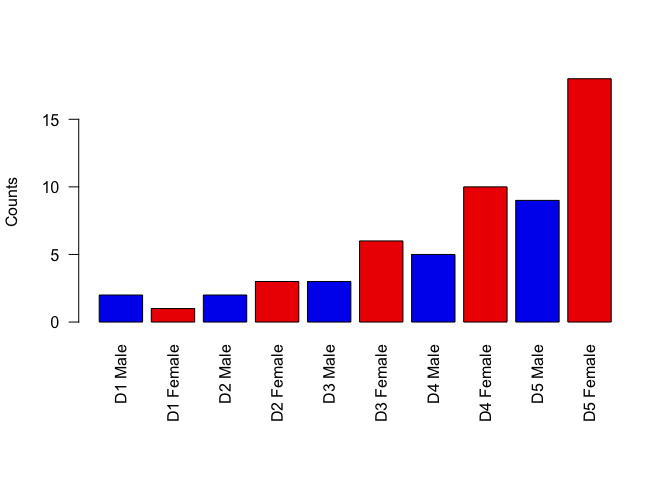

Class 05
================
HMorrisLittle
Thu Nov 1 11:47:41 2018

``` r
#2A - A line plot
#Baby weight data input - make sure run as header = T
weight <- read.table("bimm143_05_rstats/weight_chart.txt", header = TRUE)

#Make a custom point and line plot
plot(weight, type="b", cex=1.5, lwd=2, ylim=c(2,10), xlab="Age (months)", ylab="Weight (kg)", main="Baby weight over time")
```


``` r
#2B - A bar plot
#Feature counts data input - Data cannot be separated by spaces - its by tabs
counts <- read.table("bimm143_05_rstats/feature_counts.txt", header=TRUE, sep="\t")

#Create a bar plot ($ grabs something from data.frame)
#HAVE TO SET THE PARAMETERS FIRST THEN PLOT THE GRAPH
par(mar=c(3.1,11.1,4.1,2))
#Create custom bar plot 
barplot(counts$Count, horiz=TRUE, names.arg = counts$Feature, main = "Number of features in mouse GRCm38 genome", las=1, xlim = c(0,80000), col="blue")
```


``` r
#2C - Histograms
hist(c(rnorm(10000), rnorm(10000)+4), breaks=20)
```


``` r
#Plot characters
plot(1:10, pch=1:5, cex=1:5)
```


``` r
#With color
plot(1:10, pch=1:5, cex=1:5, col=c("red", "blue"))
```


``` r
## Boxplot
boxplot(cbind(rnorm(1000,0), rnorm(1000,4)))
```


``` r
#3A Providing color vectors
#Set input
gender <- read.table("bimm143_05_rstats/male_female_counts.txt", header=TRUE, sep="\t")

#Set PAR
par(mar=c(8.1,4.1,4.1,2.1))

#Rainbow plot using nrow to define number of colors
barplot(gender$Count, ylab="Counts", names.arg = gender$Sample, las=2, col=rainbow(nrow(gender)))
```


``` r
#Alternating colors
barplot(gender$Count, ylab="Counts", names.arg = gender$Sample, las=2, col=c("blue2", "red2"))
```



``` r
#3B Coloring by value
genes <- read.table("bimm143_05_rstats/up_down_expression.txt", header = TRUE, sep = "\t")

#How many genes are up, down, or unchangin?
table(genes$State) #gives a table of the count of each variable
```

    ## 
    ##       down unchanging         up 
    ##         72       4997        127

``` r
#Point graph of Condition 1(x) vs Condition 2(y), color specifications before
palette(c("yellow", "gray", "cyan"))
plot(genes$Condition1, genes$Condition2, type = "p", xlab="Expression condition 1", ylab="Expression condition 2", col=genes$State)
```


``` r
#3C Coloring by point density - the densCols function comes before the plot like the Par function
#Get input (has headers so header=T, table separated by tabs sep="\t")
meth <- read.table("bimm143_05_rstats/expression_methylation.txt", header=TRUE, sep="\t")

#Scatter plot
plot(meth$gene.meth, meth$expression, typ="p", cex=0.5)
```


``` r
#Color Density
#Limits the indices to only values with meth expression above 0
inds <- meth$expression>0

#Color Density - densCols(x,y, colramp = colorRampPalette(c("colors))) first color being least dense
##REMEMBER to change the x and y to reflect the inds we created above (x$inds and y$inds)
dcols <- densCols(meth$gene.meth[inds], meth$expression[inds], colramp = colorRampPalette(c("blue", "green", "red", "yellow")))

#Plot with only the indisces we want (use brackets), cex=point size, pch 20 = solid circle, 
#How to get the coloring by density? col=dcol (which was defined by the densCol function above)
plot(meth$gene.meth[inds], meth$expression[inds], typ="p", cex=0.5, pch=20, col=dcols)
```


