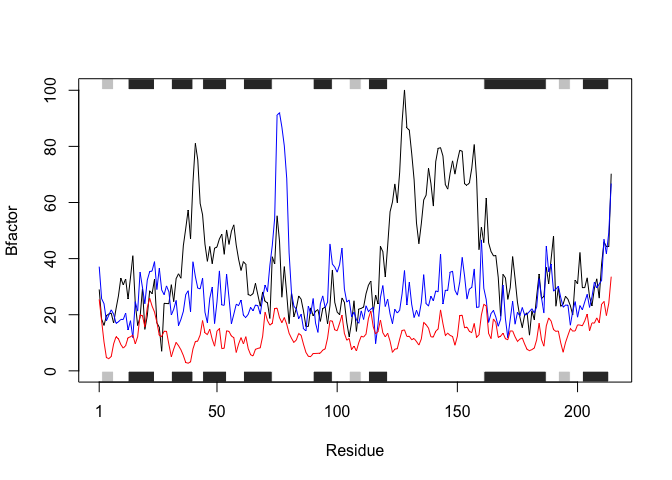

Class06
================
HMorrisLittle
Thu Nov 1 11:52:10 2018

``` r
library(bio3d)
#Function Input - "4AKE" or x
#s <- read.pdb x
#chainA <- trim.pdb(s, chain="A", elety = "CA")
#s.b <- chainA$atom$b
#plotb3

x <- "4AKE"
sx <- read.pdb(x)
```

    ##   Note: Accessing on-line PDB file

``` r
chainA.x <- trim.pdb(sx, chain="A", elety="CA")
sx.b <- chainA.x$atom$b

y <- "1AKE"
sy <- read.pdb(y)
```

    ##   Note: Accessing on-line PDB file
    ##    PDB has ALT records, taking A only, rm.alt=TRUE

``` r
chainA.y <- trim.pdb(sy, chain = "A", elety = "CA")
sy.b <- chainA.y$atom$b

z <- "1E4Y"
sz <- read.pdb(z)
```

    ##   Note: Accessing on-line PDB file

``` r
chainA.z <- trim.pdb(sz, chain = "A", elety = "CA")
sz.b <- chainA.z$atom$b

plotb3(sx.b, sse = chainA.x, typ="l", ylab = "Bfactor")
points(sy.b, typ="l", col="blue")
points(sz.b, typ="l", col="red")
```



``` r
#Q1 read.pdb - reads pdb files
#Q2 trim.pdb - shortens pdb file
#Q3 sse parameter plots helix or sheet residues in grey or black. Set sse to NULL to get rid of bars
#Q4 The original code given gives 3 individual plots. What would be a better result? An overlay using points()
###plotb3 (s1.b.....)
###points(s2.b, typ="l", col = "blue" ) ## points adds points to a plot (like an overlay)
###this will overlay s2.b over plotb3
```
