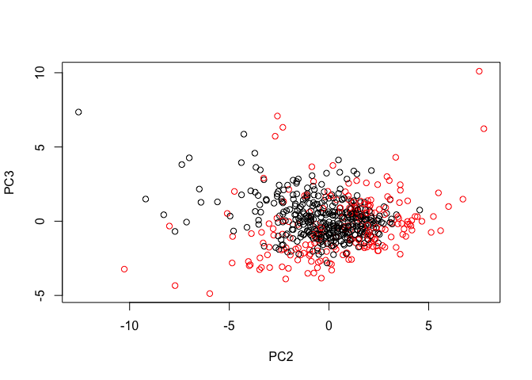
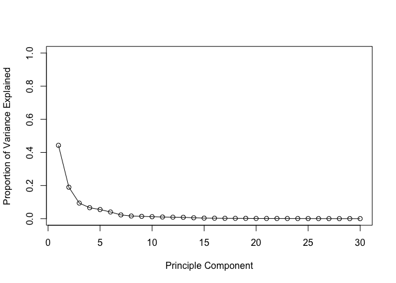
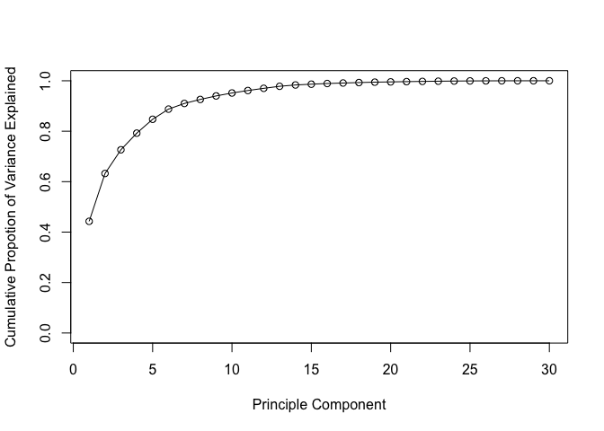
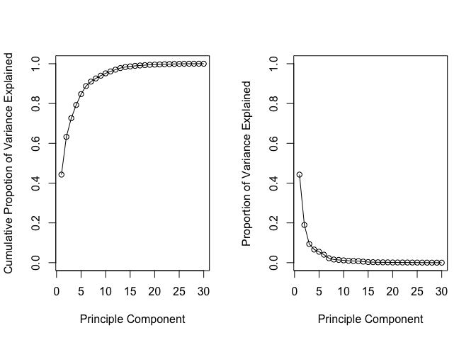
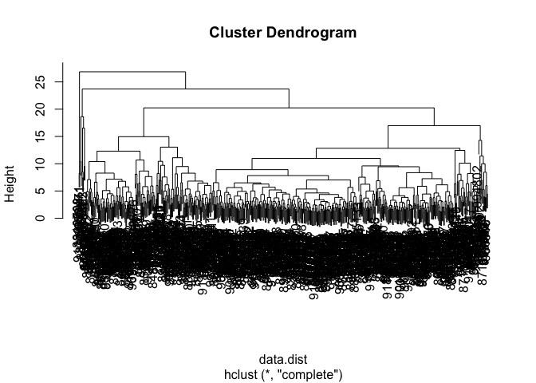
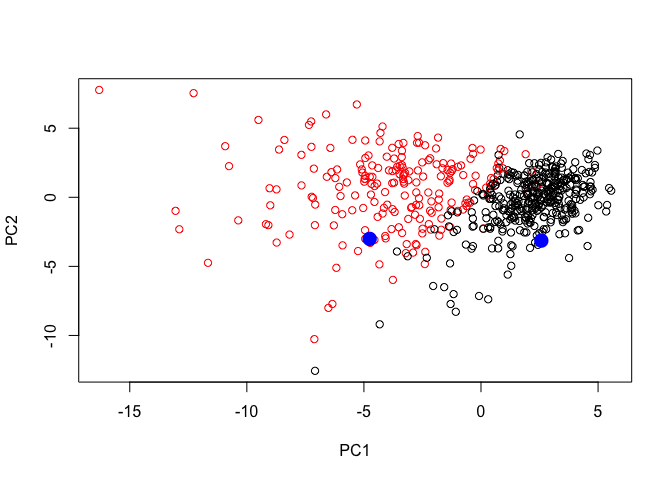

class09
================
Hannah Morris Little
10/30/2018

Background The goal of this hands-on session is for you to explore a complete analysis using the unsupervised learning techniques covered in the last class. You’ll extend what you’ve learned by combining PCA as a preprocessing step to clustering using data that consist of measurements of cell nuclei of human breast masses. This expands on our RNA-Seq analysis from last day.

The data itself comes from the Wisconsin Breast Cancer Diagnostic Data Set first reported by K. P. Benne and O. L. Mangasarian: “Robust Linear Programming Discrimination of Two Linearly Inseparable Sets”.

Values in this data set describe characteristics of the cell nuclei present in digitized images of a fine needle aspiration (FNA) of a breast mass. For example radius (i.e. mean of distances from center to points on the perimeter), texture (i.e. standard deviation of gray-scale values), and smoothness (local variation in radius lengths). Summary information is also provided for each group of cells including diagnosis (i.e. benign (not cancerous) and and malignant (cancerous)).

Section 1. Preparing the data

``` r
url <- "https://bioboot.github.io/bimm143_W18/class-material/WisconsinCancer.csv"
wisc.df <- read.csv(url)
```

``` r
head(wisc.df)
```

    ##         id diagnosis radius_mean texture_mean perimeter_mean area_mean
    ## 1   842302         M       17.99        10.38         122.80    1001.0
    ## 2   842517         M       20.57        17.77         132.90    1326.0
    ## 3 84300903         M       19.69        21.25         130.00    1203.0
    ## 4 84348301         M       11.42        20.38          77.58     386.1
    ## 5 84358402         M       20.29        14.34         135.10    1297.0
    ## 6   843786         M       12.45        15.70          82.57     477.1
    ##   smoothness_mean compactness_mean concavity_mean concave.points_mean
    ## 1         0.11840          0.27760         0.3001             0.14710
    ## 2         0.08474          0.07864         0.0869             0.07017
    ## 3         0.10960          0.15990         0.1974             0.12790
    ## 4         0.14250          0.28390         0.2414             0.10520
    ## 5         0.10030          0.13280         0.1980             0.10430
    ## 6         0.12780          0.17000         0.1578             0.08089
    ##   symmetry_mean fractal_dimension_mean radius_se texture_se perimeter_se
    ## 1        0.2419                0.07871    1.0950     0.9053        8.589
    ## 2        0.1812                0.05667    0.5435     0.7339        3.398
    ## 3        0.2069                0.05999    0.7456     0.7869        4.585
    ## 4        0.2597                0.09744    0.4956     1.1560        3.445
    ## 5        0.1809                0.05883    0.7572     0.7813        5.438
    ## 6        0.2087                0.07613    0.3345     0.8902        2.217
    ##   area_se smoothness_se compactness_se concavity_se concave.points_se
    ## 1  153.40      0.006399        0.04904      0.05373           0.01587
    ## 2   74.08      0.005225        0.01308      0.01860           0.01340
    ## 3   94.03      0.006150        0.04006      0.03832           0.02058
    ## 4   27.23      0.009110        0.07458      0.05661           0.01867
    ## 5   94.44      0.011490        0.02461      0.05688           0.01885
    ## 6   27.19      0.007510        0.03345      0.03672           0.01137
    ##   symmetry_se fractal_dimension_se radius_worst texture_worst
    ## 1     0.03003             0.006193        25.38         17.33
    ## 2     0.01389             0.003532        24.99         23.41
    ## 3     0.02250             0.004571        23.57         25.53
    ## 4     0.05963             0.009208        14.91         26.50
    ## 5     0.01756             0.005115        22.54         16.67
    ## 6     0.02165             0.005082        15.47         23.75
    ##   perimeter_worst area_worst smoothness_worst compactness_worst
    ## 1          184.60     2019.0           0.1622            0.6656
    ## 2          158.80     1956.0           0.1238            0.1866
    ## 3          152.50     1709.0           0.1444            0.4245
    ## 4           98.87      567.7           0.2098            0.8663
    ## 5          152.20     1575.0           0.1374            0.2050
    ## 6          103.40      741.6           0.1791            0.5249
    ##   concavity_worst concave.points_worst symmetry_worst
    ## 1          0.7119               0.2654         0.4601
    ## 2          0.2416               0.1860         0.2750
    ## 3          0.4504               0.2430         0.3613
    ## 4          0.6869               0.2575         0.6638
    ## 5          0.4000               0.1625         0.2364
    ## 6          0.5355               0.1741         0.3985
    ##   fractal_dimension_worst  X
    ## 1                 0.11890 NA
    ## 2                 0.08902 NA
    ## 3                 0.08758 NA
    ## 4                 0.17300 NA
    ## 5                 0.07678 NA
    ## 6                 0.12440 NA

Examine your input data to ensure column names are set correctly. The id and diagnosis columns will not be used for most of the following steps. Use as.matrix() to convert the other features (i.e. columns) of the data (in columns 3 through 32) to a matrix. Store this in a variable called wisc.data.

Assign the row names of wisc.data the values currently contained in the id column of wisc.df. While not strictly required, this will help you keep track of the different observations throughout the modeling process.

``` r
wisc.data <- as.matrix(wisc.df[,3:32])
row.names(wisc.data) <- wisc.df$id
#Take columns 3 - 32
head(wisc.data)
```

    ##          radius_mean texture_mean perimeter_mean area_mean smoothness_mean
    ## 842302         17.99        10.38         122.80    1001.0         0.11840
    ## 842517         20.57        17.77         132.90    1326.0         0.08474
    ## 84300903       19.69        21.25         130.00    1203.0         0.10960
    ## 84348301       11.42        20.38          77.58     386.1         0.14250
    ## 84358402       20.29        14.34         135.10    1297.0         0.10030
    ## 843786         12.45        15.70          82.57     477.1         0.12780
    ##          compactness_mean concavity_mean concave.points_mean symmetry_mean
    ## 842302            0.27760         0.3001             0.14710        0.2419
    ## 842517            0.07864         0.0869             0.07017        0.1812
    ## 84300903          0.15990         0.1974             0.12790        0.2069
    ## 84348301          0.28390         0.2414             0.10520        0.2597
    ## 84358402          0.13280         0.1980             0.10430        0.1809
    ## 843786            0.17000         0.1578             0.08089        0.2087
    ##          fractal_dimension_mean radius_se texture_se perimeter_se area_se
    ## 842302                  0.07871    1.0950     0.9053        8.589  153.40
    ## 842517                  0.05667    0.5435     0.7339        3.398   74.08
    ## 84300903                0.05999    0.7456     0.7869        4.585   94.03
    ## 84348301                0.09744    0.4956     1.1560        3.445   27.23
    ## 84358402                0.05883    0.7572     0.7813        5.438   94.44
    ## 843786                  0.07613    0.3345     0.8902        2.217   27.19
    ##          smoothness_se compactness_se concavity_se concave.points_se
    ## 842302        0.006399        0.04904      0.05373           0.01587
    ## 842517        0.005225        0.01308      0.01860           0.01340
    ## 84300903      0.006150        0.04006      0.03832           0.02058
    ## 84348301      0.009110        0.07458      0.05661           0.01867
    ## 84358402      0.011490        0.02461      0.05688           0.01885
    ## 843786        0.007510        0.03345      0.03672           0.01137
    ##          symmetry_se fractal_dimension_se radius_worst texture_worst
    ## 842302       0.03003             0.006193        25.38         17.33
    ## 842517       0.01389             0.003532        24.99         23.41
    ## 84300903     0.02250             0.004571        23.57         25.53
    ## 84348301     0.05963             0.009208        14.91         26.50
    ## 84358402     0.01756             0.005115        22.54         16.67
    ## 843786       0.02165             0.005082        15.47         23.75
    ##          perimeter_worst area_worst smoothness_worst compactness_worst
    ## 842302            184.60     2019.0           0.1622            0.6656
    ## 842517            158.80     1956.0           0.1238            0.1866
    ## 84300903          152.50     1709.0           0.1444            0.4245
    ## 84348301           98.87      567.7           0.2098            0.8663
    ## 84358402          152.20     1575.0           0.1374            0.2050
    ## 843786            103.40      741.6           0.1791            0.5249
    ##          concavity_worst concave.points_worst symmetry_worst
    ## 842302            0.7119               0.2654         0.4601
    ## 842517            0.2416               0.1860         0.2750
    ## 84300903          0.4504               0.2430         0.3613
    ## 84348301          0.6869               0.2575         0.6638
    ## 84358402          0.4000               0.1625         0.2364
    ## 843786            0.5355               0.1741         0.3985
    ##          fractal_dimension_worst
    ## 842302                   0.11890
    ## 842517                   0.08902
    ## 84300903                 0.08758
    ## 84348301                 0.17300
    ## 84358402                 0.07678
    ## 843786                   0.12440

``` r
#How would we make a vector of ones and zeroes where M = 1 and B = 0
diagnosis <- as.numeric(wisc.df$diagnosis == "M")
table(wisc.df$diagnosis)
```

    ## 
    ##   B   M 
    ## 357 212

``` r
#Check that diagnosis vector matches M count
sum(diagnosis)
```

    ## [1] 212

Exploratory Data Analysis

``` r
#Q1. How many observations are in the dataset
nrow(wisc.df)
```

    ## [1] 569

``` r
#Q2. How many variables are in the data set suffixed with _mean
x <- length(grep(pattern = "_mean", colnames(wisc.data)))
#Q3. How many observations are malignant. Table function will count the number of values. 
table(wisc.df$diagnosis)
```

    ## 
    ##   B   M 
    ## 357 212

There are 10 mean measurements in this dataset

Section 2. Performing PCA

It is important to check if the data need to be scaled before performing PCA. Recall two common reasons for scaling data include:

The input variables use different units of measurement. The input variables have significantly different variances. Check the mean and standard deviation of the features (i.e. columns) of the wisc.data to determine if the data should be scaled. Use the colMeans() and apply() functions like you’ve done before.

``` r
colMeans(wisc.data)
```

    ##             radius_mean            texture_mean          perimeter_mean 
    ##            1.412729e+01            1.928965e+01            9.196903e+01 
    ##               area_mean         smoothness_mean        compactness_mean 
    ##            6.548891e+02            9.636028e-02            1.043410e-01 
    ##          concavity_mean     concave.points_mean           symmetry_mean 
    ##            8.879932e-02            4.891915e-02            1.811619e-01 
    ##  fractal_dimension_mean               radius_se              texture_se 
    ##            6.279761e-02            4.051721e-01            1.216853e+00 
    ##            perimeter_se                 area_se           smoothness_se 
    ##            2.866059e+00            4.033708e+01            7.040979e-03 
    ##          compactness_se            concavity_se       concave.points_se 
    ##            2.547814e-02            3.189372e-02            1.179614e-02 
    ##             symmetry_se    fractal_dimension_se            radius_worst 
    ##            2.054230e-02            3.794904e-03            1.626919e+01 
    ##           texture_worst         perimeter_worst              area_worst 
    ##            2.567722e+01            1.072612e+02            8.805831e+02 
    ##        smoothness_worst       compactness_worst         concavity_worst 
    ##            1.323686e-01            2.542650e-01            2.721885e-01 
    ##    concave.points_worst          symmetry_worst fractal_dimension_worst 
    ##            1.146062e-01            2.900756e-01            8.394582e-02

``` r
apply(wisc.data, 2, sd)
```

    ##             radius_mean            texture_mean          perimeter_mean 
    ##            3.524049e+00            4.301036e+00            2.429898e+01 
    ##               area_mean         smoothness_mean        compactness_mean 
    ##            3.519141e+02            1.406413e-02            5.281276e-02 
    ##          concavity_mean     concave.points_mean           symmetry_mean 
    ##            7.971981e-02            3.880284e-02            2.741428e-02 
    ##  fractal_dimension_mean               radius_se              texture_se 
    ##            7.060363e-03            2.773127e-01            5.516484e-01 
    ##            perimeter_se                 area_se           smoothness_se 
    ##            2.021855e+00            4.549101e+01            3.002518e-03 
    ##          compactness_se            concavity_se       concave.points_se 
    ##            1.790818e-02            3.018606e-02            6.170285e-03 
    ##             symmetry_se    fractal_dimension_se            radius_worst 
    ##            8.266372e-03            2.646071e-03            4.833242e+00 
    ##           texture_worst         perimeter_worst              area_worst 
    ##            6.146258e+00            3.360254e+01            5.693570e+02 
    ##        smoothness_worst       compactness_worst         concavity_worst 
    ##            2.283243e-02            1.573365e-01            2.086243e-01 
    ##    concave.points_worst          symmetry_worst fractal_dimension_worst 
    ##            6.573234e-02            6.186747e-02            1.806127e-02

``` r
wisc.pr <- prcomp(wisc.data, scale = TRUE)
summary(wisc.pr)
```

    ## Importance of components:
    ##                           PC1    PC2     PC3     PC4     PC5     PC6
    ## Standard deviation     3.6444 2.3857 1.67867 1.40735 1.28403 1.09880
    ## Proportion of Variance 0.4427 0.1897 0.09393 0.06602 0.05496 0.04025
    ## Cumulative Proportion  0.4427 0.6324 0.72636 0.79239 0.84734 0.88759
    ##                            PC7     PC8    PC9    PC10   PC11    PC12
    ## Standard deviation     0.82172 0.69037 0.6457 0.59219 0.5421 0.51104
    ## Proportion of Variance 0.02251 0.01589 0.0139 0.01169 0.0098 0.00871
    ## Cumulative Proportion  0.91010 0.92598 0.9399 0.95157 0.9614 0.97007
    ##                           PC13    PC14    PC15    PC16    PC17    PC18
    ## Standard deviation     0.49128 0.39624 0.30681 0.28260 0.24372 0.22939
    ## Proportion of Variance 0.00805 0.00523 0.00314 0.00266 0.00198 0.00175
    ## Cumulative Proportion  0.97812 0.98335 0.98649 0.98915 0.99113 0.99288
    ##                           PC19    PC20   PC21    PC22    PC23   PC24
    ## Standard deviation     0.22244 0.17652 0.1731 0.16565 0.15602 0.1344
    ## Proportion of Variance 0.00165 0.00104 0.0010 0.00091 0.00081 0.0006
    ## Cumulative Proportion  0.99453 0.99557 0.9966 0.99749 0.99830 0.9989
    ##                           PC25    PC26    PC27    PC28    PC29    PC30
    ## Standard deviation     0.12442 0.09043 0.08307 0.03987 0.02736 0.01153
    ## Proportion of Variance 0.00052 0.00027 0.00023 0.00005 0.00002 0.00000
    ## Cumulative Proportion  0.99942 0.99969 0.99992 0.99997 1.00000 1.00000

``` r
#We see that PC1 accounts for 44% of variance and PC2 accounts for 19% of variance
wisc.prF <- prcomp(wisc.data, scale = FALSE)
summary(wisc.prF)
```

    ## Importance of components:
    ##                            PC1      PC2      PC3     PC4     PC5     PC6
    ## Standard deviation     666.170 85.49912 26.52987 7.39248 6.31585 1.73337
    ## Proportion of Variance   0.982  0.01618  0.00156 0.00012 0.00009 0.00001
    ## Cumulative Proportion    0.982  0.99822  0.99978 0.99990 0.99999 0.99999
    ##                          PC7    PC8    PC9   PC10   PC11    PC12    PC13
    ## Standard deviation     1.347 0.6095 0.3944 0.2899 0.1778 0.08659 0.05623
    ## Proportion of Variance 0.000 0.0000 0.0000 0.0000 0.0000 0.00000 0.00000
    ## Cumulative Proportion  1.000 1.0000 1.0000 1.0000 1.0000 1.00000 1.00000
    ##                           PC14    PC15   PC16    PC17    PC18    PC19
    ## Standard deviation     0.04649 0.03642 0.0253 0.01936 0.01534 0.01359
    ## Proportion of Variance 0.00000 0.00000 0.0000 0.00000 0.00000 0.00000
    ## Cumulative Proportion  1.00000 1.00000 1.0000 1.00000 1.00000 1.00000
    ##                           PC20     PC21    PC22     PC23     PC24     PC25
    ## Standard deviation     0.01281 0.008838 0.00759 0.005909 0.005329 0.004018
    ## Proportion of Variance 0.00000 0.000000 0.00000 0.000000 0.000000 0.000000
    ## Cumulative Proportion  1.00000 1.000000 1.00000 1.000000 1.000000 1.000000
    ##                            PC26     PC27     PC28     PC29      PC30
    ## Standard deviation     0.003534 0.001918 0.001688 0.001416 0.0008379
    ## Proportion of Variance 0.000000 0.000000 0.000000 0.000000 0.0000000
    ## Cumulative Proportion  1.000000 1.000000 1.000000 1.000000 1.0000000

``` r
#We see that PC1 accounts for 98% of variance
```

Q1. PC1 accounts for 44% of variance Q2. 3 PCs are required to describe at least 70% variance in the data Q3. 7 PCs are required to describe at least 90% variance in the data

``` r
biplot(wisc.pr)
```


``` r
attributes(wisc.pr)
```

    ## $names
    ## [1] "sdev"     "rotation" "center"   "scale"    "x"       
    ## 
    ## $class
    ## [1] "prcomp"

``` r
#There is no color for values that are 0 so they are colored white. Instead just add one. Benign now = 1 and malignant = 2 so benign = black and malignant = red
plot(wisc.pr$x[,1], wisc.pr$x[,2], col = diagnosis+1, xlab = "PC1", ylab = "PC2")
```


We are seeing actual separation of malignancy and benign in the PC1 but not in the PC2

``` r
plot(wisc.pr$x[,1], wisc.pr$x[,3], col = diagnosis+1, xlab = "PC1", ylab = "PC3")
```


Same trend as seen above. Separation in PC1 but not PC2

``` r
plot(wisc.pr$x[,2], wisc.pr$x[,3], col = diagnosis+1, xlab = "PC2", ylab = "PC3")
```



Overall, the plots indicate that principal component 1 is capturing a separation of malignant from benign samples. This is an important and interesting result worthy of further exploration - as we will do in the next sections!

Variance explained

In this exercise, you will produce scree plots showing the proportion of variance explained as the number of principal components increases. The data from PCA must be prepared for these plots, as there is not a built-in function in base R to create them directly from the PCA model.

As you look at these plots, ask yourself if there’s an ‘elbow’ in the amount of variance explained that might lead you to pick a natural number of principal components. If an obvious elbow does not exist, as is typical in some real-world datasets, consider how else you might determine the number of principal components to retain based on the scree plot.

Calculate the variance of each principal component by squaring the sdev component of wisc.pr (i.e. wisc.pr$sdev^2). Save the result as an object called pr.var.

Calculate the variance explained by each principal component by dividing by the total variance explained of all principal components. Assign this to a variable called pve and create a plot of variance explained for each principal component

``` r
pr.var <- wisc.pr$sdev^2
tot.var <- sum(pr.var)
pve <- pr.var/tot.var
pve
```

    ##  [1] 4.427203e-01 1.897118e-01 9.393163e-02 6.602135e-02 5.495768e-02
    ##  [6] 4.024522e-02 2.250734e-02 1.588724e-02 1.389649e-02 1.168978e-02
    ## [11] 9.797190e-03 8.705379e-03 8.045250e-03 5.233657e-03 3.137832e-03
    ## [16] 2.662093e-03 1.979968e-03 1.753959e-03 1.649253e-03 1.038647e-03
    ## [21] 9.990965e-04 9.146468e-04 8.113613e-04 6.018336e-04 5.160424e-04
    ## [26] 2.725880e-04 2.300155e-04 5.297793e-05 2.496010e-05 4.434827e-06

``` r
plot(pve, xlab = "Principle Component", ylab = "Proportion of Variance Explained", ylim = c(0,1), typ = "o")
```



``` r
barplot(pve, ylab = "Precent of Variance Explained",
     names.arg=paste0("PC",1:length(pve)), las=2, axes = FALSE)
axis(2, at=pve, labels=round(pve,2)*100 )
```


``` r
plot(cumsum(pve), xlab = "Principle Component", 
     ylab = "Cumulative Propotion of Variance Explained", 
     ylim = c(0,1), type = "o")
```



``` r
par(mfrow = c(1,2))
plot(cumsum(pve), xlab = "Principle Component", 
     ylab = "Cumulative Propotion of Variance Explained", 
     ylim = c(0,1), type = "o")
plot(pve, xlab = "Principle Component", ylab = "Proportion of Variance Explained", ylim = c(0,1), typ = "o")
```



Section 3. Hierarchical clustering of case data

The goal of this section is to do hierarchical clustering of the observations. Recall from our last class that this type of clustering does not assume in advance the number of natural groups that exist in the data.

As part of the preparation for hierarchical clustering, the distance between all pairs of observations are computed. Furthermore, there are different ways to link clusters together, with single, complete, and average being the most common linkage methods.

Scale the wisc.data data and assign the result to data.scaled.

``` r
data.scaled <- scale(wisc.data)
data.dist <- dist(data.scaled)
wisc.hclust <- hclust(data.dist, method = "complete")
plot(wisc.hclust)
```



Selecting number of clusters In this section, you will compare the outputs from your hierarchical clustering model to the actual diagnoses. Normally when performing unsupervised learning like this, a target variable (i.e. known answer or labels) isn’t available. We do have it with this dataset, however, so it can be used to check the performance of the clustering model.

When performing supervised learning - that is, when you’re trying to predict some target variable of interest and that target variable is available in the original data - using clustering to create new features may or may not improve the performance of the final model.

This exercise will help you determine if, in this case, hierarchical clustering provides a promising new feature.

Use cutree() to cut the tree so that it has 4 clusters. Assign the output to the variable wisc.hclust.clusters.

``` r
wisc.hclust.clusters4 <- cutree(wisc.hclust, k = 4)
table(wisc.hclust.clusters4, diagnosis)
```

    ##                      diagnosis
    ## wisc.hclust.clusters4   0   1
    ##                     1  12 165
    ##                     2   2   5
    ##                     3 343  40
    ##                     4   0   2

Here we picked four clusters and see that cluster 1 largely corresponds to malignant cells (with diagnosis values of 1) whilst cluster 3 largely corresponds to benign cells (with diagnosis values of 0).

Section 4. K-means clustering and comparing results

Section 5. Clustering on PCA results

In this final section, you will put together several steps you used earlier and, in doing so, you will experience some of the creativity and open endedness that is typical in unsupervised learning.

Recall from earlier sections that the PCA model required significantly fewer features to describe 70%, 80% and 95% of the variability of the data. In addition to normalizing data and potentially avoiding over-fitting, PCA also uncorrelates the variables, sometimes improving the performance of other modeling techniques.

Let’s see if PCA improves or degrades the performance of hierarchical clustering.

Using the minimum number of principal components required to describe at least 90% of the variability in the data, create a hierarchical clustering model with complete linkage. Assign the results to wisc.pr.hclust.

``` r
d.pr <- dist(wisc.pr$x[,1:7])
wisc.pr.hclust <- hclust(d.pr)
wisc.pr.hclust.clusters <- cutree(wisc.pr.hclust, k = 4)
table(wisc.pr.hclust.clusters, diagnosis)
```

    ##                        diagnosis
    ## wisc.pr.hclust.clusters   0   1
    ##                       1   5 113
    ##                       2 350  97
    ##                       3   2   0
    ##                       4   0   2

``` r
table(wisc.hclust.clusters4, diagnosis)
```

    ##                      diagnosis
    ## wisc.hclust.clusters4   0   1
    ##                     1  12 165
    ##                     2   2   5
    ##                     3 343  40
    ##                     4   0   2

Section 6. Sensitivity refers to a test’s ability to correctly detect ill patients who do have the condition. In our example here the sensitivity is the total number of samples in the cluster identified as predominantly malignant (cancerous) divided by the total number of known malignant samples.

Specificity relates to a test’s ability to correctly reject healthy patients without a condition. In our example specificity is the proportion of benign (not cancerous) samples in the cluster identified as predominantly benign that are known to be benign.

Q16. Which of your analysis procedures resulted in a clustering model with the best specificity? How about sensitivity?

Bonus Section
-------------

Predicting with our PCA model Take new patient data and apply our PCA model

``` r
## Predicting Malignancy Of New samples
url <- "https://tinyurl.com/new-samples-CSV"
new <- read.csv(url)
npc <- predict(wisc.pr, newdata = new)
plot(wisc.pr$x[,1:2], col = diagnosis + 1)
points(npc[,1], npc[,2], col = "blue", pch = 16, cex = 2)
```



One patient we should worry more about than the other. Patient 2 we should worry more about.
