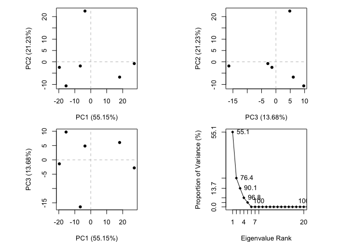

Class 11: Structural Bioinformatics
================

1.1 PDB Statistics
------------------

Download pdb stats data as CSV file from <https://www.rcsb.org/stats/summary>

``` r
pdbstats <- read.csv("Data Export Summary.csv", row.names = 1)
library(knitr)
kable(pdbstats)
```

|                     |  Proteins|  Nucleic.Acids|  Protein.NA.Complex|  Other|   Total|
|---------------------|---------:|--------------:|-------------------:|------:|-------:|
| X-Ray               |    122263|           1960|                6333|     10|  130566|
| NMR                 |     10898|           1263|                 253|      8|   12422|
| Electron Microscopy |      1822|             31|                 657|      0|    2510|
| Other               |       244|              4|                   6|     13|     267|
| Multi Method        |       119|              5|                   2|      1|     127|

``` r
#total number of structures
tot.st <- sum(pdbstats$Total)
#total number of structures 
percent <- round(pdbstats$Total/tot.st*100, 2)
nstats <- pdbstats
nstats$Percent <- percent
kable(nstats)
```

|                     |  Proteins|  Nucleic.Acids|  Protein.NA.Complex|  Other|   Total|  Percent|
|---------------------|---------:|--------------:|-------------------:|------:|-------:|--------:|
| X-Ray               |    122263|           1960|                6333|     10|  130566|    89.49|
| NMR                 |     10898|           1263|                 253|      8|   12422|     8.51|
| Electron Microscopy |      1822|             31|                 657|      0|    2510|     1.72|
| Other               |       244|              4|                   6|     13|     267|     0.18|
| Multi Method        |       119|              5|                   2|      1|     127|     0.09|

Question 1: There are 89.49% X-ray structures and 8.51% NMR strutures in the PDB data base as of 2018-12-04.

``` r
percent.pro <- round(sum(pdbstats$Proteins)/tot.st*100, 2)
```

There are 92.77% protein strutures in the PDB data base as of 2018-12-04.

Section 3: Getting Started with Bio3D
-------------------------------------

Any time we want to use a package we must load it with the **library()** function.

``` r
library(bio3d)
```

``` r
pdb <- read.pdb("1hsg")
```

    ##   Note: Accessing on-line PDB file

``` r
pdb
```

    ## 
    ##  Call:  read.pdb(file = "1hsg")
    ## 
    ##    Total Models#: 1
    ##      Total Atoms#: 1686,  XYZs#: 5058  Chains#: 2  (values: A B)
    ## 
    ##      Protein Atoms#: 1514  (residues/Calpha atoms#: 198)
    ##      Nucleic acid Atoms#: 0  (residues/phosphate atoms#: 0)
    ## 
    ##      Non-protein/nucleic Atoms#: 172  (residues: 128)
    ##      Non-protein/nucleic resid values: [ HOH (127), MK1 (1) ]
    ## 
    ##    Protein sequence:
    ##       PQITLWQRPLVTIKIGGQLKEALLDTGADDTVLEEMSLPGRWKPKMIGGIGGFIKVRQYD
    ##       QILIEICGHKAIGTVLVGPTPVNIIGRNLLTQIGCTLNFPQITLWQRPLVTIKIGGQLKE
    ##       ALLDTGADDTVLEEMSLPGRWKPKMIGGIGGFIKVRQYDQILIEICGHKAIGTVLVGPTP
    ##       VNIIGRNLLTQIGCTLNF
    ## 
    ## + attr: atom, xyz, seqres, helix, sheet,
    ##         calpha, remark, call

``` r
head(pdb$atom)
```

    ##   type eleno elety  alt resid chain resno insert      x      y     z o
    ## 1 ATOM     1     N <NA>   PRO     A     1   <NA> 29.361 39.686 5.862 1
    ## 2 ATOM     2    CA <NA>   PRO     A     1   <NA> 30.307 38.663 5.319 1
    ## 3 ATOM     3     C <NA>   PRO     A     1   <NA> 29.760 38.071 4.022 1
    ## 4 ATOM     4     O <NA>   PRO     A     1   <NA> 28.600 38.302 3.676 1
    ## 5 ATOM     5    CB <NA>   PRO     A     1   <NA> 30.508 37.541 6.342 1
    ## 6 ATOM     6    CG <NA>   PRO     A     1   <NA> 29.296 37.591 7.162 1
    ##       b segid elesy charge
    ## 1 38.10  <NA>     N   <NA>
    ## 2 40.62  <NA>     C   <NA>
    ## 3 42.64  <NA>     C   <NA>
    ## 4 43.40  <NA>     O   <NA>
    ## 5 37.87  <NA>     C   <NA>
    ## 6 38.40  <NA>     C   <NA>

``` r
pdb$xyz
```

    ## 
    ##    Total Frames#: 1
    ##    Total XYZs#:   5058,  (Atoms#:  1686)
    ## 
    ##     [1]  29.361  39.686  5.862  <...>  30.112  17.912  -4.791  [5058] 
    ## 
    ## + attr: Matrix DIM = 1 x 5058

``` r
dim(pdb$xyz)
```

    ## [1]    1 5058

``` r
pdb$xyz[ 1, atom2xyz(1:2)]
```

    ## [1] 29.361 39.686  5.862 30.307 38.663  5.319

Select all C-alpha atoms

``` r
ca.inds <- atom.select(pdb, "calpha")
ca.inds
```

    ## 
    ##  Call:  atom.select.pdb(pdb = pdb, string = "calpha")
    ## 
    ##    Atom Indices#: 198  ($atom)
    ##    XYZ  Indices#: 594  ($xyz)
    ## 
    ## + attr: atom, xyz, call

``` r
#Print details of the first few selected atoms
head(pdb$atom[ca.inds$atom,])
```

    ##    type eleno elety  alt resid chain resno insert      x      y     z o
    ## 2  ATOM     2    CA <NA>   PRO     A     1   <NA> 30.307 38.663 5.319 1
    ## 9  ATOM     9    CA <NA>   GLN     A     2   <NA> 30.158 36.492 2.199 1
    ## 18 ATOM    18    CA <NA>   ILE     A     3   <NA> 29.123 33.098 3.397 1
    ## 26 ATOM    26    CA <NA>   THR     A     4   <NA> 29.774 30.143 1.062 1
    ## 33 ATOM    33    CA <NA>   LEU     A     5   <NA> 27.644 27.003 1.144 1
    ## 41 ATOM    41    CA <NA>   TRP     A     6   <NA> 30.177 24.150 1.279 1
    ##        b segid elesy charge
    ## 2  40.62  <NA>     C   <NA>
    ## 9  41.30  <NA>     C   <NA>
    ## 18 34.13  <NA>     C   <NA>
    ## 26 30.14  <NA>     C   <NA>
    ## 33 30.12  <NA>     C   <NA>
    ## 41 30.82  <NA>     C   <NA>

``` r
#And selected xyz coordinates
head(pdb$xyz[,ca.inds$xyz])
```

    ## [1] 30.307 38.663  5.319 30.158 36.492  2.199

``` r
ligand.inds <- atom.select(pdb, "ligand")
ligand.inds
```

    ## 
    ##  Call:  atom.select.pdb(pdb = pdb, string = "ligand")
    ## 
    ##    Atom Indices#: 45  ($atom)
    ##    XYZ  Indices#: 135  ($xyz)
    ## 
    ## + attr: atom, xyz, call

``` r
pdb$atom[ligand.inds$atom,]
```

    ##        type eleno elety  alt resid chain resno insert      x      y      z
    ## 1515 HETATM  1517    N1 <NA>   MK1     B   902   <NA>  9.280 23.763  3.004
    ## 1516 HETATM  1518    C1 <NA>   MK1     B   902   <NA>  9.498 23.983  4.459
    ## 1517 HETATM  1519    C2 <NA>   MK1     B   902   <NA> 10.591 24.905  4.962
    ## 1518 HETATM  1520    C3 <NA>   MK1     B   902   <NA> 10.591 24.864  6.466
    ## 1519 HETATM  1521    O1 <NA>   MK1     B   902   <NA> 10.937 23.849  7.057
    ## 1520 HETATM  1522    N2 <NA>   MK1     B   902   <NA> 10.193 25.953  7.094
    ## 1521 HETATM  1523    C4 <NA>   MK1     B   902   <NA> 10.145 26.250  8.490
    ## 1522 HETATM  1524    C5 <NA>   MK1     B   902   <NA>  9.379 27.577  8.641
    ## 1523 HETATM  1525    C6 <NA>   MK1     B   902   <NA> 11.398 26.347  9.074
    ## 1524 HETATM  1526    C7 <NA>   MK1     B   902   <NA>  9.364 25.283  9.268
    ## 1525 HETATM  1527    N3 <NA>   MK1     B   902   <NA> 11.819 24.282  4.355
    ## 1526 HETATM  1528    C8 <NA>   MK1     B   902   <NA> 11.753 23.776  2.961
    ## 1527 HETATM  1529    C9 <NA>   MK1     B   902   <NA> 10.440 23.182  2.493
    ## 1528 HETATM  1530   C10 <NA>   MK1     B   902   <NA> 13.083 24.963  4.552
    ## 1529 HETATM  1531   C11 <NA>   MK1     B   902   <NA> 14.203 24.064  5.078
    ## 1530 HETATM  1532    O2 <NA>   MK1     B   902   <NA> 15.242 24.884  4.634
    ## 1531 HETATM  1533   C12 <NA>   MK1     B   902   <NA> 14.440 23.761  6.569
    ## 1532 HETATM  1534   C13 <NA>   MK1     B   902   <NA> 15.573 22.821  7.005
    ## 1533 HETATM  1535   C14 <NA>   MK1     B   902   <NA> 15.644 22.664  8.534
    ## 1534 HETATM  1536   C15 <NA>   MK1     B   902   <NA> 16.733 21.750  8.961
    ## 1535 HETATM  1537   C16 <NA>   MK1     B   902   <NA> 18.058 21.916  8.553
    ## 1536 HETATM  1538   C17 <NA>   MK1     B   902   <NA> 19.037 21.016  8.947
    ## 1537 HETATM  1539   C18 <NA>   MK1     B   902   <NA> 18.673 19.939  9.758
    ## 1538 HETATM  1540   C19 <NA>   MK1     B   902   <NA> 17.347 19.773 10.176
    ## 1539 HETATM  1541   C20 <NA>   MK1     B   902   <NA> 16.374 20.687  9.772
    ## 1540 HETATM  1542   C21 <NA>   MK1     B   902   <NA> 15.447 21.440  6.373
    ## 1541 HETATM  1543    O3 <NA>   MK1     B   902   <NA> 14.367 20.831  6.397
    ## 1542 HETATM  1544    N4 <NA>   MK1     B   902   <NA> 16.583 20.913  5.924
    ## 1543 HETATM  1545   C22 <NA>   MK1     B   902   <NA> 16.692 19.500  5.604
    ## 1544 HETATM  1546   C23 <NA>   MK1     B   902   <NA> 18.067 18.945  5.936
    ## 1545 HETATM  1547    O4 <NA>   MK1     B   902   <NA> 19.061 19.938  5.729
    ## 1546 HETATM  1548   C24 <NA>   MK1     B   902   <NA> 18.226 17.726  5.057
    ## 1547 HETATM  1549   C25 <NA>   MK1     B   902   <NA> 17.476 17.904  3.760
    ## 1548 HETATM  1550   C26 <NA>   MK1     B   902   <NA> 17.500 17.363  2.496
    ## 1549 HETATM  1551   C27 <NA>   MK1     B   902   <NA> 16.613 17.872  1.541
    ## 1550 HETATM  1552   C28 <NA>   MK1     B   902   <NA> 15.722 18.906  1.865
    ## 1551 HETATM  1553   C29 <NA>   MK1     B   902   <NA> 15.683 19.479  3.129
    ## 1552 HETATM  1554   C30 <NA>   MK1     B   902   <NA> 16.504 19.061  4.128
    ## 1553 HETATM  1555   C31 <NA>   MK1     B   902   <NA>  8.033 23.100  2.604
    ## 1554 HETATM  1556   C32 <NA>   MK1     B   902   <NA>  6.666 23.739  2.876
    ## 1555 HETATM  1557   C33 <NA>   MK1     B   902   <NA>  6.158 24.808  2.124
    ## 1556 HETATM  1558    N5 <NA>   MK1     B   902   <NA>  4.911 25.430  2.300
    ## 1557 HETATM  1559   C34 <NA>   MK1     B   902   <NA>  4.207 24.839  3.348
    ## 1558 HETATM  1560   C35 <NA>   MK1     B   902   <NA>  4.654 23.774  4.136
    ## 1559 HETATM  1561   C36 <NA>   MK1     B   902   <NA>  5.905 23.211  3.897
    ##      o     b segid elesy charge
    ## 1515 1 28.25  <NA>     N   <NA>
    ## 1516 1 30.30  <NA>     C   <NA>
    ## 1517 1 27.27  <NA>     C   <NA>
    ## 1518 1 28.85  <NA>     C   <NA>
    ## 1519 1 29.59  <NA>     O   <NA>
    ## 1520 1 22.29  <NA>     N   <NA>
    ## 1521 1 23.47  <NA>     C   <NA>
    ## 1522 1 27.66  <NA>     C   <NA>
    ## 1523 1 21.71  <NA>     C   <NA>
    ## 1524 1 22.75  <NA>     C   <NA>
    ## 1525 1 28.91  <NA>     N   <NA>
    ## 1526 1 26.24  <NA>     C   <NA>
    ## 1527 1 27.47  <NA>     C   <NA>
    ## 1528 1 20.86  <NA>     C   <NA>
    ## 1529 1 21.68  <NA>     C   <NA>
    ## 1530 1 15.87  <NA>     O   <NA>
    ## 1531 1 21.49  <NA>     C   <NA>
    ## 1532 1 26.89  <NA>     C   <NA>
    ## 1533 1 28.67  <NA>     C   <NA>
    ## 1534 1 26.89  <NA>     C   <NA>
    ## 1535 1 29.22  <NA>     C   <NA>
    ## 1536 1 29.22  <NA>     C   <NA>
    ## 1537 1 30.97  <NA>     C   <NA>
    ## 1538 1 29.25  <NA>     C   <NA>
    ## 1539 1 29.96  <NA>     C   <NA>
    ## 1540 1 29.35  <NA>     C   <NA>
    ## 1541 1 32.66  <NA>     O   <NA>
    ## 1542 1 31.19  <NA>     N   <NA>
    ## 1543 1 29.22  <NA>     C   <NA>
    ## 1544 1 28.82  <NA>     C   <NA>
    ## 1545 1 28.32  <NA>     O   <NA>
    ## 1546 1 32.05  <NA>     C   <NA>
    ## 1547 1 31.29  <NA>     C   <NA>
    ## 1548 1 32.00  <NA>     C   <NA>
    ## 1549 1 28.00  <NA>     C   <NA>
    ## 1550 1 29.01  <NA>     C   <NA>
    ## 1551 1 27.70  <NA>     C   <NA>
    ## 1552 1 31.86  <NA>     C   <NA>
    ## 1553 1 36.25  <NA>     C   <NA>
    ## 1554 1 42.75  <NA>     C   <NA>
    ## 1555 1 47.41  <NA>     C   <NA>
    ## 1556 1 51.38  <NA>     N   <NA>
    ## 1557 1 50.60  <NA>     C   <NA>
    ## 1558 1 49.34  <NA>     C   <NA>
    ## 1559 1 44.71  <NA>     C   <NA>

Section 4: Working with multiple PDB files
------------------------------------------

Aligning multiple structures

``` r
ids <- c("1TND_B","1AGR_A","1TAG_A","1GG2_A","1KJY_A","4G5Q_A")
files <- get.pdb(ids, split = TRUE)
```

    ## Warning in get.pdb(ids, split = TRUE): ./1TND.pdb exists. Skipping download

    ## Warning in get.pdb(ids, split = TRUE): ./1AGR.pdb exists. Skipping download

    ## Warning in get.pdb(ids, split = TRUE): ./1TAG.pdb exists. Skipping download

    ## Warning in get.pdb(ids, split = TRUE): ./1GG2.pdb exists. Skipping download

    ## Warning in get.pdb(ids, split = TRUE): ./1KJY.pdb exists. Skipping download

    ## Warning in get.pdb(ids, split = TRUE): ./4G5Q.pdb exists. Skipping download

    ## 
      |                                                                       
      |                                                                 |   0%
      |                                                                       
      |===========                                                      |  17%
      |                                                                       
      |======================                                           |  33%
      |                                                                       
      |================================                                 |  50%
      |                                                                       
      |===========================================                      |  67%
      |                                                                       
      |======================================================           |  83%
      |                                                                       
      |=================================================================| 100%

Extract and Align the chains we are interested in Print to screen a summary of the 'pdbs' object

``` r
pdbs <- pdbaln(files, fit = TRUE)
```

    ## Reading PDB files:
    ## ./split_chain/1TND_B.pdb
    ## ./split_chain/1AGR_A.pdb
    ## ./split_chain/1TAG_A.pdb
    ## ./split_chain/1GG2_A.pdb
    ## ./split_chain/1KJY_A.pdb
    ## ./split_chain/4G5Q_A.pdb
    ## .....   PDB has ALT records, taking A only, rm.alt=TRUE
    ## .
    ## 
    ## Extracting sequences
    ## 
    ## pdb/seq: 1   name: ./split_chain/1TND_B.pdb 
    ## pdb/seq: 2   name: ./split_chain/1AGR_A.pdb 
    ## pdb/seq: 3   name: ./split_chain/1TAG_A.pdb 
    ## pdb/seq: 4   name: ./split_chain/1GG2_A.pdb 
    ## pdb/seq: 5   name: ./split_chain/1KJY_A.pdb 
    ## pdb/seq: 6   name: ./split_chain/4G5Q_A.pdb 
    ##    PDB has ALT records, taking A only, rm.alt=TRUE

``` r
pdbs
```

    ##                                1        .         .         .         .         50 
    ## [Truncated_Name:1]1TND_B.pdb   --------------------------ARTVKLLLLGAGESGKSTIVKQMK
    ## [Truncated_Name:2]1AGR_A.pdb   LSAEDKAAVERSKMIDRNLREDGEKAAREVKLLLLGAGESGKSTIVKQMK
    ## [Truncated_Name:3]1TAG_A.pdb   --------------------------ARTVKLLLLGAGESGKSTIVKQMK
    ## [Truncated_Name:4]1GG2_A.pdb   LSAEDKAAVERSKMIDRNLREDGEKAAREVKLLLLGAGESGKSTIVKQMK
    ## [Truncated_Name:5]1KJY_A.pdb   -------------------------GAREVKLLLLGAGESGKSTIVKQMK
    ## [Truncated_Name:6]4G5Q_A.pdb   --------------------------AREVKLLLLGAGESGKSTIVKQMK
    ##                                                          ** ********************* 
    ##                                1        .         .         .         .         50 
    ## 
    ##                               51        .         .         .         .         100 
    ## [Truncated_Name:1]1TND_B.pdb   IIHQDGYSLEECLEFIAIIYGNTLQSILAIVRAMTTLNIQYGDSARQDDA
    ## [Truncated_Name:2]1AGR_A.pdb   IIHEAGYSEEECKQYKAVVYSNTIQSIIAIIRAMGRLKIDFGDAARADDA
    ## [Truncated_Name:3]1TAG_A.pdb   IIHQDGYSLEECLEFIAIIYGNTLQSILAIVRAMTTLNIQYGDSARQDDA
    ## [Truncated_Name:4]1GG2_A.pdb   IIHEAGYSEEECKQYKAVVYSNTIQSIIAIIRAMGRLKIDFGDAARADDA
    ## [Truncated_Name:5]1KJY_A.pdb   IIHEAGYSEEECKQYKAVVYSNTIQSIIAIIRAMGRLKIDFGDSARADDA
    ## [Truncated_Name:6]4G5Q_A.pdb   IIHEAGYSEEECKQYKAVVYSNTIQSIIAIIRAMGRLKIDFGDSARADDA
    ##                                ***  *** ***  ^ *^^* **^***^**^***  * * ^** ** *** 
    ##                               51        .         .         .         .         100 
    ## 
    ##                              101        .         .         .         .         150 
    ## [Truncated_Name:1]1TND_B.pdb   RKLMHMADTIEEGTMPKEMSDIIQRLWKDSGIQACFDRASEYQLNDSAGY
    ## [Truncated_Name:2]1AGR_A.pdb   RQLFVLAGAAEEGFMTAELAGVIKRLWKDSGVQACFNRSREYQLNDSAAY
    ## [Truncated_Name:3]1TAG_A.pdb   RKLMHMADTIEEGTMPKEMSDIIQRLWKDSGIQACFDRASEYQLNDSAGY
    ## [Truncated_Name:4]1GG2_A.pdb   RQLFVLAGAAEEGFMTAELAGVIKRLWKDSGVQACFNRSREYQLNDSAAY
    ## [Truncated_Name:5]1KJY_A.pdb   RQLFVLAGAAEEGFMTAELAGVIKRLWKDSGVQACFNRSREYQLNDSAAY
    ## [Truncated_Name:6]4G5Q_A.pdb   RQLFVLAGAAEEGFMTAELAGVIKRLWKDSGVQACFNRSREYQLNDSAAY
    ##                                * *  ^*   *** *  *^  ^* *******^**** *  ********^* 
    ##                              101        .         .         .         .         150 
    ## 
    ##                              151        .         .         .         .         200 
    ## [Truncated_Name:1]1TND_B.pdb   YLSDLERLVTPGYVPTEQDVLRSRVKTTGIIETQFSFKDLNFRMFDVGGQ
    ## [Truncated_Name:2]1AGR_A.pdb   YLNDLDRIAQPNYIPTQQDVLRTRVKTTGIVETHFTFKDLHFKMFDVGGQ
    ## [Truncated_Name:3]1TAG_A.pdb   YLSDLERLVTPGYVPTEQDVLRSRVKTTGIIETQFSFKDLNFRMFDVGGQ
    ## [Truncated_Name:4]1GG2_A.pdb   YLNDLDRIAQPNYIPTQQDVLRTRVKTTGIVETHFTFKDLHFKMFDVGAQ
    ## [Truncated_Name:5]1KJY_A.pdb   YLNDLDRIAQPNYIPTQQDVLRTRVKTTGIVETHFTFKDLHFKMFDVGGQ
    ## [Truncated_Name:6]4G5Q_A.pdb   YLNDLDRIAQPNYIPTQQDVLRTRVKTTGIVETHFTFKDLHFKMFDVGGQ
    ##                                ** **^*^  * *^** *****^*******^** *^**** *^*****^* 
    ##                              151        .         .         .         .         200 
    ## 
    ##                              201        .         .         .         .         250 
    ## [Truncated_Name:1]1TND_B.pdb   RSERKKWIHCFEGVTCIIFIAALSAYDMVLVEDDEVNRMHESLHLFNSIC
    ## [Truncated_Name:2]1AGR_A.pdb   RSERKKWIHCFEGVTAIIFCVALSDYDLVLAEDEEMNRMHESMKLFDSIC
    ## [Truncated_Name:3]1TAG_A.pdb   RSERKKWIHCFEGVTCIIFIAALSAYDMVLVEDDEVNRMHESLHLFNSIC
    ## [Truncated_Name:4]1GG2_A.pdb   RSERKKWIHCFEGVTAIIFCVALSDYDLVLAEDEEMNRMHESMKLFDSIC
    ## [Truncated_Name:5]1KJY_A.pdb   RSERKKWIHCFEGVTAIIFCVALSDYDLVLAEDEEMNRMHESMKLFDSIC
    ## [Truncated_Name:6]4G5Q_A.pdb   RSERKKWIHCFEGVTAIIFCVALSDYDLVLAEDEEMNRMHESMKLFDSIC
    ##                                *************** ***  *** **^** **^*^******^^** *** 
    ##                              201        .         .         .         .         250 
    ## 
    ##                              251        .         .         .         .         300 
    ## [Truncated_Name:1]1TND_B.pdb   NHRYFATTSIVLFLNKKDVFSEKIKKAHLSICFPDYNGPNTYEDAGNYIK
    ## [Truncated_Name:2]1AGR_A.pdb   NNKWFTDTSIILFLNKKDLFEEKIKKSPLTICYPEYAGSNTYEEAAAYIQ
    ## [Truncated_Name:3]1TAG_A.pdb   NHRYFATTSIVLFLNKKDVFSEKIKKAHLSICFPDYNGPNTYEDAGNYIK
    ## [Truncated_Name:4]1GG2_A.pdb   NNKWFTDTSIILFLNKKDLFEEKIKKSPLTICYPEYAGSNTYEEAAAYIQ
    ## [Truncated_Name:5]1KJY_A.pdb   NNKWFTDTSIILFLNKKDLFEEKIKKSPLTICYPEYAGSNTYEEAAAYIQ
    ## [Truncated_Name:6]4G5Q_A.pdb   NNKWFTDTSIILFLNKKDLFEEKIKKSPLTICYPEYAGSNTYEEAAAYIQ
    ##                                * ^^*  ***^*******^* *****  *^**^*^* * ****^*^ **  
    ##                              251        .         .         .         .         300 
    ## 
    ##                              301        .         .         .         .         350 
    ## [Truncated_Name:1]1TND_B.pdb   VQFLELNMRRDVKEIYSHMTCATDTQNVKFVFDAVTDIIIKE--------
    ## [Truncated_Name:2]1AGR_A.pdb   CQFEDLNKRKDTKEIYTHFTCATDTKNVQFVFDAVTDVIIKNNLKDCGLF
    ## [Truncated_Name:3]1TAG_A.pdb   VQFLELNMRRDVKEIYSHMTCATDTQNVKFVFDAVTDIII----------
    ## [Truncated_Name:4]1GG2_A.pdb   CQFEDLNKRKDTKEIYTHFTCATDTKNVQFVFDAVTDVIIKNNL------
    ## [Truncated_Name:5]1KJY_A.pdb   CQFEDLNKRKDTKEIYTHFTCATDTKNVQFVFDAVTDVIIKNNLK-----
    ## [Truncated_Name:6]4G5Q_A.pdb   CQFEDLNKRKDTKEIYTHFTCATDTKNVQFVFDAVTDVIIKNNLKD----
    ##                                 ** ^** *^* ****^* ****** ** ********^**           
    ##                              301        .         .         .         .         350 
    ## 
    ## Call:
    ##   pdbaln(files = files, fit = TRUE)
    ## 
    ## Class:
    ##   pdbs, fasta
    ## 
    ## Alignment dimensions:
    ##   6 sequence rows; 350 position columns (314 non-gap, 36 gap) 
    ## 
    ## + attr: xyz, resno, b, chain, id, ali, resid, sse, call

To access the first few rows of the alignment matrix we use standard subsetting syntax for matrices in R:

``` r
pdbs$ali[1:5, 1:8]
```

    ##                          [,1] [,2] [,3] [,4] [,5] [,6] [,7] [,8]
    ## ./split_chain/1TND_B.pdb "-"  "-"  "-"  "-"  "-"  "-"  "-"  "-" 
    ## ./split_chain/1AGR_A.pdb "L"  "S"  "A"  "E"  "D"  "K"  "A"  "A" 
    ## ./split_chain/1TAG_A.pdb "-"  "-"  "-"  "-"  "-"  "-"  "-"  "-" 
    ## ./split_chain/1GG2_A.pdb "L"  "S"  "A"  "E"  "D"  "K"  "A"  "A" 
    ## ./split_chain/1KJY_A.pdb "-"  "-"  "-"  "-"  "-"  "-"  "-"  "-"

Associated residue numbers

``` r
pdbs$resno[1:5, 1:8]
```

    ##                          [,1] [,2] [,3] [,4] [,5] [,6] [,7] [,8]
    ## ./split_chain/1TND_B.pdb   NA   NA   NA   NA   NA   NA   NA   NA
    ## ./split_chain/1AGR_A.pdb    5    6    7    8    9   10   11   12
    ## ./split_chain/1TAG_A.pdb   NA   NA   NA   NA   NA   NA   NA   NA
    ## ./split_chain/1GG2_A.pdb    5    6    7    8    9   10   11   12
    ## ./split_chain/1KJY_A.pdb   NA   NA   NA   NA   NA   NA   NA   NA

PCA of the above aligned sequences
----------------------------------

Find invariant core

``` r
core <- core.find(pdbs)
```

    ##  core size 313 of 314  vol = 241.558 
    ##  core size 312 of 314  vol = 217.599 
    ##  core size 311 of 314  vol = 194.397 
    ##  core size 310 of 314  vol = 177.259 
    ##  core size 309 of 314  vol = 161.443 
    ##  core size 308 of 314  vol = 146.247 
    ##  core size 307 of 314  vol = 135.78 
    ##  core size 306 of 314  vol = 125.525 
    ##  core size 305 of 314  vol = 115.017 
    ##  core size 304 of 314  vol = 104.339 
    ##  core size 303 of 314  vol = 94.412 
    ##  core size 302 of 314  vol = 86.327 
    ##  core size 301 of 314  vol = 78.663 
    ##  core size 300 of 314  vol = 71.293 
    ##  core size 299 of 314  vol = 64.866 
    ##  core size 298 of 314  vol = 59.347 
    ##  core size 297 of 314  vol = 54.274 
    ##  core size 296 of 314  vol = 49.72 
    ##  core size 295 of 314  vol = 46.485 
    ##  core size 294 of 314  vol = 43.639 
    ##  core size 293 of 314  vol = 41.628 
    ##  core size 292 of 314  vol = 39.703 
    ##  core size 291 of 314  vol = 37.84 
    ##  core size 290 of 314  vol = 35.859 
    ##  core size 289 of 314  vol = 34.543 
    ##  core size 288 of 314  vol = 33.215 
    ##  core size 287 of 314  vol = 32.214 
    ##  core size 286 of 314  vol = 31.47 
    ##  core size 285 of 314  vol = 30.828 
    ##  core size 284 of 314  vol = 29.732 
    ##  core size 283 of 314  vol = 29.029 
    ##  core size 282 of 314  vol = 28.478 
    ##  core size 281 of 314  vol = 27.992 
    ##  core size 280 of 314  vol = 27.527 
    ##  core size 279 of 314  vol = 26.858 
    ##  core size 278 of 314  vol = 26.562 
    ##  core size 277 of 314  vol = 26.087 
    ##  core size 276 of 314  vol = 25.568 
    ##  core size 275 of 314  vol = 25.119 
    ##  core size 274 of 314  vol = 24.72 
    ##  core size 273 of 314  vol = 24.296 
    ##  core size 272 of 314  vol = 23.828 
    ##  core size 271 of 314  vol = 23.483 
    ##  core size 270 of 314  vol = 23.184 
    ##  core size 269 of 314  vol = 22.787 
    ##  core size 268 of 314  vol = 22.432 
    ##  core size 267 of 314  vol = 22.102 
    ##  core size 266 of 314  vol = 21.735 
    ##  core size 265 of 314  vol = 21.409 
    ##  core size 264 of 314  vol = 21.143 
    ##  core size 263 of 314  vol = 20.877 
    ##  core size 262 of 314  vol = 20.543 
    ##  core size 261 of 314  vol = 20.24 
    ##  core size 260 of 314  vol = 19.941 
    ##  core size 259 of 314  vol = 19.623 
    ##  core size 258 of 314  vol = 19.349 
    ##  core size 257 of 314  vol = 19.049 
    ##  core size 256 of 314  vol = 18.745 
    ##  core size 255 of 314  vol = 18.435 
    ##  core size 254 of 314  vol = 18.197 
    ##  core size 253 of 314  vol = 17.917 
    ##  core size 252 of 314  vol = 17.648 
    ##  core size 251 of 314  vol = 17.371 
    ##  core size 250 of 314  vol = 17.114 
    ##  core size 249 of 314  vol = 16.879 
    ##  core size 248 of 314  vol = 16.659 
    ##  core size 247 of 314  vol = 16.414 
    ##  core size 246 of 314  vol = 16.159 
    ##  core size 245 of 314  vol = 15.982 
    ##  core size 244 of 314  vol = 15.786 
    ##  core size 243 of 314  vol = 15.545 
    ##  core size 242 of 314  vol = 15.311 
    ##  core size 241 of 314  vol = 15.072 
    ##  core size 240 of 314  vol = 14.858 
    ##  core size 239 of 314  vol = 14.629 
    ##  core size 238 of 314  vol = 14.459 
    ##  core size 237 of 314  vol = 14.278 
    ##  core size 236 of 314  vol = 14.076 
    ##  core size 235 of 314  vol = 13.849 
    ##  core size 234 of 314  vol = 13.628 
    ##  core size 233 of 314  vol = 13.47 
    ##  core size 232 of 314  vol = 13.283 
    ##  core size 231 of 314  vol = 13.031 
    ##  core size 230 of 314  vol = 12.86 
    ##  core size 229 of 314  vol = 12.655 
    ##  core size 228 of 314  vol = 12.385 
    ##  core size 227 of 314  vol = 12.205 
    ##  core size 226 of 314  vol = 12.052 
    ##  core size 225 of 314  vol = 11.849 
    ##  core size 224 of 314  vol = 11.581 
    ##  core size 223 of 314  vol = 11.393 
    ##  core size 222 of 314  vol = 11.257 
    ##  core size 221 of 314  vol = 11.09 
    ##  core size 220 of 314  vol = 10.932 
    ##  core size 219 of 314  vol = 10.77 
    ##  core size 218 of 314  vol = 10.62 
    ##  core size 217 of 314  vol = 10.487 
    ##  core size 216 of 314  vol = 10.359 
    ##  core size 215 of 314  vol = 10.202 
    ##  core size 214 of 314  vol = 10.069 
    ##  core size 213 of 314  vol = 9.906 
    ##  core size 212 of 314  vol = 9.788 
    ##  core size 211 of 314  vol = 9.651 
    ##  core size 210 of 314  vol = 9.467 
    ##  core size 209 of 314  vol = 9.308 
    ##  core size 208 of 314  vol = 9.173 
    ##  core size 207 of 314  vol = 8.992 
    ##  core size 206 of 314  vol = 8.861 
    ##  core size 205 of 314  vol = 8.746 
    ##  core size 204 of 314  vol = 8.597 
    ##  core size 203 of 314  vol = 8.451 
    ##  core size 202 of 314  vol = 8.297 
    ##  core size 201 of 314  vol = 8.158 
    ##  core size 200 of 314  vol = 8.037 
    ##  core size 199 of 314  vol = 7.882 
    ##  core size 198 of 314  vol = 7.736 
    ##  core size 197 of 314  vol = 7.59 
    ##  core size 196 of 314  vol = 7.466 
    ##  core size 195 of 314  vol = 7.344 
    ##  core size 194 of 314  vol = 7.223 
    ##  core size 193 of 314  vol = 7.124 
    ##  core size 192 of 314  vol = 6.94 
    ##  core size 191 of 314  vol = 6.801 
    ##  core size 190 of 314  vol = 6.682 
    ##  core size 189 of 314  vol = 6.582 
    ##  core size 188 of 314  vol = 6.476 
    ##  core size 187 of 314  vol = 6.32 
    ##  core size 186 of 314  vol = 6.208 
    ##  core size 185 of 314  vol = 6.09 
    ##  core size 184 of 314  vol = 6.018 
    ##  core size 183 of 314  vol = 5.919 
    ##  core size 182 of 314  vol = 5.805 
    ##  core size 181 of 314  vol = 5.699 
    ##  core size 180 of 314  vol = 5.631 
    ##  core size 179 of 314  vol = 5.54 
    ##  core size 178 of 314  vol = 5.446 
    ##  core size 177 of 314  vol = 5.344 
    ##  core size 176 of 314  vol = 5.277 
    ##  core size 175 of 314  vol = 5.198 
    ##  core size 174 of 314  vol = 5.109 
    ##  core size 173 of 314  vol = 5.038 
    ##  core size 172 of 314  vol = 4.977 
    ##  core size 171 of 314  vol = 4.912 
    ##  core size 170 of 314  vol = 4.841 
    ##  core size 169 of 314  vol = 4.768 
    ##  core size 168 of 314  vol = 4.689 
    ##  core size 167 of 314  vol = 4.612 
    ##  core size 166 of 314  vol = 4.54 
    ##  core size 165 of 314  vol = 4.424 
    ##  core size 164 of 314  vol = 4.352 
    ##  core size 163 of 314  vol = 4.27 
    ##  core size 162 of 314  vol = 4.197 
    ##  core size 161 of 314  vol = 4.141 
    ##  core size 160 of 314  vol = 4.064 
    ##  core size 159 of 314  vol = 3.96 
    ##  core size 158 of 314  vol = 3.883 
    ##  core size 157 of 314  vol = 3.813 
    ##  core size 156 of 314  vol = 3.742 
    ##  core size 155 of 314  vol = 3.664 
    ##  core size 154 of 314  vol = 3.522 
    ##  core size 153 of 314  vol = 3.442 
    ##  core size 152 of 314  vol = 3.377 
    ##  core size 151 of 314  vol = 3.291 
    ##  core size 150 of 314  vol = 3.2 
    ##  core size 149 of 314  vol = 3.107 
    ##  core size 148 of 314  vol = 3.029 
    ##  core size 147 of 314  vol = 2.979 
    ##  core size 146 of 314  vol = 2.915 
    ##  core size 145 of 314  vol = 2.839 
    ##  core size 144 of 314  vol = 2.776 
    ##  core size 143 of 314  vol = 2.716 
    ##  core size 142 of 314  vol = 2.669 
    ##  core size 141 of 314  vol = 2.629 
    ##  core size 140 of 314  vol = 2.585 
    ##  core size 139 of 314  vol = 2.488 
    ##  core size 138 of 314  vol = 2.432 
    ##  core size 137 of 314  vol = 2.379 
    ##  core size 136 of 314  vol = 2.326 
    ##  core size 135 of 314  vol = 2.26 
    ##  core size 134 of 314  vol = 2.215 
    ##  core size 133 of 314  vol = 2.154 
    ##  core size 132 of 314  vol = 2.101 
    ##  core size 131 of 314  vol = 2.052 
    ##  core size 130 of 314  vol = 1.988 
    ##  core size 129 of 314  vol = 1.918 
    ##  core size 128 of 314  vol = 1.849 
    ##  core size 127 of 314  vol = 1.776 
    ##  core size 126 of 314  vol = 1.736 
    ##  core size 125 of 314  vol = 1.694 
    ##  core size 124 of 314  vol = 1.64 
    ##  core size 123 of 314  vol = 1.604 
    ##  core size 122 of 314  vol = 1.565 
    ##  core size 121 of 314  vol = 1.539 
    ##  core size 120 of 314  vol = 1.513 
    ##  core size 119 of 314  vol = 1.464 
    ##  core size 118 of 314  vol = 1.416 
    ##  core size 117 of 314  vol = 1.384 
    ##  core size 116 of 314  vol = 1.343 
    ##  core size 115 of 314  vol = 1.313 
    ##  core size 114 of 314  vol = 1.285 
    ##  core size 113 of 314  vol = 1.246 
    ##  core size 112 of 314  vol = 1.207 
    ##  core size 111 of 314  vol = 1.18 
    ##  core size 110 of 314  vol = 1.149 
    ##  core size 109 of 314  vol = 1.11 
    ##  core size 108 of 314  vol = 1.069 
    ##  core size 107 of 314  vol = 1.031 
    ##  core size 106 of 314  vol = 1.002 
    ##  core size 105 of 314  vol = 0.971 
    ##  core size 104 of 314  vol = 0.939 
    ##  core size 103 of 314  vol = 0.918 
    ##  core size 102 of 314  vol = 0.893 
    ##  core size 101 of 314  vol = 0.862 
    ##  core size 100 of 314  vol = 0.837 
    ##  core size 99 of 314  vol = 0.805 
    ##  core size 98 of 314  vol = 0.777 
    ##  core size 97 of 314  vol = 0.753 
    ##  core size 96 of 314  vol = 0.736 
    ##  core size 95 of 314  vol = 0.71 
    ##  core size 94 of 314  vol = 0.688 
    ##  core size 93 of 314  vol = 0.672 
    ##  core size 92 of 314  vol = 0.653 
    ##  core size 91 of 314  vol = 0.641 
    ##  core size 90 of 314  vol = 0.626 
    ##  core size 89 of 314  vol = 0.609 
    ##  core size 88 of 314  vol = 0.594 
    ##  core size 87 of 314  vol = 0.58 
    ##  core size 86 of 314  vol = 0.564 
    ##  core size 85 of 314  vol = 0.546 
    ##  core size 84 of 314  vol = 0.531 
    ##  core size 83 of 314  vol = 0.516 
    ##  core size 82 of 314  vol = 0.502 
    ##  core size 81 of 314  vol = 0.491 
    ##  FINISHED: Min vol ( 0.5 ) reached

Superimpose all structures to core

``` r
pdbs$xyz = pdbfit(pdbs, core)
```

Perform PCA

``` r
pc.xray <- pca(pdbs)
plot(pc.xray)
```

 Calculate RMSD

``` r
rd <- rmsd(pdbs)
```

    ## Warning in rmsd(pdbs): No indices provided, using the 314 non NA positions

Visualize first principal component
-----------------------------------

``` r
pc1 <- mktrj(pc.xray, pc=1, file="pc_1.pdb")
```
