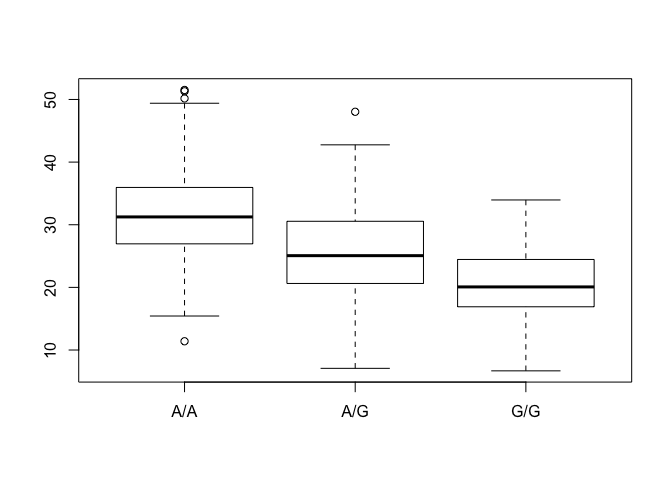

Class 14: RNA Seq
================

Part 1: Asthmal SNPs
--------------------

Examing Asthma SnPs in the MXL (Mexican Ancestry in Los Angeles) 1000 Genomes sequencing data

``` r
mxl <- read.csv("373531-SampleGenotypes-Homo_sapiens_Variation_Sample_rs8067378.csv", row.names = 1)
table(mxl)
```

    ## , , Father = -, Mother = -
    ## 
    ##                          Population.s.
    ## Genotype..forward.strand. ALL, AMR, MXL
    ##                       A|A            22
    ##                       A|G            21
    ##                       G|A            12
    ##                       G|G             9

Let's focus on the column that

``` r
genotypes <- round(table(mxl[,1])/nrow(mxl)*100, 2)
genotypes
```

    ## 
    ##   A|A   A|G   G|A   G|G 
    ## 34.38 32.81 18.75 14.06

In the MXL population, 34.38% have the A/A SNP.

Part 2: Initial RNA Seq analysis
--------------------------------

Interpreting Bast qualities in R: FastQ - Q stands for "quality scores line" This is a fastqsanger file. The offset is 33.

``` r
#install.packages("seqinr")
#install.packages("gtools")
library(seqinr)
library(gtools)
phred <- asc( s2c("DDDDCDEDCDDDDBBDDDCC@") ) - 33
phred
```

    ##  D  D  D  D  C  D  E  D  C  D  D  D  D  B  B  D  D  D  C  C  @ 
    ## 35 35 35 35 34 35 36 35 34 35 35 35 35 33 33 35 35 35 34 34 31

``` r
prob <- 10**(-phred/10)
```

Using Galaxy for NGS analysis
-----------------------------

Uploaded fastq files online to galaxy. Performed quality control - fastqc manipulation Looked at sequencing quality and context

Mapping RNA-seq reads to genome
-------------------------------

Using Galaxy for NGS analysis:

The major challenge when mapping RNA-seq reads is that the reads, because they come from RNA, often cross splice junction boundaries; splice junctions are not present in a genome's sequence. We will use TopHat which is designed to map RNA-seq reads.

Our input data is pair-end data. For Tophat in Galaxy, you need to set paired-end as your input type and then provide the forward read file and reverse read file. Because the reads are paired, you'll also need to set mean inner distance between pairs; this is the average distance in basepairs between reads. Use a mean inner distance of 150 for our data as this was the fragment length from the experimental library preparation step.

``` r
expression <- read.table("expression.txt")
table(expression$geno)
```

    ## 
    ## A/A A/G G/G 
    ## 108 233 121

``` r
inds.aa <- expression$geno == "A/A"
summary(expression$exp[inds.aa])
```

    ##    Min. 1st Qu.  Median    Mean 3rd Qu.    Max. 
    ##   11.40   27.02   31.25   31.82   35.92   51.52

``` r
inds.ag <- expression$geno == "A/G"
summary(expression$exp[inds.ag])
```

    ##    Min. 1st Qu.  Median    Mean 3rd Qu.    Max. 
    ##   7.075  20.626  25.065  25.397  30.552  48.034

``` r
inds.gg <- expression$geno == "G/G"
summary(expression$exp[inds.gg]) 
```

    ##    Min. 1st Qu.  Median    Mean 3rd Qu.    Max. 
    ##   6.675  16.903  20.074  20.594  24.457  33.956

``` r
#boxplot(count ~ spray, data = InsectSprays, col = "lightgray")
boxplot(exp ~ geno, data = expression)
```



steps 1. fastq (input) 2. quality control with fastqc (galaxy) 3. mapping (alignment) with tophat (galaxy) 4. cufflink (counting) (galaxy) 5. htseq count to get table of geno expression
