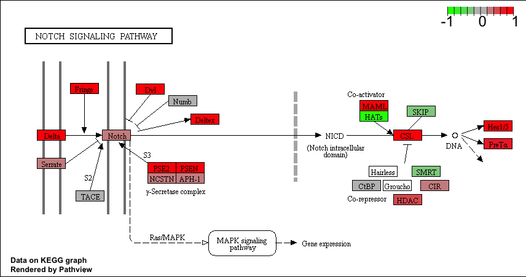

```{r setup, include=FALSE}
knitr::opts_chunk$set(echo = TRUE)
```

## Section 1: Differential Expression Analysis

The data for for hands-on session comes from GEO entry: GSE37704, which is associated with the following publication:

Trapnell C, Hendrickson DG, Sauvageau M, Goff L et al. “Differential analysis of gene regulation at transcript resolution with  RNA-seq”. Nat Biotechnol 2013 Jan;31(1):46-53. PMID: 23222703

The authors report on differential analysis of lung fibroblasts in response to loss of the developmental transcription factor HOXA1. Their results and others indicate that HOXA1 is required for lung fibroblast and HeLa cell cycle progression. In particular their analysis show that *“loss of HOXA1 results in significant expression level changes in thousands of individual transcripts, along with isoform switching events in key regulators of the cell cycle”.* For our session we have used their Sailfish gene-level estimated counts and hence are restricted to protein-coding genes only.

```{r}
library(DESeq2)
```

```{r}
metaFile <- "data/GSE37704_metadata.csv"
countFile <- "data/GSE37704_featurecounts.csv"
```

```{r}
colData = read.csv(metaFile, row.names = 1)
head(colData)
```

```{r}
countData = read.csv(countFile, row.names = 1)
head(countData)
```

```{r, include= FALSE}
ncol(countData)
```

```{r, include= FALSE}
#countData$length
#countData[,1]
```


```{r}
# countData needs to match the first column in the colData. We need to remove the first $length col
countData <- as.matrix(countData[,-1])
# -1 excludes the first column. "Everything but column 1". Much cleaner than [,2:7] and is more reproducible.
head(countData)
```

Remove the zero entries


```{r}
head(rowSums(countData) != 0)
non.zero <- rowSums(countData) != 0
countData = countData[ non.zero, ]
head(countData)
```

```{r}
nrow(countData)
```

We are working with `nrow(countData)` genes.

## Running DESeq2

Setup the DESeqDataSet object required for the `DESeq()` function then run the DESeq pipeline 

```{r}
#First argument is defining the countData, second argument is defining the metaData, third argument ?
dds = DESeqDataSetFromMatrix(countData=countData,
                             colData=colData,
                             design=~condition)
dds = DESeq(dds)
```

Get the results

```{r}
results(dds)
```

Next, get results for the HoxA1 knockdown versus control siRNA (remember that these were labeled as “hoxa1_kd” and “control_sirna” in our original colData metaFile input to DESeq, you can check this above and by running resultsNames(dds) command).

```{r}
res = results(dds, contrast=c("condition", "hoxa1_kd", "control_sirna"))
```

If we want to find out how many genes make the default cutoff, call the `summary()` on res

```{r}
summary(res)
# We often work with a p-value < 0.05 or 0.01. Default is < 0.1 which is more liberal
# We often work with a log fold change of 2, default is 0
```


```{r}


# Make a color vector for all genes
mycols <- rep("gray", nrow(res))

# Color red the genes with absolute fold change above 2
mycols[ abs(res$log2FoldChange) > 2 ] <- "red"

#Color blue those with adjusted p-value < 0.01 and absolute fold change more than 2

inds <- (res$padj < 0.01) & (abs(res$log2FoldChange) > 2)
mycols[inds] <- "blue"

plot( res$log2FoldChange, -log(res$padj), col = mycols)
```

## Adding gene annotation

```{r}
library("AnnotationDbi")
library("org.Hs.eg.db")

columns(org.Hs.eg.db)

```

```{r}
res$symbol = mapIds(org.Hs.eg.db,
                    keys= row.names(res), 
                    keytype="ENSEMBL",
                    column="SYMBOL",
                    multiVals="first")

res$entrez = mapIds(org.Hs.eg.db,
                    keys= row.names(res),
                    keytype="ENSEMBL",
                    column="ENTREZID",
                    multiVals="first")

res$name =   mapIds(org.Hs.eg.db,
                    keys=row.names(res),
                    keytype="ENSEMBL",
                    column="GENENAME",
                    multiVals="first")

head(res)
```

Reorder these results by adjusted p-value and save them to a CSV file in the current project director

```{r}
res = res[order(res$pvalue),]
write.csv(res, file = "deseq_results.csv")
```


## Section 2: Pathway Analysis

Load the packages and setup the KEGG data-sets
```{r}
library(pathview)
library(gage)
library(gageData)
```

```{r}
data("kegg.sets.hs")
data("sigmet.idx.hs")
```

Focus on signaling and metabolic pathways only
```{r}
kegg.sets.hs = kegg.sets.hs[sigmet.idx.hs]
```

Examine the first 3 pathways
```{r}
head(kegg.sets.hs, 3)
```

Now we want to know if these things overlap with our things. We will use the `gage()` function to do this. 

The `gage()` function requires a named vector of fold changes, where the names of the values are the Entrez gene IDs. 

So we need to create a vector of fold changes with Entez gene ID names

```{r}
foldchanges = res$log2FoldChange
names(foldchanges) = res$entrez
head(foldchanges)
```

Now let's run the `gage` pathway analysis

You might want to try changing the value of same.dir. This value determines whether to test for changes in a gene set toward a single direction (all genes up or down regulated) or changes towards both directions simultaneously (i.e. any genes in the pathway dysregulated). Here, we’re using the default same.dir=TRUE, which will give us separate lists for pathways that are upregulated versus pathways that are down-regulated.

Now lets look at the object returned from `gage()`

```{r}
keggres = gage(foldchanges, gsets = kegg.sets.hs)

attributes(keggres)
```

Each `keggres$less` and `keggres$greater` object is data matrix with gene sets as rows sorted by p-value.

```{r}
head(keggres$less)
```


The top “less/down” pathways is “Cell cycle” with the KEGG pathway identifier `hsa04110`

Now, let’s try out the `pathview()` function from the pathview package to make a pathway plot with our RNA-Seq expression results shown in color.

To begin with lets manually supply a pathway.id (namely the first part of the `"hsa04110 Cell cycle"`) that we could see from the print out above.

```{r}
pathview(gene.data = foldchanges, pathway.id = "hsa04110")
```

This downloads the pathway figure data from KEGG and adds our results to it. 

How do we put this figure into our report?


Now, let’s process our results a bit more to automagicaly pull out the top 5 upregulated pathways, then further process that just to get the pathway IDs needed by the `pathview()` function. We’ll use these KEGG pathway IDs for pathview plotting below.

```{r}
## Focus on top 5 upregulated pathways here for demo purposes only
keggrespathways <- rownames(keggres$greater)[1:5]

# Extract the 8 character long IDs part of each string
keggresids = substr(keggrespathways, start=1, stop=8)
keggresids
```

```{r}
pathview(gene.data=foldchanges, pathway.id=keggresids, species="hsa")
```




## Section 3: Gene Ontology (GO)

We can also do a similar procedure with gene ontology. Similar to above, `go.sets.hs` has all GO terms. `go.subs.hs` is a named list containing indexes for the BP, CC, and MF ontologies. Let’s focus on BP (a.k.a Biological Process) 

```{r}
data(go.sets.hs)
data(go.subs.hs)

# Focus on Biological Process subset of GO
gobpsets = go.sets.hs[go.subs.hs$BP]

gobpres = gage(foldchanges, gsets=gobpsets, same.dir=TRUE)

lapply(gobpres, head)
```


```{r}
head(gobpres$less)
```

GO has given us different information than KEGG analysis

## Section 4: Reactome Analysis

# Online Reactome setup

```{r}
sig_genes <- res[res$padj <= 0.05 & !is.na(res$padj), "symbol"]
print(paste("Total number of significant genes:", length(sig_genes)))
```

```{r}
write.table(sig_genes, file="significant_genes.txt", row.names=FALSE, col.names=FALSE, quote=FALSE)
```

We will use this file *significant_genes.txt* to analyze our data online with Reactome. 


