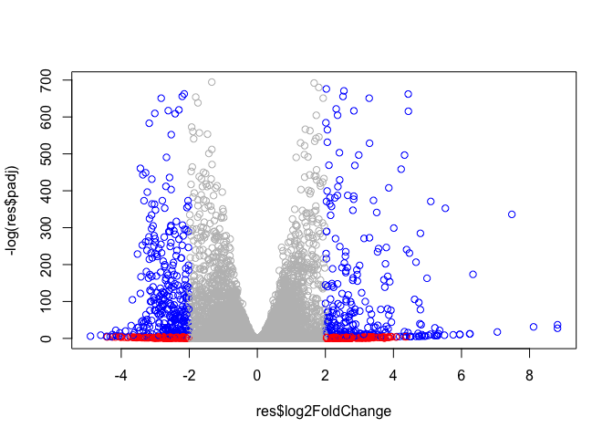

Pathway Analysis for RNA Seq Results
================

Section 1: Differential Expression Analysis
-------------------------------------------

The data for for hands-on session comes from GEO entry: GSE37704, which is associated with the following publication:

Trapnell C, Hendrickson DG, Sauvageau M, Goff L et al. “Differential analysis of gene regulation at transcript resolution with RNA-seq”. Nat Biotechnol 2013 Jan;31(1):46-53. PMID: 23222703

The authors report on differential analysis of lung fibroblasts in response to loss of the developmental transcription factor HOXA1. Their results and others indicate that HOXA1 is required for lung fibroblast and HeLa cell cycle progression. In particular their analysis show that *“loss of HOXA1 results in significant expression level changes in thousands of individual transcripts, along with isoform switching events in key regulators of the cell cycle”.* For our session we have used their Sailfish gene-level estimated counts and hence are restricted to protein-coding genes only.

``` r
library(DESeq2)
```

    ## Loading required package: S4Vectors

    ## Loading required package: stats4

    ## Loading required package: BiocGenerics

    ## Loading required package: parallel

    ## 
    ## Attaching package: 'BiocGenerics'

    ## The following objects are masked from 'package:parallel':
    ## 
    ##     clusterApply, clusterApplyLB, clusterCall, clusterEvalQ,
    ##     clusterExport, clusterMap, parApply, parCapply, parLapply,
    ##     parLapplyLB, parRapply, parSapply, parSapplyLB

    ## The following objects are masked from 'package:stats':
    ## 
    ##     IQR, mad, sd, var, xtabs

    ## The following objects are masked from 'package:base':
    ## 
    ##     anyDuplicated, append, as.data.frame, basename, cbind,
    ##     colMeans, colnames, colSums, dirname, do.call, duplicated,
    ##     eval, evalq, Filter, Find, get, grep, grepl, intersect,
    ##     is.unsorted, lapply, lengths, Map, mapply, match, mget, order,
    ##     paste, pmax, pmax.int, pmin, pmin.int, Position, rank, rbind,
    ##     Reduce, rowMeans, rownames, rowSums, sapply, setdiff, sort,
    ##     table, tapply, union, unique, unsplit, which, which.max,
    ##     which.min

    ## 
    ## Attaching package: 'S4Vectors'

    ## The following object is masked from 'package:base':
    ## 
    ##     expand.grid

    ## Loading required package: IRanges

    ## Loading required package: GenomicRanges

    ## Loading required package: GenomeInfoDb

    ## Loading required package: SummarizedExperiment

    ## Loading required package: Biobase

    ## Welcome to Bioconductor
    ## 
    ##     Vignettes contain introductory material; view with
    ##     'browseVignettes()'. To cite Bioconductor, see
    ##     'citation("Biobase")', and for packages 'citation("pkgname")'.

    ## Loading required package: DelayedArray

    ## Loading required package: matrixStats

    ## 
    ## Attaching package: 'matrixStats'

    ## The following objects are masked from 'package:Biobase':
    ## 
    ##     anyMissing, rowMedians

    ## Loading required package: BiocParallel

    ## 
    ## Attaching package: 'DelayedArray'

    ## The following objects are masked from 'package:matrixStats':
    ## 
    ##     colMaxs, colMins, colRanges, rowMaxs, rowMins, rowRanges

    ## The following objects are masked from 'package:base':
    ## 
    ##     aperm, apply

``` r
metaFile <- "data/GSE37704_metadata.csv"
countFile <- "data/GSE37704_featurecounts.csv"
```

``` r
colData = read.csv(metaFile, row.names = 1)
head(colData)
```

    ##               condition
    ## SRR493366 control_sirna
    ## SRR493367 control_sirna
    ## SRR493368 control_sirna
    ## SRR493369      hoxa1_kd
    ## SRR493370      hoxa1_kd
    ## SRR493371      hoxa1_kd

``` r
countData = read.csv(countFile, row.names = 1)
head(countData)
```

    ##                 length SRR493366 SRR493367 SRR493368 SRR493369 SRR493370
    ## ENSG00000186092    918         0         0         0         0         0
    ## ENSG00000279928    718         0         0         0         0         0
    ## ENSG00000279457   1982        23        28        29        29        28
    ## ENSG00000278566    939         0         0         0         0         0
    ## ENSG00000273547    939         0         0         0         0         0
    ## ENSG00000187634   3214       124       123       205       207       212
    ##                 SRR493371
    ## ENSG00000186092         0
    ## ENSG00000279928         0
    ## ENSG00000279457        46
    ## ENSG00000278566         0
    ## ENSG00000273547         0
    ## ENSG00000187634       258

``` r
# countData needs to match the first column in the colData. We need to remove the first $length col
countData <- as.matrix(countData[,-1])
# -1 excludes the first column. "Everything but column 1". Much cleaner than [,2:7] and is more reproducible.
head(countData)
```

    ##                 SRR493366 SRR493367 SRR493368 SRR493369 SRR493370
    ## ENSG00000186092         0         0         0         0         0
    ## ENSG00000279928         0         0         0         0         0
    ## ENSG00000279457        23        28        29        29        28
    ## ENSG00000278566         0         0         0         0         0
    ## ENSG00000273547         0         0         0         0         0
    ## ENSG00000187634       124       123       205       207       212
    ##                 SRR493371
    ## ENSG00000186092         0
    ## ENSG00000279928         0
    ## ENSG00000279457        46
    ## ENSG00000278566         0
    ## ENSG00000273547         0
    ## ENSG00000187634       258

Remove the zero entries

``` r
head(rowSums(countData) != 0)
```

    ## ENSG00000186092 ENSG00000279928 ENSG00000279457 ENSG00000278566 
    ##           FALSE           FALSE            TRUE           FALSE 
    ## ENSG00000273547 ENSG00000187634 
    ##           FALSE            TRUE

``` r
non.zero <- rowSums(countData) != 0
countData = countData[ non.zero, ]
head(countData)
```

    ##                 SRR493366 SRR493367 SRR493368 SRR493369 SRR493370
    ## ENSG00000279457        23        28        29        29        28
    ## ENSG00000187634       124       123       205       207       212
    ## ENSG00000188976      1637      1831      2383      1226      1326
    ## ENSG00000187961       120       153       180       236       255
    ## ENSG00000187583        24        48        65        44        48
    ## ENSG00000187642         4         9        16        14        16
    ##                 SRR493371
    ## ENSG00000279457        46
    ## ENSG00000187634       258
    ## ENSG00000188976      1504
    ## ENSG00000187961       357
    ## ENSG00000187583        64
    ## ENSG00000187642        16

``` r
nrow(countData)
```

    ## [1] 15975

We are working with `nrow(countData)` genes.

Running DESeq2
--------------

Setup the DESeqDataSet object required for the `DESeq()` function then run the DESeq pipeline

``` r
#First argument is defining the countData, second argument is defining the metaData, third argument ?
dds = DESeqDataSetFromMatrix(countData=countData,
                             colData=colData,
                             design=~condition)
dds = DESeq(dds)
```

    ## estimating size factors

    ## estimating dispersions

    ## gene-wise dispersion estimates

    ## mean-dispersion relationship

    ## final dispersion estimates

    ## fitting model and testing

Get the results

``` r
results(dds)
```

    ## log2 fold change (MLE): condition hoxa1 kd vs control sirna 
    ## Wald test p-value: condition hoxa1 kd vs control sirna 
    ## DataFrame with 15975 rows and 6 columns
    ##                         baseMean     log2FoldChange              lfcSE
    ##                        <numeric>          <numeric>          <numeric>
    ## ENSG00000279457 29.9135794276176  0.179257083507182  0.324821567384885
    ## ENSG00000187634 183.229649921658  0.426457118523753  0.140265821446798
    ## ENSG00000188976 1651.18807619944 -0.692720464805286 0.0548465422585101
    ## ENSG00000187961 209.637938486147  0.729755610539782  0.131859900943774
    ## ENSG00000187583 47.2551232589398 0.0405765280914035  0.271892810550752
    ## ...                          ...                ...                ...
    ## ENSG00000273748 35.3026523877463  0.674387102442895  0.303666189415791
    ## ENSG00000278817 2.42302393023632 -0.388988266824845   1.13039378429663
    ## ENSG00000278384 1.10179649846993  0.332990659157057    1.6602614319652
    ## ENSG00000276345 73.6449563127136 -0.356180759240918  0.207715659818896
    ## ENSG00000271254 181.595902546813  -0.60966654519814  0.141320483856522
    ##                               stat               pvalue
    ##                          <numeric>            <numeric>
    ## ENSG00000279457  0.551863242796248    0.581042053581228
    ## ENSG00000187634   3.04034948874202  0.00236303767254541
    ## ENSG00000188976  -12.6301574589746 1.43989822640707e-36
    ## ENSG00000187961   5.53432548725297 3.12428321585946e-08
    ## ENSG00000187583  0.149237223335221    0.881366448887056
    ## ...                            ...                  ...
    ## ENSG00000273748   2.22081721952752   0.0263633438026806
    ## ENSG00000278817 -0.344117485630803    0.730757933417009
    ## ENSG00000278384  0.200565195785406    0.841038574762714
    ## ENSG00000276345  -1.71475159625166   0.0863907793871932
    ## ENSG00000271254   -4.3140706043514 1.60275722566234e-05
    ##                                 padj
    ##                            <numeric>
    ## ENSG00000279457    0.686554781181763
    ## ENSG00000187634  0.00515718187738401
    ## ENSG00000188976 1.76549251753639e-35
    ## ENSG00000187961  1.1341301979147e-07
    ## ENSG00000187583    0.919030615798602
    ## ...                              ...
    ## ENSG00000273748   0.0479091197242794
    ## ENSG00000278817    0.809772072057368
    ## ENSG00000278384    0.892653532650506
    ## ENSG00000276345    0.139761504567338
    ## ENSG00000271254 4.53647704855225e-05

Next, get results for the HoxA1 knockdown versus control siRNA (remember that these were labeled as “hoxa1\_kd” and “control\_sirna” in our original colData metaFile input to DESeq, you can check this above and by running resultsNames(dds) command).

``` r
res = results(dds, contrast=c("condition", "hoxa1_kd", "control_sirna"))
```

If we want to find out how many genes make the default cutoff, call the `summary()` on res

``` r
summary(res)
```

    ## 
    ## out of 15975 with nonzero total read count
    ## adjusted p-value < 0.1
    ## LFC > 0 (up)       : 4349, 27%
    ## LFC < 0 (down)     : 4396, 28%
    ## outliers [1]       : 0, 0%
    ## low counts [2]     : 1237, 7.7%
    ## (mean count < 0)
    ## [1] see 'cooksCutoff' argument of ?results
    ## [2] see 'independentFiltering' argument of ?results

``` r
# We often work with a p-value < 0.05 or 0.01. Default is < 0.1 which is more liberal
# We often work with a log fold change of 2, default is 0
```

``` r
# Make a color vector for all genes
mycols <- rep("gray", nrow(res))

# Color red the genes with absolute fold change above 2
mycols[ abs(res$log2FoldChange) > 2 ] <- "red"

#Color blue those with adjusted p-value < 0.01 and absolute fold change more than 2

inds <- (res$padj < 0.01) & (abs(res$log2FoldChange) > 2)
mycols[inds] <- "blue"

plot( res$log2FoldChange, -log(res$padj), col = mycols)
```



Adding gene annotation
----------------------

``` r
library("AnnotationDbi")
library("org.Hs.eg.db")
```

    ## 

``` r
columns(org.Hs.eg.db)
```

    ##  [1] "ACCNUM"       "ALIAS"        "ENSEMBL"      "ENSEMBLPROT" 
    ##  [5] "ENSEMBLTRANS" "ENTREZID"     "ENZYME"       "EVIDENCE"    
    ##  [9] "EVIDENCEALL"  "GENENAME"     "GO"           "GOALL"       
    ## [13] "IPI"          "MAP"          "OMIM"         "ONTOLOGY"    
    ## [17] "ONTOLOGYALL"  "PATH"         "PFAM"         "PMID"        
    ## [21] "PROSITE"      "REFSEQ"       "SYMBOL"       "UCSCKG"      
    ## [25] "UNIGENE"      "UNIPROT"

``` r
res$symbol = mapIds(org.Hs.eg.db,
                    keys= row.names(res), 
                    keytype="ENSEMBL",
                    column="SYMBOL",
                    multiVals="first")
```

    ## 'select()' returned 1:many mapping between keys and columns

``` r
res$entrez = mapIds(org.Hs.eg.db,
                    keys= row.names(res),
                    keytype="ENSEMBL",
                    column="ENTREZID",
                    multiVals="first")
```

    ## 'select()' returned 1:many mapping between keys and columns

``` r
res$name =   mapIds(org.Hs.eg.db,
                    keys=row.names(res),
                    keytype="ENSEMBL",
                    column="GENENAME",
                    multiVals="first")
```

    ## 'select()' returned 1:many mapping between keys and columns

``` r
head(res)
```

    ## log2 fold change (MLE): condition hoxa1_kd vs control_sirna 
    ## Wald test p-value: condition hoxa1 kd vs control sirna 
    ## DataFrame with 6 rows and 9 columns
    ##                         baseMean     log2FoldChange              lfcSE
    ##                        <numeric>          <numeric>          <numeric>
    ## ENSG00000279457 29.9135794276176  0.179257083507182  0.324821567384885
    ## ENSG00000187634 183.229649921658  0.426457118523753  0.140265821446798
    ## ENSG00000188976 1651.18807619944 -0.692720464805286 0.0548465422585101
    ## ENSG00000187961 209.637938486147  0.729755610539782  0.131859900943774
    ## ENSG00000187583 47.2551232589398 0.0405765280914035  0.271892810550752
    ## ENSG00000187642 11.9797501642461  0.542810492083239  0.521559853002058
    ##                              stat               pvalue
    ##                         <numeric>            <numeric>
    ## ENSG00000279457 0.551863242796248    0.581042053581228
    ## ENSG00000187634  3.04034948874202  0.00236303767254541
    ## ENSG00000188976 -12.6301574589746 1.43989822640707e-36
    ## ENSG00000187961  5.53432548725297 3.12428321585946e-08
    ## ENSG00000187583 0.149237223335221    0.881366448887056
    ## ENSG00000187642  1.04074439195974    0.297994194483224
    ##                                 padj      symbol      entrez
    ##                            <numeric> <character> <character>
    ## ENSG00000279457    0.686554781181763          NA          NA
    ## ENSG00000187634  0.00515718187738401      SAMD11      148398
    ## ENSG00000188976 1.76549251753639e-35       NOC2L       26155
    ## ENSG00000187961  1.1341301979147e-07      KLHL17      339451
    ## ENSG00000187583    0.919030615798602     PLEKHN1       84069
    ## ENSG00000187642    0.403379315307624       PERM1       84808
    ##                                                                     name
    ##                                                              <character>
    ## ENSG00000279457                                                       NA
    ## ENSG00000187634                 sterile alpha motif domain containing 11
    ## ENSG00000188976 NOC2 like nucleolar associated transcriptional repressor
    ## ENSG00000187961                              kelch like family member 17
    ## ENSG00000187583                 pleckstrin homology domain containing N1
    ## ENSG00000187642             PPARGC1 and ESRR induced regulator, muscle 1

Reorder these results by adjusted p-value and save them to a CSV file in the current project director

``` r
res = res[order(res$pvalue),]
write.csv(res, file = "deseq_results.csv")
```

Section 2: Pathway Analysis
---------------------------

Load the packages and setup the KEGG data-sets

``` r
library(pathview)
```

    ## ##############################################################################
    ## Pathview is an open source software package distributed under GNU General
    ## Public License version 3 (GPLv3). Details of GPLv3 is available at
    ## http://www.gnu.org/licenses/gpl-3.0.html. Particullary, users are required to
    ## formally cite the original Pathview paper (not just mention it) in publications
    ## or products. For details, do citation("pathview") within R.
    ## 
    ## The pathview downloads and uses KEGG data. Non-academic uses may require a KEGG
    ## license agreement (details at http://www.kegg.jp/kegg/legal.html).
    ## ##############################################################################

``` r
library(gage)
library(gageData)
```

``` r
data("kegg.sets.hs")
data("sigmet.idx.hs")
```

Focus on signaling and metabolic pathways only

``` r
kegg.sets.hs = kegg.sets.hs[sigmet.idx.hs]
```

Examine the first 3 pathways

``` r
head(kegg.sets.hs, 3)
```

    ## $`hsa00232 Caffeine metabolism`
    ## [1] "10"   "1544" "1548" "1549" "1553" "7498" "9"   
    ## 
    ## $`hsa00983 Drug metabolism - other enzymes`
    ##  [1] "10"     "1066"   "10720"  "10941"  "151531" "1548"   "1549"  
    ##  [8] "1551"   "1553"   "1576"   "1577"   "1806"   "1807"   "1890"  
    ## [15] "221223" "2990"   "3251"   "3614"   "3615"   "3704"   "51733" 
    ## [22] "54490"  "54575"  "54576"  "54577"  "54578"  "54579"  "54600" 
    ## [29] "54657"  "54658"  "54659"  "54963"  "574537" "64816"  "7083"  
    ## [36] "7084"   "7172"   "7363"   "7364"   "7365"   "7366"   "7367"  
    ## [43] "7371"   "7372"   "7378"   "7498"   "79799"  "83549"  "8824"  
    ## [50] "8833"   "9"      "978"   
    ## 
    ## $`hsa00230 Purine metabolism`
    ##   [1] "100"    "10201"  "10606"  "10621"  "10622"  "10623"  "107"   
    ##   [8] "10714"  "108"    "10846"  "109"    "111"    "11128"  "11164" 
    ##  [15] "112"    "113"    "114"    "115"    "122481" "122622" "124583"
    ##  [22] "132"    "158"    "159"    "1633"   "171568" "1716"   "196883"
    ##  [29] "203"    "204"    "205"    "221823" "2272"   "22978"  "23649" 
    ##  [36] "246721" "25885"  "2618"   "26289"  "270"    "271"    "27115" 
    ##  [43] "272"    "2766"   "2977"   "2982"   "2983"   "2984"   "2986"  
    ##  [50] "2987"   "29922"  "3000"   "30833"  "30834"  "318"    "3251"  
    ##  [57] "353"    "3614"   "3615"   "3704"   "377841" "471"    "4830"  
    ##  [64] "4831"   "4832"   "4833"   "4860"   "4881"   "4882"   "4907"  
    ##  [71] "50484"  "50940"  "51082"  "51251"  "51292"  "5136"   "5137"  
    ##  [78] "5138"   "5139"   "5140"   "5141"   "5142"   "5143"   "5144"  
    ##  [85] "5145"   "5146"   "5147"   "5148"   "5149"   "5150"   "5151"  
    ##  [92] "5152"   "5153"   "5158"   "5167"   "5169"   "51728"  "5198"  
    ##  [99] "5236"   "5313"   "5315"   "53343"  "54107"  "5422"   "5424"  
    ## [106] "5425"   "5426"   "5427"   "5430"   "5431"   "5432"   "5433"  
    ## [113] "5434"   "5435"   "5436"   "5437"   "5438"   "5439"   "5440"  
    ## [120] "5441"   "5471"   "548644" "55276"  "5557"   "5558"   "55703" 
    ## [127] "55811"  "55821"  "5631"   "5634"   "56655"  "56953"  "56985" 
    ## [134] "57804"  "58497"  "6240"   "6241"   "64425"  "646625" "654364"
    ## [141] "661"    "7498"   "8382"   "84172"  "84265"  "84284"  "84618" 
    ## [148] "8622"   "8654"   "87178"  "8833"   "9060"   "9061"   "93034" 
    ## [155] "953"    "9533"   "954"    "955"    "956"    "957"    "9583"  
    ## [162] "9615"

Now we want to know if these things overlap with our things. We will use the `gage()` function to do this.

The `gage()` function requires a named vector of fold changes, where the names of the values are the Entrez gene IDs.

So we need to create a vector of fold changes with Entez gene ID names

``` r
foldchanges = res$log2FoldChange
names(foldchanges) = res$entrez
head(foldchanges)
```

    ##      1266     54855      1465     51232      2034      2317 
    ## -2.422719  3.201955 -2.313738 -2.059631 -1.888019 -1.649792

Now let's run the `gage` pathway analysis

You might want to try changing the value of same.dir. This value determines whether to test for changes in a gene set toward a single direction (all genes up or down regulated) or changes towards both directions simultaneously (i.e. any genes in the pathway dysregulated). Here, we’re using the default same.dir=TRUE, which will give us separate lists for pathways that are upregulated versus pathways that are down-regulated.

Now lets look at the object returned from `gage()`

``` r
keggres = gage(foldchanges, gsets = kegg.sets.hs)

attributes(keggres)
```

    ## $names
    ## [1] "greater" "less"    "stats"

Each `keggres$less` and `keggres$greater` object is data matrix with gene sets as rows sorted by p-value.

``` r
head(keggres$less)
```

    ##                                          p.geomean stat.mean        p.val
    ## hsa04110 Cell cycle                   8.995727e-06 -4.378644 8.995727e-06
    ## hsa03030 DNA replication              9.424076e-05 -3.951803 9.424076e-05
    ## hsa03013 RNA transport                1.375901e-03 -3.028500 1.375901e-03
    ## hsa03440 Homologous recombination     3.066756e-03 -2.852899 3.066756e-03
    ## hsa04114 Oocyte meiosis               3.784520e-03 -2.698128 3.784520e-03
    ## hsa00010 Glycolysis / Gluconeogenesis 8.961413e-03 -2.405398 8.961413e-03
    ##                                             q.val set.size         exp1
    ## hsa04110 Cell cycle                   0.001448312      121 8.995727e-06
    ## hsa03030 DNA replication              0.007586381       36 9.424076e-05
    ## hsa03013 RNA transport                0.073840037      144 1.375901e-03
    ## hsa03440 Homologous recombination     0.121861535       28 3.066756e-03
    ## hsa04114 Oocyte meiosis               0.121861535      102 3.784520e-03
    ## hsa00010 Glycolysis / Gluconeogenesis 0.212222694       53 8.961413e-03

The top “less/down” pathways is “Cell cycle” with the KEGG pathway identifier `hsa04110`

Now, let’s try out the `pathview()` function from the pathview package to make a pathway plot with our RNA-Seq expression results shown in color.

To begin with lets manually supply a pathway.id (namely the first part of the `"hsa04110 Cell cycle"`) that we could see from the print out above.

``` r
pathview(gene.data = foldchanges, pathway.id = "hsa04110")
```

    ## 'select()' returned 1:1 mapping between keys and columns

    ## Info: Working in directory /Users/HMorrisLittle/Desktop/BIMM143/bimm143_github/class16

    ## Info: Writing image file hsa04110.pathview.png

This downloads the pathway figure data from KEGG and adds our results to it.

How do we put this figure into our report?


Now, let’s process our results a bit more to automagicaly pull out the top 5 upregulated pathways, then further process that just to get the pathway IDs needed by the `pathview()` function. We’ll use these KEGG pathway IDs for pathview plotting below.

``` r
## Focus on top 5 upregulated pathways here for demo purposes only
keggrespathways <- rownames(keggres$greater)[1:5]

# Extract the 8 character long IDs part of each string
keggresids = substr(keggrespathways, start=1, stop=8)
keggresids
```

    ## [1] "hsa04640" "hsa04630" "hsa00140" "hsa04142" "hsa04330"

``` r
pathview(gene.data=foldchanges, pathway.id=keggresids, species="hsa")
```

    ## 'select()' returned 1:1 mapping between keys and columns

    ## Info: Working in directory /Users/HMorrisLittle/Desktop/BIMM143/bimm143_github/class16

    ## Info: Writing image file hsa04640.pathview.png

    ## 'select()' returned 1:1 mapping between keys and columns

    ## Info: Working in directory /Users/HMorrisLittle/Desktop/BIMM143/bimm143_github/class16

    ## Info: Writing image file hsa04630.pathview.png

    ## Warning in structure(x$children, class = "XMLNodeList"): Calling 'structure(NULL, *)' is deprecated, as NULL cannot have attributes.
    ##   Consider 'structure(list(), *)' instead.

    ## Warning in structure(x$children, class = "XMLNodeList"): Calling 'structure(NULL, *)' is deprecated, as NULL cannot have attributes.
    ##   Consider 'structure(list(), *)' instead.

    ## Warning in structure(x$children, class = "XMLNodeList"): Calling 'structure(NULL, *)' is deprecated, as NULL cannot have attributes.
    ##   Consider 'structure(list(), *)' instead.

    ## Warning in structure(x$children, class = "XMLNodeList"): Calling 'structure(NULL, *)' is deprecated, as NULL cannot have attributes.
    ##   Consider 'structure(list(), *)' instead.

    ## Warning in structure(x$children, class = "XMLNodeList"): Calling 'structure(NULL, *)' is deprecated, as NULL cannot have attributes.
    ##   Consider 'structure(list(), *)' instead.

    ## Warning in structure(x$children, class = "XMLNodeList"): Calling 'structure(NULL, *)' is deprecated, as NULL cannot have attributes.
    ##   Consider 'structure(list(), *)' instead.

    ## Warning in structure(x$children, class = "XMLNodeList"): Calling 'structure(NULL, *)' is deprecated, as NULL cannot have attributes.
    ##   Consider 'structure(list(), *)' instead.

    ## Warning in structure(x$children, class = "XMLNodeList"): Calling 'structure(NULL, *)' is deprecated, as NULL cannot have attributes.
    ##   Consider 'structure(list(), *)' instead.

    ## Warning in structure(x$children, class = "XMLNodeList"): Calling 'structure(NULL, *)' is deprecated, as NULL cannot have attributes.
    ##   Consider 'structure(list(), *)' instead.

    ## Warning in structure(x$children, class = "XMLNodeList"): Calling 'structure(NULL, *)' is deprecated, as NULL cannot have attributes.
    ##   Consider 'structure(list(), *)' instead.

    ## Warning in structure(x$children, class = "XMLNodeList"): Calling 'structure(NULL, *)' is deprecated, as NULL cannot have attributes.
    ##   Consider 'structure(list(), *)' instead.

    ## Warning in structure(x$children, class = "XMLNodeList"): Calling 'structure(NULL, *)' is deprecated, as NULL cannot have attributes.
    ##   Consider 'structure(list(), *)' instead.

    ## Warning in structure(x$children, class = "XMLNodeList"): Calling 'structure(NULL, *)' is deprecated, as NULL cannot have attributes.
    ##   Consider 'structure(list(), *)' instead.

    ## Warning in structure(x$children, class = "XMLNodeList"): Calling 'structure(NULL, *)' is deprecated, as NULL cannot have attributes.
    ##   Consider 'structure(list(), *)' instead.

    ## Warning in structure(x$children, class = "XMLNodeList"): Calling 'structure(NULL, *)' is deprecated, as NULL cannot have attributes.
    ##   Consider 'structure(list(), *)' instead.

    ## Warning in structure(x$children, class = "XMLNodeList"): Calling 'structure(NULL, *)' is deprecated, as NULL cannot have attributes.
    ##   Consider 'structure(list(), *)' instead.

    ## Warning in structure(x$children, class = "XMLNodeList"): Calling 'structure(NULL, *)' is deprecated, as NULL cannot have attributes.
    ##   Consider 'structure(list(), *)' instead.

    ## Warning in structure(x$children, class = "XMLNodeList"): Calling 'structure(NULL, *)' is deprecated, as NULL cannot have attributes.
    ##   Consider 'structure(list(), *)' instead.

    ## Warning in structure(x$children, class = "XMLNodeList"): Calling 'structure(NULL, *)' is deprecated, as NULL cannot have attributes.
    ##   Consider 'structure(list(), *)' instead.

    ## Warning in structure(x$children, class = "XMLNodeList"): Calling 'structure(NULL, *)' is deprecated, as NULL cannot have attributes.
    ##   Consider 'structure(list(), *)' instead.

    ## Warning in structure(x$children, class = "XMLNodeList"): Calling 'structure(NULL, *)' is deprecated, as NULL cannot have attributes.
    ##   Consider 'structure(list(), *)' instead.

    ## Warning in structure(x$children, class = "XMLNodeList"): Calling 'structure(NULL, *)' is deprecated, as NULL cannot have attributes.
    ##   Consider 'structure(list(), *)' instead.

    ## Warning in structure(x$children, class = "XMLNodeList"): Calling 'structure(NULL, *)' is deprecated, as NULL cannot have attributes.
    ##   Consider 'structure(list(), *)' instead.

    ## Warning in structure(x$children, class = "XMLNodeList"): Calling 'structure(NULL, *)' is deprecated, as NULL cannot have attributes.
    ##   Consider 'structure(list(), *)' instead.

    ## Warning in structure(x$children, class = "XMLNodeList"): Calling 'structure(NULL, *)' is deprecated, as NULL cannot have attributes.
    ##   Consider 'structure(list(), *)' instead.

    ## Warning in structure(x$children, class = "XMLNodeList"): Calling 'structure(NULL, *)' is deprecated, as NULL cannot have attributes.
    ##   Consider 'structure(list(), *)' instead.

    ## Warning in structure(x$children, class = "XMLNodeList"): Calling 'structure(NULL, *)' is deprecated, as NULL cannot have attributes.
    ##   Consider 'structure(list(), *)' instead.

    ## Warning in structure(x$children, class = "XMLNodeList"): Calling 'structure(NULL, *)' is deprecated, as NULL cannot have attributes.
    ##   Consider 'structure(list(), *)' instead.

    ## Warning in structure(x$children, class = "XMLNodeList"): Calling 'structure(NULL, *)' is deprecated, as NULL cannot have attributes.
    ##   Consider 'structure(list(), *)' instead.

    ## Warning in structure(x$children, class = "XMLNodeList"): Calling 'structure(NULL, *)' is deprecated, as NULL cannot have attributes.
    ##   Consider 'structure(list(), *)' instead.

    ## Warning in structure(x$children, class = "XMLNodeList"): Calling 'structure(NULL, *)' is deprecated, as NULL cannot have attributes.
    ##   Consider 'structure(list(), *)' instead.

    ## Warning in structure(x$children, class = "XMLNodeList"): Calling 'structure(NULL, *)' is deprecated, as NULL cannot have attributes.
    ##   Consider 'structure(list(), *)' instead.

    ## Warning in structure(x$children, class = "XMLNodeList"): Calling 'structure(NULL, *)' is deprecated, as NULL cannot have attributes.
    ##   Consider 'structure(list(), *)' instead.

    ## Warning in structure(x$children, class = "XMLNodeList"): Calling 'structure(NULL, *)' is deprecated, as NULL cannot have attributes.
    ##   Consider 'structure(list(), *)' instead.

    ## Warning in structure(x$children, class = "XMLNodeList"): Calling 'structure(NULL, *)' is deprecated, as NULL cannot have attributes.
    ##   Consider 'structure(list(), *)' instead.

    ## Warning in structure(x$children, class = "XMLNodeList"): Calling 'structure(NULL, *)' is deprecated, as NULL cannot have attributes.
    ##   Consider 'structure(list(), *)' instead.

    ## Warning in structure(x$children, class = "XMLNodeList"): Calling 'structure(NULL, *)' is deprecated, as NULL cannot have attributes.
    ##   Consider 'structure(list(), *)' instead.

    ## Warning in structure(x$children, class = "XMLNodeList"): Calling 'structure(NULL, *)' is deprecated, as NULL cannot have attributes.
    ##   Consider 'structure(list(), *)' instead.

    ## Warning in structure(x$children, class = "XMLNodeList"): Calling 'structure(NULL, *)' is deprecated, as NULL cannot have attributes.
    ##   Consider 'structure(list(), *)' instead.

    ## Warning in structure(x$children, class = "XMLNodeList"): Calling 'structure(NULL, *)' is deprecated, as NULL cannot have attributes.
    ##   Consider 'structure(list(), *)' instead.

    ## Warning in structure(x$children, class = "XMLNodeList"): Calling 'structure(NULL, *)' is deprecated, as NULL cannot have attributes.
    ##   Consider 'structure(list(), *)' instead.

    ## Warning in structure(x$children, class = "XMLNodeList"): Calling 'structure(NULL, *)' is deprecated, as NULL cannot have attributes.
    ##   Consider 'structure(list(), *)' instead.

    ## Warning in structure(x$children, class = "XMLNodeList"): Calling 'structure(NULL, *)' is deprecated, as NULL cannot have attributes.
    ##   Consider 'structure(list(), *)' instead.

    ## Warning in structure(x$children, class = "XMLNodeList"): Calling 'structure(NULL, *)' is deprecated, as NULL cannot have attributes.
    ##   Consider 'structure(list(), *)' instead.

    ## Warning in structure(x$children, class = "XMLNodeList"): Calling 'structure(NULL, *)' is deprecated, as NULL cannot have attributes.
    ##   Consider 'structure(list(), *)' instead.

    ## Warning in structure(x$children, class = "XMLNodeList"): Calling 'structure(NULL, *)' is deprecated, as NULL cannot have attributes.
    ##   Consider 'structure(list(), *)' instead.

    ## Warning in structure(x$children, class = "XMLNodeList"): Calling 'structure(NULL, *)' is deprecated, as NULL cannot have attributes.
    ##   Consider 'structure(list(), *)' instead.

    ## Warning in structure(x$children, class = "XMLNodeList"): Calling 'structure(NULL, *)' is deprecated, as NULL cannot have attributes.
    ##   Consider 'structure(list(), *)' instead.

    ## Warning in structure(x$children, class = "XMLNodeList"): Calling 'structure(NULL, *)' is deprecated, as NULL cannot have attributes.
    ##   Consider 'structure(list(), *)' instead.

    ## Warning in structure(x$children, class = "XMLNodeList"): Calling 'structure(NULL, *)' is deprecated, as NULL cannot have attributes.
    ##   Consider 'structure(list(), *)' instead.

    ## Warning in structure(x$children, class = "XMLNodeList"): Calling 'structure(NULL, *)' is deprecated, as NULL cannot have attributes.
    ##   Consider 'structure(list(), *)' instead.

    ## Warning in structure(x$children, class = "XMLNodeList"): Calling 'structure(NULL, *)' is deprecated, as NULL cannot have attributes.
    ##   Consider 'structure(list(), *)' instead.

    ## Warning in structure(x$children, class = "XMLNodeList"): Calling 'structure(NULL, *)' is deprecated, as NULL cannot have attributes.
    ##   Consider 'structure(list(), *)' instead.

    ## Warning in structure(x$children, class = "XMLNodeList"): Calling 'structure(NULL, *)' is deprecated, as NULL cannot have attributes.
    ##   Consider 'structure(list(), *)' instead.

    ## Warning in structure(x$children, class = "XMLNodeList"): Calling 'structure(NULL, *)' is deprecated, as NULL cannot have attributes.
    ##   Consider 'structure(list(), *)' instead.

    ## Warning in structure(x$children, class = "XMLNodeList"): Calling 'structure(NULL, *)' is deprecated, as NULL cannot have attributes.
    ##   Consider 'structure(list(), *)' instead.

    ## Warning in structure(x$children, class = "XMLNodeList"): Calling 'structure(NULL, *)' is deprecated, as NULL cannot have attributes.
    ##   Consider 'structure(list(), *)' instead.

    ## Warning in structure(x$children, class = "XMLNodeList"): Calling 'structure(NULL, *)' is deprecated, as NULL cannot have attributes.
    ##   Consider 'structure(list(), *)' instead.

    ## Warning in structure(x$children, class = "XMLNodeList"): Calling 'structure(NULL, *)' is deprecated, as NULL cannot have attributes.
    ##   Consider 'structure(list(), *)' instead.

    ## Warning in structure(x$children, class = "XMLNodeList"): Calling 'structure(NULL, *)' is deprecated, as NULL cannot have attributes.
    ##   Consider 'structure(list(), *)' instead.

    ## Warning in structure(x$children, class = "XMLNodeList"): Calling 'structure(NULL, *)' is deprecated, as NULL cannot have attributes.
    ##   Consider 'structure(list(), *)' instead.

    ## Warning in structure(x$children, class = "XMLNodeList"): Calling 'structure(NULL, *)' is deprecated, as NULL cannot have attributes.
    ##   Consider 'structure(list(), *)' instead.

    ## Warning in structure(x$children, class = "XMLNodeList"): Calling 'structure(NULL, *)' is deprecated, as NULL cannot have attributes.
    ##   Consider 'structure(list(), *)' instead.

    ## Warning in structure(x$children, class = "XMLNodeList"): Calling 'structure(NULL, *)' is deprecated, as NULL cannot have attributes.
    ##   Consider 'structure(list(), *)' instead.

    ## Warning in structure(x$children, class = "XMLNodeList"): Calling 'structure(NULL, *)' is deprecated, as NULL cannot have attributes.
    ##   Consider 'structure(list(), *)' instead.

    ## Warning in structure(x$children, class = "XMLNodeList"): Calling 'structure(NULL, *)' is deprecated, as NULL cannot have attributes.
    ##   Consider 'structure(list(), *)' instead.

    ## Warning in structure(x$children, class = "XMLNodeList"): Calling 'structure(NULL, *)' is deprecated, as NULL cannot have attributes.
    ##   Consider 'structure(list(), *)' instead.

    ## Warning in structure(x$children, class = "XMLNodeList"): Calling 'structure(NULL, *)' is deprecated, as NULL cannot have attributes.
    ##   Consider 'structure(list(), *)' instead.

    ## Warning in structure(x$children, class = "XMLNodeList"): Calling 'structure(NULL, *)' is deprecated, as NULL cannot have attributes.
    ##   Consider 'structure(list(), *)' instead.

    ## Warning in structure(x$children, class = "XMLNodeList"): Calling 'structure(NULL, *)' is deprecated, as NULL cannot have attributes.
    ##   Consider 'structure(list(), *)' instead.

    ## Warning in structure(x$children, class = "XMLNodeList"): Calling 'structure(NULL, *)' is deprecated, as NULL cannot have attributes.
    ##   Consider 'structure(list(), *)' instead.

    ## Warning in structure(x$children, class = "XMLNodeList"): Calling 'structure(NULL, *)' is deprecated, as NULL cannot have attributes.
    ##   Consider 'structure(list(), *)' instead.

    ## Warning in structure(x$children, class = "XMLNodeList"): Calling 'structure(NULL, *)' is deprecated, as NULL cannot have attributes.
    ##   Consider 'structure(list(), *)' instead.

    ## Warning in structure(x$children, class = "XMLNodeList"): Calling 'structure(NULL, *)' is deprecated, as NULL cannot have attributes.
    ##   Consider 'structure(list(), *)' instead.

    ## Warning in structure(x$children, class = "XMLNodeList"): Calling 'structure(NULL, *)' is deprecated, as NULL cannot have attributes.
    ##   Consider 'structure(list(), *)' instead.

    ## Warning in structure(x$children, class = "XMLNodeList"): Calling 'structure(NULL, *)' is deprecated, as NULL cannot have attributes.
    ##   Consider 'structure(list(), *)' instead.

    ## Warning in structure(x$children, class = "XMLNodeList"): Calling 'structure(NULL, *)' is deprecated, as NULL cannot have attributes.
    ##   Consider 'structure(list(), *)' instead.

    ## Warning in structure(x$children, class = "XMLNodeList"): Calling 'structure(NULL, *)' is deprecated, as NULL cannot have attributes.
    ##   Consider 'structure(list(), *)' instead.

    ## Warning in structure(x$children, class = "XMLNodeList"): Calling 'structure(NULL, *)' is deprecated, as NULL cannot have attributes.
    ##   Consider 'structure(list(), *)' instead.

    ## Warning in structure(x$children, class = "XMLNodeList"): Calling 'structure(NULL, *)' is deprecated, as NULL cannot have attributes.
    ##   Consider 'structure(list(), *)' instead.

    ## Warning in structure(x$children, class = "XMLNodeList"): Calling 'structure(NULL, *)' is deprecated, as NULL cannot have attributes.
    ##   Consider 'structure(list(), *)' instead.

    ## Warning in structure(x$children, class = "XMLNodeList"): Calling 'structure(NULL, *)' is deprecated, as NULL cannot have attributes.
    ##   Consider 'structure(list(), *)' instead.

    ## Warning in structure(x$children, class = "XMLNodeList"): Calling 'structure(NULL, *)' is deprecated, as NULL cannot have attributes.
    ##   Consider 'structure(list(), *)' instead.

    ## Warning in structure(x$children, class = "XMLNodeList"): Calling 'structure(NULL, *)' is deprecated, as NULL cannot have attributes.
    ##   Consider 'structure(list(), *)' instead.

    ## Warning in structure(x$children, class = "XMLNodeList"): Calling 'structure(NULL, *)' is deprecated, as NULL cannot have attributes.
    ##   Consider 'structure(list(), *)' instead.

    ## Warning in structure(x$children, class = "XMLNodeList"): Calling 'structure(NULL, *)' is deprecated, as NULL cannot have attributes.
    ##   Consider 'structure(list(), *)' instead.

    ## Warning in structure(x$children, class = "XMLNodeList"): Calling 'structure(NULL, *)' is deprecated, as NULL cannot have attributes.
    ##   Consider 'structure(list(), *)' instead.

    ## Warning in structure(x$children, class = "XMLNodeList"): Calling 'structure(NULL, *)' is deprecated, as NULL cannot have attributes.
    ##   Consider 'structure(list(), *)' instead.

    ## Warning in structure(x$children, class = "XMLNodeList"): Calling 'structure(NULL, *)' is deprecated, as NULL cannot have attributes.
    ##   Consider 'structure(list(), *)' instead.

    ## Warning in structure(x$children, class = "XMLNodeList"): Calling 'structure(NULL, *)' is deprecated, as NULL cannot have attributes.
    ##   Consider 'structure(list(), *)' instead.

    ## Warning in structure(x$children, class = "XMLNodeList"): Calling 'structure(NULL, *)' is deprecated, as NULL cannot have attributes.
    ##   Consider 'structure(list(), *)' instead.

    ## Warning in structure(x$children, class = "XMLNodeList"): Calling 'structure(NULL, *)' is deprecated, as NULL cannot have attributes.
    ##   Consider 'structure(list(), *)' instead.

    ## Warning in structure(x$children, class = "XMLNodeList"): Calling 'structure(NULL, *)' is deprecated, as NULL cannot have attributes.
    ##   Consider 'structure(list(), *)' instead.

    ## Warning in structure(x$children, class = "XMLNodeList"): Calling 'structure(NULL, *)' is deprecated, as NULL cannot have attributes.
    ##   Consider 'structure(list(), *)' instead.

    ## Warning in structure(x$children, class = "XMLNodeList"): Calling 'structure(NULL, *)' is deprecated, as NULL cannot have attributes.
    ##   Consider 'structure(list(), *)' instead.

    ## Warning in structure(x$children, class = "XMLNodeList"): Calling 'structure(NULL, *)' is deprecated, as NULL cannot have attributes.
    ##   Consider 'structure(list(), *)' instead.

    ## Warning in structure(x$children, class = "XMLNodeList"): Calling 'structure(NULL, *)' is deprecated, as NULL cannot have attributes.
    ##   Consider 'structure(list(), *)' instead.

    ## Warning in structure(x$children, class = "XMLNodeList"): Calling 'structure(NULL, *)' is deprecated, as NULL cannot have attributes.
    ##   Consider 'structure(list(), *)' instead.

    ## Warning in structure(x$children, class = "XMLNodeList"): Calling 'structure(NULL, *)' is deprecated, as NULL cannot have attributes.
    ##   Consider 'structure(list(), *)' instead.

    ## Warning in structure(x$children, class = "XMLNodeList"): Calling 'structure(NULL, *)' is deprecated, as NULL cannot have attributes.
    ##   Consider 'structure(list(), *)' instead.

    ## Warning in structure(x$children, class = "XMLNodeList"): Calling 'structure(NULL, *)' is deprecated, as NULL cannot have attributes.
    ##   Consider 'structure(list(), *)' instead.

    ## Warning in structure(x$children, class = "XMLNodeList"): Calling 'structure(NULL, *)' is deprecated, as NULL cannot have attributes.
    ##   Consider 'structure(list(), *)' instead.

    ## Warning in structure(x$children, class = "XMLNodeList"): Calling 'structure(NULL, *)' is deprecated, as NULL cannot have attributes.
    ##   Consider 'structure(list(), *)' instead.

    ## Warning in structure(x$children, class = "XMLNodeList"): Calling 'structure(NULL, *)' is deprecated, as NULL cannot have attributes.
    ##   Consider 'structure(list(), *)' instead.

    ## Warning in structure(x$children, class = "XMLNodeList"): Calling 'structure(NULL, *)' is deprecated, as NULL cannot have attributes.
    ##   Consider 'structure(list(), *)' instead.

    ## Warning in structure(x$children, class = "XMLNodeList"): Calling 'structure(NULL, *)' is deprecated, as NULL cannot have attributes.
    ##   Consider 'structure(list(), *)' instead.

    ## Warning in structure(x$children, class = "XMLNodeList"): Calling 'structure(NULL, *)' is deprecated, as NULL cannot have attributes.
    ##   Consider 'structure(list(), *)' instead.

    ## Warning in structure(x$children, class = "XMLNodeList"): Calling 'structure(NULL, *)' is deprecated, as NULL cannot have attributes.
    ##   Consider 'structure(list(), *)' instead.

    ## Warning in structure(x$children, class = "XMLNodeList"): Calling 'structure(NULL, *)' is deprecated, as NULL cannot have attributes.
    ##   Consider 'structure(list(), *)' instead.

    ## Warning in structure(x$children, class = "XMLNodeList"): Calling 'structure(NULL, *)' is deprecated, as NULL cannot have attributes.
    ##   Consider 'structure(list(), *)' instead.

    ## Warning in structure(x$children, class = "XMLNodeList"): Calling 'structure(NULL, *)' is deprecated, as NULL cannot have attributes.
    ##   Consider 'structure(list(), *)' instead.

    ## Warning in structure(x$children, class = "XMLNodeList"): Calling 'structure(NULL, *)' is deprecated, as NULL cannot have attributes.
    ##   Consider 'structure(list(), *)' instead.

    ## Warning in structure(x$children, class = "XMLNodeList"): Calling 'structure(NULL, *)' is deprecated, as NULL cannot have attributes.
    ##   Consider 'structure(list(), *)' instead.

    ## Warning in structure(x$children, class = "XMLNodeList"): Calling 'structure(NULL, *)' is deprecated, as NULL cannot have attributes.
    ##   Consider 'structure(list(), *)' instead.

    ## Warning in structure(x$children, class = "XMLNodeList"): Calling 'structure(NULL, *)' is deprecated, as NULL cannot have attributes.
    ##   Consider 'structure(list(), *)' instead.

    ## Warning in structure(x$children, class = "XMLNodeList"): Calling 'structure(NULL, *)' is deprecated, as NULL cannot have attributes.
    ##   Consider 'structure(list(), *)' instead.

    ## Warning in structure(x$children, class = "XMLNodeList"): Calling 'structure(NULL, *)' is deprecated, as NULL cannot have attributes.
    ##   Consider 'structure(list(), *)' instead.

    ## Warning in structure(x$children, class = "XMLNodeList"): Calling 'structure(NULL, *)' is deprecated, as NULL cannot have attributes.
    ##   Consider 'structure(list(), *)' instead.

    ## Warning in structure(x$children, class = "XMLNodeList"): Calling 'structure(NULL, *)' is deprecated, as NULL cannot have attributes.
    ##   Consider 'structure(list(), *)' instead.

    ## Warning in structure(x$children, class = "XMLNodeList"): Calling 'structure(NULL, *)' is deprecated, as NULL cannot have attributes.
    ##   Consider 'structure(list(), *)' instead.

    ## Warning in structure(x$children, class = "XMLNodeList"): Calling 'structure(NULL, *)' is deprecated, as NULL cannot have attributes.
    ##   Consider 'structure(list(), *)' instead.

    ## Warning in structure(x$children, class = "XMLNodeList"): Calling 'structure(NULL, *)' is deprecated, as NULL cannot have attributes.
    ##   Consider 'structure(list(), *)' instead.

    ## Warning in structure(x$children, class = "XMLNodeList"): Calling 'structure(NULL, *)' is deprecated, as NULL cannot have attributes.
    ##   Consider 'structure(list(), *)' instead.

    ## Warning in structure(x$children, class = "XMLNodeList"): Calling 'structure(NULL, *)' is deprecated, as NULL cannot have attributes.
    ##   Consider 'structure(list(), *)' instead.

    ## Warning in structure(x$children, class = "XMLNodeList"): Calling 'structure(NULL, *)' is deprecated, as NULL cannot have attributes.
    ##   Consider 'structure(list(), *)' instead.

    ## Warning in structure(x$children, class = "XMLNodeList"): Calling 'structure(NULL, *)' is deprecated, as NULL cannot have attributes.
    ##   Consider 'structure(list(), *)' instead.

    ## Warning in structure(x$children, class = "XMLNodeList"): Calling 'structure(NULL, *)' is deprecated, as NULL cannot have attributes.
    ##   Consider 'structure(list(), *)' instead.

    ## Warning in structure(x$children, class = "XMLNodeList"): Calling 'structure(NULL, *)' is deprecated, as NULL cannot have attributes.
    ##   Consider 'structure(list(), *)' instead.

    ## Warning in structure(x$children, class = "XMLNodeList"): Calling 'structure(NULL, *)' is deprecated, as NULL cannot have attributes.
    ##   Consider 'structure(list(), *)' instead.

    ## Warning in structure(x$children, class = "XMLNodeList"): Calling 'structure(NULL, *)' is deprecated, as NULL cannot have attributes.
    ##   Consider 'structure(list(), *)' instead.

    ## Warning in structure(x$children, class = "XMLNodeList"): Calling 'structure(NULL, *)' is deprecated, as NULL cannot have attributes.
    ##   Consider 'structure(list(), *)' instead.

    ## Warning in structure(x$children, class = "XMLNodeList"): Calling 'structure(NULL, *)' is deprecated, as NULL cannot have attributes.
    ##   Consider 'structure(list(), *)' instead.

    ## Warning in structure(x$children, class = "XMLNodeList"): Calling 'structure(NULL, *)' is deprecated, as NULL cannot have attributes.
    ##   Consider 'structure(list(), *)' instead.

    ## Warning in structure(x$children, class = "XMLNodeList"): Calling 'structure(NULL, *)' is deprecated, as NULL cannot have attributes.
    ##   Consider 'structure(list(), *)' instead.

    ## Warning in structure(x$children, class = "XMLNodeList"): Calling 'structure(NULL, *)' is deprecated, as NULL cannot have attributes.
    ##   Consider 'structure(list(), *)' instead.

    ## Warning in structure(x$children, class = "XMLNodeList"): Calling 'structure(NULL, *)' is deprecated, as NULL cannot have attributes.
    ##   Consider 'structure(list(), *)' instead.

    ## Warning in structure(x$children, class = "XMLNodeList"): Calling 'structure(NULL, *)' is deprecated, as NULL cannot have attributes.
    ##   Consider 'structure(list(), *)' instead.

    ## Warning in structure(x$children, class = "XMLNodeList"): Calling 'structure(NULL, *)' is deprecated, as NULL cannot have attributes.
    ##   Consider 'structure(list(), *)' instead.

    ## Warning in structure(x$children, class = "XMLNodeList"): Calling 'structure(NULL, *)' is deprecated, as NULL cannot have attributes.
    ##   Consider 'structure(list(), *)' instead.

    ## Warning in structure(x$children, class = "XMLNodeList"): Calling 'structure(NULL, *)' is deprecated, as NULL cannot have attributes.
    ##   Consider 'structure(list(), *)' instead.

    ## Warning in structure(x$children, class = "XMLNodeList"): Calling 'structure(NULL, *)' is deprecated, as NULL cannot have attributes.
    ##   Consider 'structure(list(), *)' instead.

    ## Warning in structure(x$children, class = "XMLNodeList"): Calling 'structure(NULL, *)' is deprecated, as NULL cannot have attributes.
    ##   Consider 'structure(list(), *)' instead.

    ## Warning in structure(x$children, class = "XMLNodeList"): Calling 'structure(NULL, *)' is deprecated, as NULL cannot have attributes.
    ##   Consider 'structure(list(), *)' instead.

    ## Warning in structure(x$children, class = "XMLNodeList"): Calling 'structure(NULL, *)' is deprecated, as NULL cannot have attributes.
    ##   Consider 'structure(list(), *)' instead.

    ## Warning in structure(x$children, class = "XMLNodeList"): Calling 'structure(NULL, *)' is deprecated, as NULL cannot have attributes.
    ##   Consider 'structure(list(), *)' instead.

    ## Warning in structure(x$children, class = "XMLNodeList"): Calling 'structure(NULL, *)' is deprecated, as NULL cannot have attributes.
    ##   Consider 'structure(list(), *)' instead.

    ## Warning in structure(x$children, class = "XMLNodeList"): Calling 'structure(NULL, *)' is deprecated, as NULL cannot have attributes.
    ##   Consider 'structure(list(), *)' instead.

    ## Warning in structure(x$children, class = "XMLNodeList"): Calling 'structure(NULL, *)' is deprecated, as NULL cannot have attributes.
    ##   Consider 'structure(list(), *)' instead.

    ## Warning in structure(x$children, class = "XMLNodeList"): Calling 'structure(NULL, *)' is deprecated, as NULL cannot have attributes.
    ##   Consider 'structure(list(), *)' instead.

    ## Warning in structure(x$children, class = "XMLNodeList"): Calling 'structure(NULL, *)' is deprecated, as NULL cannot have attributes.
    ##   Consider 'structure(list(), *)' instead.

    ## Warning in structure(x$children, class = "XMLNodeList"): Calling 'structure(NULL, *)' is deprecated, as NULL cannot have attributes.
    ##   Consider 'structure(list(), *)' instead.

    ## Warning in structure(x$children, class = "XMLNodeList"): Calling 'structure(NULL, *)' is deprecated, as NULL cannot have attributes.
    ##   Consider 'structure(list(), *)' instead.

    ## Warning in structure(x$children, class = "XMLNodeList"): Calling 'structure(NULL, *)' is deprecated, as NULL cannot have attributes.
    ##   Consider 'structure(list(), *)' instead.

    ## Warning in structure(x$children, class = "XMLNodeList"): Calling 'structure(NULL, *)' is deprecated, as NULL cannot have attributes.
    ##   Consider 'structure(list(), *)' instead.

    ## Warning in structure(x$children, class = "XMLNodeList"): Calling 'structure(NULL, *)' is deprecated, as NULL cannot have attributes.
    ##   Consider 'structure(list(), *)' instead.

    ## Warning in structure(x$children, class = "XMLNodeList"): Calling 'structure(NULL, *)' is deprecated, as NULL cannot have attributes.
    ##   Consider 'structure(list(), *)' instead.

    ## Warning in structure(x$children, class = "XMLNodeList"): Calling 'structure(NULL, *)' is deprecated, as NULL cannot have attributes.
    ##   Consider 'structure(list(), *)' instead.

    ## Warning in structure(x$children, class = "XMLNodeList"): Calling 'structure(NULL, *)' is deprecated, as NULL cannot have attributes.
    ##   Consider 'structure(list(), *)' instead.

    ## Warning in structure(x$children, class = "XMLNodeList"): Calling 'structure(NULL, *)' is deprecated, as NULL cannot have attributes.
    ##   Consider 'structure(list(), *)' instead.

    ## Warning in structure(x$children, class = "XMLNodeList"): Calling 'structure(NULL, *)' is deprecated, as NULL cannot have attributes.
    ##   Consider 'structure(list(), *)' instead.

    ## Warning in structure(x$children, class = "XMLNodeList"): Calling 'structure(NULL, *)' is deprecated, as NULL cannot have attributes.
    ##   Consider 'structure(list(), *)' instead.

    ## Warning in structure(x$children, class = "XMLNodeList"): Calling 'structure(NULL, *)' is deprecated, as NULL cannot have attributes.
    ##   Consider 'structure(list(), *)' instead.

    ## Warning in structure(x$children, class = "XMLNodeList"): Calling 'structure(NULL, *)' is deprecated, as NULL cannot have attributes.
    ##   Consider 'structure(list(), *)' instead.

    ## Warning in structure(x$children, class = "XMLNodeList"): Calling 'structure(NULL, *)' is deprecated, as NULL cannot have attributes.
    ##   Consider 'structure(list(), *)' instead.

    ## Warning in structure(x$children, class = "XMLNodeList"): Calling 'structure(NULL, *)' is deprecated, as NULL cannot have attributes.
    ##   Consider 'structure(list(), *)' instead.

    ## Warning in structure(x$children, class = "XMLNodeList"): Calling 'structure(NULL, *)' is deprecated, as NULL cannot have attributes.
    ##   Consider 'structure(list(), *)' instead.

    ## Warning in structure(x$children, class = "XMLNodeList"): Calling 'structure(NULL, *)' is deprecated, as NULL cannot have attributes.
    ##   Consider 'structure(list(), *)' instead.

    ## Warning in structure(x$children, class = "XMLNodeList"): Calling 'structure(NULL, *)' is deprecated, as NULL cannot have attributes.
    ##   Consider 'structure(list(), *)' instead.

    ## Warning in structure(x$children, class = "XMLNodeList"): Calling 'structure(NULL, *)' is deprecated, as NULL cannot have attributes.
    ##   Consider 'structure(list(), *)' instead.

    ## Warning in structure(x$children, class = "XMLNodeList"): Calling 'structure(NULL, *)' is deprecated, as NULL cannot have attributes.
    ##   Consider 'structure(list(), *)' instead.

    ## Warning in structure(x$children, class = "XMLNodeList"): Calling 'structure(NULL, *)' is deprecated, as NULL cannot have attributes.
    ##   Consider 'structure(list(), *)' instead.

    ## Warning in structure(x$children, class = "XMLNodeList"): Calling 'structure(NULL, *)' is deprecated, as NULL cannot have attributes.
    ##   Consider 'structure(list(), *)' instead.

    ## Warning in structure(x$children, class = "XMLNodeList"): Calling 'structure(NULL, *)' is deprecated, as NULL cannot have attributes.
    ##   Consider 'structure(list(), *)' instead.

    ## Warning in structure(x$children, class = "XMLNodeList"): Calling 'structure(NULL, *)' is deprecated, as NULL cannot have attributes.
    ##   Consider 'structure(list(), *)' instead.

    ## Warning in structure(x$children, class = "XMLNodeList"): Calling 'structure(NULL, *)' is deprecated, as NULL cannot have attributes.
    ##   Consider 'structure(list(), *)' instead.

    ## Warning in structure(x$children, class = "XMLNodeList"): Calling 'structure(NULL, *)' is deprecated, as NULL cannot have attributes.
    ##   Consider 'structure(list(), *)' instead.

    ## Warning in structure(x$children, class = "XMLNodeList"): Calling 'structure(NULL, *)' is deprecated, as NULL cannot have attributes.
    ##   Consider 'structure(list(), *)' instead.

    ## Warning in structure(x$children, class = "XMLNodeList"): Calling 'structure(NULL, *)' is deprecated, as NULL cannot have attributes.
    ##   Consider 'structure(list(), *)' instead.

    ## Warning in structure(x$children, class = "XMLNodeList"): Calling 'structure(NULL, *)' is deprecated, as NULL cannot have attributes.
    ##   Consider 'structure(list(), *)' instead.

    ## Warning in structure(x$children, class = "XMLNodeList"): Calling 'structure(NULL, *)' is deprecated, as NULL cannot have attributes.
    ##   Consider 'structure(list(), *)' instead.

    ## Warning in structure(x$children, class = "XMLNodeList"): Calling 'structure(NULL, *)' is deprecated, as NULL cannot have attributes.
    ##   Consider 'structure(list(), *)' instead.

    ## Warning in structure(x$children, class = "XMLNodeList"): Calling 'structure(NULL, *)' is deprecated, as NULL cannot have attributes.
    ##   Consider 'structure(list(), *)' instead.

    ## Warning in structure(x$children, class = "XMLNodeList"): Calling 'structure(NULL, *)' is deprecated, as NULL cannot have attributes.
    ##   Consider 'structure(list(), *)' instead.

    ## Warning in structure(x$children, class = "XMLNodeList"): Calling 'structure(NULL, *)' is deprecated, as NULL cannot have attributes.
    ##   Consider 'structure(list(), *)' instead.

    ## Warning in structure(x$children, class = "XMLNodeList"): Calling 'structure(NULL, *)' is deprecated, as NULL cannot have attributes.
    ##   Consider 'structure(list(), *)' instead.

    ## Warning in structure(x$children, class = "XMLNodeList"): Calling 'structure(NULL, *)' is deprecated, as NULL cannot have attributes.
    ##   Consider 'structure(list(), *)' instead.

    ## Warning in structure(x$children, class = "XMLNodeList"): Calling 'structure(NULL, *)' is deprecated, as NULL cannot have attributes.
    ##   Consider 'structure(list(), *)' instead.

    ## Warning in structure(x$children, class = "XMLNodeList"): Calling 'structure(NULL, *)' is deprecated, as NULL cannot have attributes.
    ##   Consider 'structure(list(), *)' instead.

    ## Warning in structure(x$children, class = "XMLNodeList"): Calling 'structure(NULL, *)' is deprecated, as NULL cannot have attributes.
    ##   Consider 'structure(list(), *)' instead.

    ## Warning in structure(x$children, class = "XMLNodeList"): Calling 'structure(NULL, *)' is deprecated, as NULL cannot have attributes.
    ##   Consider 'structure(list(), *)' instead.

    ## Warning in structure(x$children, class = "XMLNodeList"): Calling 'structure(NULL, *)' is deprecated, as NULL cannot have attributes.
    ##   Consider 'structure(list(), *)' instead.

    ## Warning in structure(x$children, class = "XMLNodeList"): Calling 'structure(NULL, *)' is deprecated, as NULL cannot have attributes.
    ##   Consider 'structure(list(), *)' instead.

    ## Warning in structure(x$children, class = "XMLNodeList"): Calling 'structure(NULL, *)' is deprecated, as NULL cannot have attributes.
    ##   Consider 'structure(list(), *)' instead.

    ## Warning in structure(x$children, class = "XMLNodeList"): Calling 'structure(NULL, *)' is deprecated, as NULL cannot have attributes.
    ##   Consider 'structure(list(), *)' instead.

    ## Warning in structure(x$children, class = "XMLNodeList"): Calling 'structure(NULL, *)' is deprecated, as NULL cannot have attributes.
    ##   Consider 'structure(list(), *)' instead.

    ## Warning in structure(x$children, class = "XMLNodeList"): Calling 'structure(NULL, *)' is deprecated, as NULL cannot have attributes.
    ##   Consider 'structure(list(), *)' instead.

    ## Warning in structure(x$children, class = "XMLNodeList"): Calling 'structure(NULL, *)' is deprecated, as NULL cannot have attributes.
    ##   Consider 'structure(list(), *)' instead.

    ## Warning in structure(x$children, class = "XMLNodeList"): Calling 'structure(NULL, *)' is deprecated, as NULL cannot have attributes.
    ##   Consider 'structure(list(), *)' instead.

    ## Warning in structure(x$children, class = "XMLNodeList"): Calling 'structure(NULL, *)' is deprecated, as NULL cannot have attributes.
    ##   Consider 'structure(list(), *)' instead.

    ## Warning in structure(x$children, class = "XMLNodeList"): Calling 'structure(NULL, *)' is deprecated, as NULL cannot have attributes.
    ##   Consider 'structure(list(), *)' instead.

    ## Warning in structure(x$children, class = "XMLNodeList"): Calling 'structure(NULL, *)' is deprecated, as NULL cannot have attributes.
    ##   Consider 'structure(list(), *)' instead.

    ## Warning in structure(x$children, class = "XMLNodeList"): Calling 'structure(NULL, *)' is deprecated, as NULL cannot have attributes.
    ##   Consider 'structure(list(), *)' instead.

    ## Warning in structure(x$children, class = "XMLNodeList"): Calling 'structure(NULL, *)' is deprecated, as NULL cannot have attributes.
    ##   Consider 'structure(list(), *)' instead.

    ## Warning in structure(x$children, class = "XMLNodeList"): Calling 'structure(NULL, *)' is deprecated, as NULL cannot have attributes.
    ##   Consider 'structure(list(), *)' instead.

    ## Warning in structure(x$children, class = "XMLNodeList"): Calling 'structure(NULL, *)' is deprecated, as NULL cannot have attributes.
    ##   Consider 'structure(list(), *)' instead.

    ## Warning in structure(x$children, class = "XMLNodeList"): Calling 'structure(NULL, *)' is deprecated, as NULL cannot have attributes.
    ##   Consider 'structure(list(), *)' instead.

    ## Warning in structure(x$children, class = "XMLNodeList"): Calling 'structure(NULL, *)' is deprecated, as NULL cannot have attributes.
    ##   Consider 'structure(list(), *)' instead.

    ## Warning in structure(x$children, class = "XMLNodeList"): Calling 'structure(NULL, *)' is deprecated, as NULL cannot have attributes.
    ##   Consider 'structure(list(), *)' instead.

    ## Warning in structure(x$children, class = "XMLNodeList"): Calling 'structure(NULL, *)' is deprecated, as NULL cannot have attributes.
    ##   Consider 'structure(list(), *)' instead.

    ## Warning in structure(x$children, class = "XMLNodeList"): Calling 'structure(NULL, *)' is deprecated, as NULL cannot have attributes.
    ##   Consider 'structure(list(), *)' instead.

    ## Warning in structure(x$children, class = "XMLNodeList"): Calling 'structure(NULL, *)' is deprecated, as NULL cannot have attributes.
    ##   Consider 'structure(list(), *)' instead.

    ## Warning in structure(x$children, class = "XMLNodeList"): Calling 'structure(NULL, *)' is deprecated, as NULL cannot have attributes.
    ##   Consider 'structure(list(), *)' instead.

    ## Warning in structure(x$children, class = "XMLNodeList"): Calling 'structure(NULL, *)' is deprecated, as NULL cannot have attributes.
    ##   Consider 'structure(list(), *)' instead.

    ## Warning in structure(x$children, class = "XMLNodeList"): Calling 'structure(NULL, *)' is deprecated, as NULL cannot have attributes.
    ##   Consider 'structure(list(), *)' instead.

    ## Warning in structure(x$children, class = "XMLNodeList"): Calling 'structure(NULL, *)' is deprecated, as NULL cannot have attributes.
    ##   Consider 'structure(list(), *)' instead.

    ## Warning in structure(x$children, class = "XMLNodeList"): Calling 'structure(NULL, *)' is deprecated, as NULL cannot have attributes.
    ##   Consider 'structure(list(), *)' instead.

    ## Warning in structure(x$children, class = "XMLNodeList"): Calling 'structure(NULL, *)' is deprecated, as NULL cannot have attributes.
    ##   Consider 'structure(list(), *)' instead.

    ## Warning in structure(x$children, class = "XMLNodeList"): Calling 'structure(NULL, *)' is deprecated, as NULL cannot have attributes.
    ##   Consider 'structure(list(), *)' instead.

    ## Warning in structure(x$children, class = "XMLNodeList"): Calling 'structure(NULL, *)' is deprecated, as NULL cannot have attributes.
    ##   Consider 'structure(list(), *)' instead.

    ## Warning in structure(x$children, class = "XMLNodeList"): Calling 'structure(NULL, *)' is deprecated, as NULL cannot have attributes.
    ##   Consider 'structure(list(), *)' instead.

    ## Warning in structure(x$children, class = "XMLNodeList"): Calling 'structure(NULL, *)' is deprecated, as NULL cannot have attributes.
    ##   Consider 'structure(list(), *)' instead.

    ## Warning in structure(x$children, class = "XMLNodeList"): Calling 'structure(NULL, *)' is deprecated, as NULL cannot have attributes.
    ##   Consider 'structure(list(), *)' instead.

    ## Warning in structure(x$children, class = "XMLNodeList"): Calling 'structure(NULL, *)' is deprecated, as NULL cannot have attributes.
    ##   Consider 'structure(list(), *)' instead.

    ## Warning in structure(x$children, class = "XMLNodeList"): Calling 'structure(NULL, *)' is deprecated, as NULL cannot have attributes.
    ##   Consider 'structure(list(), *)' instead.

    ## Warning in structure(x$children, class = "XMLNodeList"): Calling 'structure(NULL, *)' is deprecated, as NULL cannot have attributes.
    ##   Consider 'structure(list(), *)' instead.

    ## Warning in structure(x$children, class = "XMLNodeList"): Calling 'structure(NULL, *)' is deprecated, as NULL cannot have attributes.
    ##   Consider 'structure(list(), *)' instead.

    ## Warning in structure(x$children, class = "XMLNodeList"): Calling 'structure(NULL, *)' is deprecated, as NULL cannot have attributes.
    ##   Consider 'structure(list(), *)' instead.

    ## Warning in structure(x$children, class = "XMLNodeList"): Calling 'structure(NULL, *)' is deprecated, as NULL cannot have attributes.
    ##   Consider 'structure(list(), *)' instead.

    ## Warning in structure(x$children, class = "XMLNodeList"): Calling 'structure(NULL, *)' is deprecated, as NULL cannot have attributes.
    ##   Consider 'structure(list(), *)' instead.

    ## Warning in structure(x$children, class = "XMLNodeList"): Calling 'structure(NULL, *)' is deprecated, as NULL cannot have attributes.
    ##   Consider 'structure(list(), *)' instead.

    ## 'select()' returned 1:1 mapping between keys and columns

    ## Info: Working in directory /Users/HMorrisLittle/Desktop/BIMM143/bimm143_github/class16

    ## Info: Writing image file hsa00140.pathview.png

    ## 'select()' returned 1:1 mapping between keys and columns

    ## Info: Working in directory /Users/HMorrisLittle/Desktop/BIMM143/bimm143_github/class16

    ## Info: Writing image file hsa04142.pathview.png

    ## Info: some node width is different from others, and hence adjusted!

    ## 'select()' returned 1:1 mapping between keys and columns

    ## Info: Working in directory /Users/HMorrisLittle/Desktop/BIMM143/bimm143_github/class16

    ## Info: Writing image file hsa04330.pathview.png

    

Section 3: Gene Ontology (GO)
-----------------------------

We can also do a similar procedure with gene ontology. Similar to above, `go.sets.hs` has all GO terms. `go.subs.hs` is a named list containing indexes for the BP, CC, and MF ontologies. Let’s focus on BP (a.k.a Biological Process)

``` r
data(go.sets.hs)
data(go.subs.hs)

# Focus on Biological Process subset of GO
gobpsets = go.sets.hs[go.subs.hs$BP]

gobpres = gage(foldchanges, gsets=gobpsets, same.dir=TRUE)

lapply(gobpres, head)
```

    ## $greater
    ##                                              p.geomean stat.mean
    ## GO:0007156 homophilic cell adhesion       8.519724e-05  3.824205
    ## GO:0002009 morphogenesis of an epithelium 1.396681e-04  3.653886
    ## GO:0048729 tissue morphogenesis           1.432451e-04  3.643242
    ## GO:0007610 behavior                       2.390838e-04  3.507233
    ## GO:0060562 epithelial tube morphogenesis  5.932837e-04  3.261376
    ## GO:0035295 tube development               5.953254e-04  3.253665
    ##                                                  p.val     q.val set.size
    ## GO:0007156 homophilic cell adhesion       8.519724e-05 0.1951953      113
    ## GO:0002009 morphogenesis of an epithelium 1.396681e-04 0.1951953      339
    ## GO:0048729 tissue morphogenesis           1.432451e-04 0.1951953      424
    ## GO:0007610 behavior                       2.390838e-04 0.2443437      428
    ## GO:0060562 epithelial tube morphogenesis  5.932837e-04 0.3711390      257
    ## GO:0035295 tube development               5.953254e-04 0.3711390      391
    ##                                                   exp1
    ## GO:0007156 homophilic cell adhesion       8.519724e-05
    ## GO:0002009 morphogenesis of an epithelium 1.396681e-04
    ## GO:0048729 tissue morphogenesis           1.432451e-04
    ## GO:0007610 behavior                       2.390838e-04
    ## GO:0060562 epithelial tube morphogenesis  5.932837e-04
    ## GO:0035295 tube development               5.953254e-04
    ## 
    ## $less
    ##                                             p.geomean stat.mean
    ## GO:0048285 organelle fission             1.661796e-15 -8.053464
    ## GO:0000280 nuclear division              4.640583e-15 -7.928483
    ## GO:0007067 mitosis                       4.640583e-15 -7.928483
    ## GO:0000087 M phase of mitotic cell cycle 1.262556e-14 -7.787048
    ## GO:0007059 chromosome segregation        2.028624e-11 -6.878340
    ## GO:0000236 mitotic prometaphase          2.025795e-10 -6.666757
    ##                                                 p.val        q.val
    ## GO:0048285 organelle fission             1.661796e-15 6.323567e-12
    ## GO:0000280 nuclear division              4.640583e-15 6.323567e-12
    ## GO:0007067 mitosis                       4.640583e-15 6.323567e-12
    ## GO:0000087 M phase of mitotic cell cycle 1.262556e-14 1.290333e-11
    ## GO:0007059 chromosome segregation        2.028624e-11 1.658603e-08
    ## GO:0000236 mitotic prometaphase          2.025795e-10 1.271109e-07
    ##                                          set.size         exp1
    ## GO:0048285 organelle fission                  376 1.661796e-15
    ## GO:0000280 nuclear division                   352 4.640583e-15
    ## GO:0007067 mitosis                            352 4.640583e-15
    ## GO:0000087 M phase of mitotic cell cycle      362 1.262556e-14
    ## GO:0007059 chromosome segregation             142 2.028624e-11
    ## GO:0000236 mitotic prometaphase                84 2.025795e-10
    ## 
    ## $stats
    ##                                           stat.mean     exp1
    ## GO:0007156 homophilic cell adhesion        3.824205 3.824205
    ## GO:0002009 morphogenesis of an epithelium  3.653886 3.653886
    ## GO:0048729 tissue morphogenesis            3.643242 3.643242
    ## GO:0007610 behavior                        3.507233 3.507233
    ## GO:0060562 epithelial tube morphogenesis   3.261376 3.261376
    ## GO:0035295 tube development                3.253665 3.253665

``` r
head(gobpres$less)
```

    ##                                             p.geomean stat.mean
    ## GO:0048285 organelle fission             1.661796e-15 -8.053464
    ## GO:0000280 nuclear division              4.640583e-15 -7.928483
    ## GO:0007067 mitosis                       4.640583e-15 -7.928483
    ## GO:0000087 M phase of mitotic cell cycle 1.262556e-14 -7.787048
    ## GO:0007059 chromosome segregation        2.028624e-11 -6.878340
    ## GO:0000236 mitotic prometaphase          2.025795e-10 -6.666757
    ##                                                 p.val        q.val
    ## GO:0048285 organelle fission             1.661796e-15 6.323567e-12
    ## GO:0000280 nuclear division              4.640583e-15 6.323567e-12
    ## GO:0007067 mitosis                       4.640583e-15 6.323567e-12
    ## GO:0000087 M phase of mitotic cell cycle 1.262556e-14 1.290333e-11
    ## GO:0007059 chromosome segregation        2.028624e-11 1.658603e-08
    ## GO:0000236 mitotic prometaphase          2.025795e-10 1.271109e-07
    ##                                          set.size         exp1
    ## GO:0048285 organelle fission                  376 1.661796e-15
    ## GO:0000280 nuclear division                   352 4.640583e-15
    ## GO:0007067 mitosis                            352 4.640583e-15
    ## GO:0000087 M phase of mitotic cell cycle      362 1.262556e-14
    ## GO:0007059 chromosome segregation             142 2.028624e-11
    ## GO:0000236 mitotic prometaphase                84 2.025795e-10

GO has given us different information than KEGG analysis

Section 4: Reactome Analysis
----------------------------

Online Reactome setup
=====================

``` r
sig_genes <- res[res$padj <= 0.05 & !is.na(res$padj), "symbol"]
print(paste("Total number of significant genes:", length(sig_genes)))
```

    ## [1] "Total number of significant genes: 8147"

``` r
write.table(sig_genes, file="significant_genes.txt", row.names=FALSE, col.names=FALSE, quote=FALSE)
```

We will use this file *significant\_genes.txt* to analyze our data online with Reactome.
