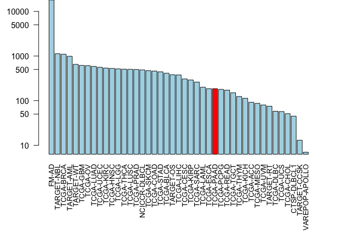
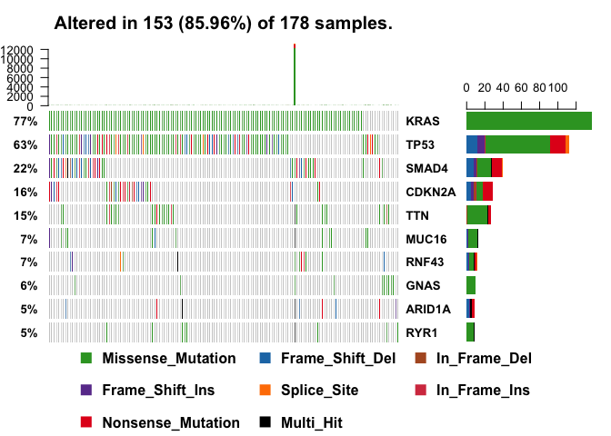
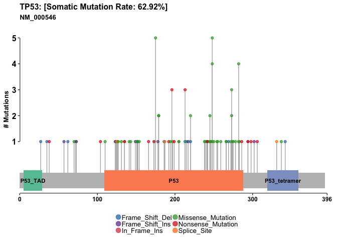

Cancer Genomics
================

Section 2: The GenomicDataCommons R package
-------------------------------------------

The GenomicDataCommons Bioconductor package provides functions for querying, accessing, and mining the NCI-GDC in R. Using this package allows us to couple large cancer genomics data sets (for example the actual RNA-Seq, WXS or SNP data) directly to the plethora of state-of-the-art bioinformatics methods available in R. This is important because it greatly facilitates both targeted and exploratory analysis of molecular cancer data well beyond that accessible via a web portal.

We will first use functions from the GenomicDataCommons package to identify and then fetch somatic variant results from the NCI-GDC and then provide a high-level assessment of those variants using the maftools package. The later package works with Mutation Annotation Format or MAF format files used by GDC and others to store somatic variants.

The workflow will be:

1.  Install packages if not already installed
2.  Load libraries
3.  Identify and download somatic variants for a representative TCGA dataset, in this case pancreatic adenocarcinoma.
4.  Use maftools to provide rich summaries of the data.

``` r
library(GenomicDataCommons)
library(maftools)
```

``` r
GenomicDataCommons::status()
```

    ## $commit
    ## [1] "acaf65369f6cea8337c6b59f0888761c9ed34654"
    ## 
    ## $data_release
    ## [1] "Data Release 13.0 - September 27, 2018"
    ## 
    ## $status
    ## [1] "OK"
    ## 
    ## $tag
    ## [1] "1.17.1"
    ## 
    ## $version
    ## [1] 1

Section 3: Querying the GDC from R
----------------------------------

We will typically start our interaction with the GDC by searching the resource to find data that we are interested in investigating further. In GDC speak this is called “Querying GDC metadata”. Metadata here refers to the extra descriptive information associated with the actual patient data (i.e. ‘cases’) in the GDC.

The are four main sets of metadata that we can query with this package, namely cases(), projects(), files(), and annotations(). We will start with cases() and use an example from the package associated publication to answer our first question above (i.e. find the number of cases/patients across different projects within the GDC):

``` r
cases_by_project <- cases() %>%
  facet("project.project_id") %>%
  aggregations()
```

Write the R code to make a bar plot of cases per project. Let's plot this data with a log scale for the y-axis, rotated axis labels (las=2) and color the bar corresponding

``` r
x <- cases_by_project$project.project_id
paa.ind <- which(x$key == "TCGA-PAAD")

colvec <- rep("lightblue", nrow(x))
#Repeating light blue the number of rows of x

colvec[paa.ind] <- "red"

par(mar = c(9, 4, 0, 2))
barplot(x$doc_count, names.arg = x$key, log = "y", col = colvec, las = 2, cex.names = 0.9)
```



Now let's answer our second question from above - namely ‘find all gene expression data files for all pancreatic cancer patients

``` r
## This code snippet is taken from the package vignette
file_records <- files() %>%
  filter(~ cases.project.project_id == "TCGA-PAAD" &
    data_type == "Gene Expression Quantification" &
    analysis.workflow_type == "HTSeq - Counts") %>%
  response_all()
```

Section 4: Variant analysis with R
----------------------------------

Note we could go to the NCI-GDC web portal and enter the Advanced Search page and then construct a search query to find MAF format somatic mutation files for our ‘TCGA-PAAD’ project. However, the website frequently crashes. Need a more robust way to get the data.

After some exploration of the website I came up with the following query: “cases.project.project\_id in \["TCGA-PAAD"\] and files.data\_type in \["Masked Somatic Mutation"\] and files.data\_format in \["MAF"\]”

``` r
maf.files = files() %>%
    filter(~ cases.project.project_id == 'TCGA-PAAD' &
        data_type == 'Masked Somatic Mutation' &
        data_format == "MAF" &
        analysis.workflow_type == "MuTect2 Variant Aggregation and Masking"
    ) %>%
    response_all()
```

``` r
attributes(maf.files)
```

    ## $names
    ## [1] "results"      "query"        "pages"        "aggregations"
    ## 
    ## $class
    ## [1] "GDCfilesResponse" "GDCResponse"      "list"

``` r
head(maf.files$results)
```

    ##                 data_type                 updated_datetime
    ## 1 Masked Somatic Mutation 2018-09-11T22:53:33.639292+00:00
    ##                                                                      file_name
    ## 1 TCGA.PAAD.mutect.fea333b5-78e0-43c8-bf76-4c78dd3fac92.DR-10.0.somatic.maf.gz
    ##                           submitter_id
    ## 1 TCGA-PAAD-mutect-public_10.0_new_maf
    ##                                file_id file_size
    ## 1 fea333b5-78e0-43c8-bf76-4c78dd3fac92   6991687
    ##                                     id                 created_datetime
    ## 1 fea333b5-78e0-43c8-bf76-4c78dd3fac92 2017-12-01T17:52:47.832941-06:00
    ##                             md5sum data_format  acl access    state
    ## 1 cdddbf7bc36774e85a5033ad1be223ba         MAF open   open released
    ##                 data_category                    type
    ## 1 Simple Nucleotide Variation masked_somatic_mutation
    ##   experimental_strategy
    ## 1                   WXS

``` r
uid <- ids(maf.files)

maffile = gdcdata(uid)
```

``` r
maffile
```

    ##                                                                                                                                       fea333b5-78e0-43c8-bf76-4c78dd3fac92 
    ## "/Users/HMorrisLittle/Library/Caches/GenomicDataCommons/fea333b5-78e0-43c8-bf76-4c78dd3fac92/TCGA.PAAD.mutect.fea333b5-78e0-43c8-bf76-4c78dd3fac92.DR-10.0.somatic.maf.gz"

``` r
vars = read.maf(maf = maffile, verbose = FALSE)
```

    ## Taking input= as a system command ('zcat < /Users/HMorrisLittle/Library/Caches/GenomicDataCommons/fea333b5-78e0-43c8-bf76-4c78dd3fac92/TCGA.PAAD.mutect.fea333b5-78e0-43c8-bf76-4c78dd3fac92.DR-10.0.somatic.maf.gz') and a variable has been used in the expression passed to `input=`. Please use fread(cmd=...). There is a security concern if you are creating an app, and the app could have a malicious user, and the app is not running in a secure envionment; e.g. the app is running as root. Please read item 5 in the NEWS file for v1.11.6 for more information and for the option to suppress this message.

Plotting MAF Summary
====================

We can use plotmafSummary() function to plot a summary of the maf object, which displays number of variants in each sample as a stacked bar plot and variant types as a boxplot summarized by Variant\_Classification. We can add either mean or median line to the stacked bar plot to display average/median number of variants across the cohort.

``` r
plotmafSummary(maf =vars, rmOutlier = TRUE,
               addStat = 'median', dashboard = TRUE,
               titvRaw = FALSE)
```


Drawing oncoplots
=================

A very useful summary representation of this data can be obtained via so-called oncoplots, also known as waterfall plots.

``` r
oncoplot(maf = vars, top = 10)
```



You might to run the oncoplot() command in the R Console and then zoom the display to see the full plot (as it is rather large and may not appear initially in your Rmarkdown document before Knitting. Another option is to send your plot to a PNG or PDF plot device directly, for example:

``` r
pdf("oncoplot_panc.pdf")
oncoplot(maf = vars, top = 10, fontSize = 12)
dev.off()
```

    ## quartz_off_screen 
    ##                 2

Lollipop Plot for KRAS
======================

``` r
lollipopPlot(maf = vars, gene = 'KRAS', 
                         showMutationRate = TRUE, domainLabelSize = 3)
```

    ## Assuming protein change information are stored under column HGVSp_Short. Use argument AACol to override if necessary.

    ## 2 transcripts available. Use arguments refSeqID or proteinID to manually specify tx name.

    ##    HGNC refseq.ID protein.ID aa.length
    ## 1: KRAS NM_004985  NP_004976       188
    ## 2: KRAS NM_033360  NP_203524       189

    ## Using longer transcript NM_033360 for now.


Lollipop Plot TP53
==================

``` r
lollipopPlot(maf = vars, gene = 'TP53', 
                         showMutationRate = TRUE, domainLabelSize = 3)
```

    ## Assuming protein change information are stored under column HGVSp_Short. Use argument AACol to override if necessary.

    ## 8 transcripts available. Use arguments refSeqID or proteinID to manually specify tx name.

    ##    HGNC    refseq.ID   protein.ID aa.length
    ## 1: TP53    NM_000546    NP_000537       393
    ## 2: TP53 NM_001126112 NP_001119584       393
    ## 3: TP53 NM_001126118 NP_001119590       354
    ## 4: TP53 NM_001126115 NP_001119587       261
    ## 5: TP53 NM_001126113 NP_001119585       346
    ## 6: TP53 NM_001126117 NP_001119589       214
    ## 7: TP53 NM_001126114 NP_001119586       341
    ## 8: TP53 NM_001126116 NP_001119588       209

    ## Using longer transcript NM_000546 for now.



### Project 2

``` r
library(bio3d)
```

``` r
seqs <- read.fasta("lecture18_sequences.fa")
```

``` r
seqaln(seqs)
```

    ##              1        .         .         .         .         .         60 
    ## P53_wt       MEEPQSDPSVEPPLSQETFSDLWKLLPENNVLSPLPSQAMDDLMLSPDDIEQWFTEDPGP
    ## P53_mutant   MEEPQSDPSVEPPLSQETFSDLWKLLPENNVLSPLPSQAMLDLMLSPDDIEQWFTEDPGP
    ##              **************************************** ******************* 
    ##              1        .         .         .         .         .         60 
    ## 
    ##             61        .         .         .         .         .         120 
    ## P53_wt       DEAPRMPEAAPPVAPAPAAPTPAAPAPAPSWPLSSSVPSQKTYQGSYGFRLGFLHSGTAK
    ## P53_mutant   DEAPWMPEAAPPVAPAPAAPTPAAPAPAPSWPLSSSVPSQKTYQGSYGFRLGFLHSGTAK
    ##              **** ******************************************************* 
    ##             61        .         .         .         .         .         120 
    ## 
    ##            121        .         .         .         .         .         180 
    ## P53_wt       SVTCTYSPALNKMFCQLAKTCPVQLWVDSTPPPGTRVRAMAIYKQSQHMTEVVRRCPHHE
    ## P53_mutant   SVTCTYSPALNKMFCQLAKTCPVQLWVDSTPPPGTRVRAMAIYKQSQHMTEVVRRCPHHE
    ##              ************************************************************ 
    ##            121        .         .         .         .         .         180 
    ## 
    ##            181        .         .         .         .         .         240 
    ## P53_wt       RCSDSDGLAPPQHLIRVEGNLRVEYLDDRNTFRHSVVVPYEPPEVGSDCTTIHYNYMCNS
    ## P53_mutant   RCSDSDGLAPPQHLIRVEGNLRVEYLDDRNTFVHSVVVPYEPPEVGSDCTTIHYNYMCNS
    ##              ******************************** *************************** 
    ##            181        .         .         .         .         .         240 
    ## 
    ##            241        .         .         .         .         .         300 
    ## P53_wt       SCMGGMNRRPILTIITLEDSSGNLLGRNSFEVRVCACPGRDRRTEEENLRKKGEPHHELP
    ## P53_mutant   SCMGGMNRRPILTIITLEV-----------------------------------------
    ##              ******************                                           
    ##            241        .         .         .         .         .         300 
    ## 
    ##            301        .         .         .         .         .         360 
    ## P53_wt       PGSTKRALPNNTSSSPQPKKKPLDGEYFTLQIRGRERFEMFRELNEALELKDAQAGKEPG
    ## P53_mutant   ------------------------------------------------------------
    ##                                                                           
    ##            301        .         .         .         .         .         360 
    ## 
    ##            361        .         .         .  393 
    ## P53_wt       GSRAHSSHLKSKKGQSTSRHKKLMFKTEGPDSD
    ## P53_mutant   ---------------------------------
    ##                                                
    ##            361        .         .         .  393 
    ## 
    ## Call:
    ##   seqaln(aln = seqs)
    ## 
    ## Class:
    ##   fasta
    ## 
    ## Alignment dimensions:
    ##   2 sequence rows; 393 position columns (259 non-gap, 134 gap) 
    ## 
    ## + attr: id, ali, call

``` r
# It appears there are some point mutations and the mutant is truncated.
```

9-mers: A sequence with the mutation. How can we use R so that we don't have to count and copy and paste each 9-mer. We want from 8 residues before the mutation to 8 residues after

1.  Find out where the residues are different (the number position of the vector)
2.  Extract the 9-mers from the vector

``` r
score <- conserv(seqs, "identity")
mutant.inds <- which(score < 1)
```

``` r
#these are the tumor specific sites (plus gaps)
seqs$ali[, mutant.inds]
```

    ##            [,1] [,2] [,3] [,4] [,5] [,6] [,7] [,8] [,9] [,10] [,11] [,12]
    ## P53_wt     "D"  "R"  "R"  "D"  "S"  "S"  "G"  "N"  "L"  "L"   "G"   "R"  
    ## P53_mutant "L"  "W"  "V"  "V"  "-"  "-"  "-"  "-"  "-"  "-"   "-"   "-"  
    ##            [,13] [,14] [,15] [,16] [,17] [,18] [,19] [,20] [,21] [,22]
    ## P53_wt     "N"   "S"   "F"   "E"   "V"   "R"   "V"   "C"   "A"   "C"  
    ## P53_mutant "-"   "-"   "-"   "-"   "-"   "-"   "-"   "-"   "-"   "-"  
    ##            [,23] [,24] [,25] [,26] [,27] [,28] [,29] [,30] [,31] [,32]
    ## P53_wt     "P"   "G"   "R"   "D"   "R"   "R"   "T"   "E"   "E"   "E"  
    ## P53_mutant "-"   "-"   "-"   "-"   "-"   "-"   "-"   "-"   "-"   "-"  
    ##            [,33] [,34] [,35] [,36] [,37] [,38] [,39] [,40] [,41] [,42]
    ## P53_wt     "N"   "L"   "R"   "K"   "K"   "G"   "E"   "P"   "H"   "H"  
    ## P53_mutant "-"   "-"   "-"   "-"   "-"   "-"   "-"   "-"   "-"   "-"  
    ##            [,43] [,44] [,45] [,46] [,47] [,48] [,49] [,50] [,51] [,52]
    ## P53_wt     "E"   "L"   "P"   "P"   "G"   "S"   "T"   "K"   "R"   "A"  
    ## P53_mutant "-"   "-"   "-"   "-"   "-"   "-"   "-"   "-"   "-"   "-"  
    ##            [,53] [,54] [,55] [,56] [,57] [,58] [,59] [,60] [,61] [,62]
    ## P53_wt     "L"   "P"   "N"   "N"   "T"   "S"   "S"   "S"   "P"   "Q"  
    ## P53_mutant "-"   "-"   "-"   "-"   "-"   "-"   "-"   "-"   "-"   "-"  
    ##            [,63] [,64] [,65] [,66] [,67] [,68] [,69] [,70] [,71] [,72]
    ## P53_wt     "P"   "K"   "K"   "K"   "P"   "L"   "D"   "G"   "E"   "Y"  
    ## P53_mutant "-"   "-"   "-"   "-"   "-"   "-"   "-"   "-"   "-"   "-"  
    ##            [,73] [,74] [,75] [,76] [,77] [,78] [,79] [,80] [,81] [,82]
    ## P53_wt     "F"   "T"   "L"   "Q"   "I"   "R"   "G"   "R"   "E"   "R"  
    ## P53_mutant "-"   "-"   "-"   "-"   "-"   "-"   "-"   "-"   "-"   "-"  
    ##            [,83] [,84] [,85] [,86] [,87] [,88] [,89] [,90] [,91] [,92]
    ## P53_wt     "F"   "E"   "M"   "F"   "R"   "E"   "L"   "N"   "E"   "A"  
    ## P53_mutant "-"   "-"   "-"   "-"   "-"   "-"   "-"   "-"   "-"   "-"  
    ##            [,93] [,94] [,95] [,96] [,97] [,98] [,99] [,100] [,101] [,102]
    ## P53_wt     "L"   "E"   "L"   "K"   "D"   "A"   "Q"   "A"    "G"    "K"   
    ## P53_mutant "-"   "-"   "-"   "-"   "-"   "-"   "-"   "-"    "-"    "-"   
    ##            [,103] [,104] [,105] [,106] [,107] [,108] [,109] [,110] [,111]
    ## P53_wt     "E"    "P"    "G"    "G"    "S"    "R"    "A"    "H"    "S"   
    ## P53_mutant "-"    "-"    "-"    "-"    "-"    "-"    "-"    "-"    "-"   
    ##            [,112] [,113] [,114] [,115] [,116] [,117] [,118] [,119] [,120]
    ## P53_wt     "S"    "H"    "L"    "K"    "S"    "K"    "K"    "G"    "Q"   
    ## P53_mutant "-"    "-"    "-"    "-"    "-"    "-"    "-"    "-"    "-"   
    ##            [,121] [,122] [,123] [,124] [,125] [,126] [,127] [,128] [,129]
    ## P53_wt     "S"    "T"    "S"    "R"    "H"    "K"    "K"    "L"    "M"   
    ## P53_mutant "-"    "-"    "-"    "-"    "-"    "-"    "-"    "-"    "-"   
    ##            [,130] [,131] [,132] [,133] [,134] [,135] [,136] [,137] [,138]
    ## P53_wt     "F"    "K"    "T"    "E"    "G"    "P"    "D"    "S"    "D"   
    ## P53_mutant "-"    "-"    "-"    "-"    "-"    "-"    "-"    "-"    "-"

Can we identify tupor specific sites and exclude gaps We can try the **gap.inspect()** function and the `f.inds` output, which is the indices for non-gap containing columns

``` r
gaps <- gap.inspect(seqs)
gaps$f.inds
```

    ##   [1]   1   2   3   4   5   6   7   8   9  10  11  12  13  14  15  16  17
    ##  [18]  18  19  20  21  22  23  24  25  26  27  28  29  30  31  32  33  34
    ##  [35]  35  36  37  38  39  40  41  42  43  44  45  46  47  48  49  50  51
    ##  [52]  52  53  54  55  56  57  58  59  60  61  62  63  64  65  66  67  68
    ##  [69]  69  70  71  72  73  74  75  76  77  78  79  80  81  82  83  84  85
    ##  [86]  86  87  88  89  90  91  92  93  94  95  96  97  98  99 100 101 102
    ## [103] 103 104 105 106 107 108 109 110 111 112 113 114 115 116 117 118 119
    ## [120] 120 121 122 123 124 125 126 127 128 129 130 131 132 133 134 135 136
    ## [137] 137 138 139 140 141 142 143 144 145 146 147 148 149 150 151 152 153
    ## [154] 154 155 156 157 158 159 160 161 162 163 164 165 166 167 168 169 170
    ## [171] 171 172 173 174 175 176 177 178 179 180 181 182 183 184 185 186 187
    ## [188] 188 189 190 191 192 193 194 195 196 197 198 199 200 201 202 203 204
    ## [205] 205 206 207 208 209 210 211 212 213 214 215 216 217 218 219 220 221
    ## [222] 222 223 224 225 226 227 228 229 230 231 232 233 234 235 236 237 238
    ## [239] 239 240 241 242 243 244 245 246 247 248 249 250 251 252 253 254 255
    ## [256] 256 257 258 259

``` r
seqs$ali[, gaps$f.inds]
```

    ##            [,1] [,2] [,3] [,4] [,5] [,6] [,7] [,8] [,9] [,10] [,11] [,12]
    ## P53_wt     "M"  "E"  "E"  "P"  "Q"  "S"  "D"  "P"  "S"  "V"   "E"   "P"  
    ## P53_mutant "M"  "E"  "E"  "P"  "Q"  "S"  "D"  "P"  "S"  "V"   "E"   "P"  
    ##            [,13] [,14] [,15] [,16] [,17] [,18] [,19] [,20] [,21] [,22]
    ## P53_wt     "P"   "L"   "S"   "Q"   "E"   "T"   "F"   "S"   "D"   "L"  
    ## P53_mutant "P"   "L"   "S"   "Q"   "E"   "T"   "F"   "S"   "D"   "L"  
    ##            [,23] [,24] [,25] [,26] [,27] [,28] [,29] [,30] [,31] [,32]
    ## P53_wt     "W"   "K"   "L"   "L"   "P"   "E"   "N"   "N"   "V"   "L"  
    ## P53_mutant "W"   "K"   "L"   "L"   "P"   "E"   "N"   "N"   "V"   "L"  
    ##            [,33] [,34] [,35] [,36] [,37] [,38] [,39] [,40] [,41] [,42]
    ## P53_wt     "S"   "P"   "L"   "P"   "S"   "Q"   "A"   "M"   "D"   "D"  
    ## P53_mutant "S"   "P"   "L"   "P"   "S"   "Q"   "A"   "M"   "L"   "D"  
    ##            [,43] [,44] [,45] [,46] [,47] [,48] [,49] [,50] [,51] [,52]
    ## P53_wt     "L"   "M"   "L"   "S"   "P"   "D"   "D"   "I"   "E"   "Q"  
    ## P53_mutant "L"   "M"   "L"   "S"   "P"   "D"   "D"   "I"   "E"   "Q"  
    ##            [,53] [,54] [,55] [,56] [,57] [,58] [,59] [,60] [,61] [,62]
    ## P53_wt     "W"   "F"   "T"   "E"   "D"   "P"   "G"   "P"   "D"   "E"  
    ## P53_mutant "W"   "F"   "T"   "E"   "D"   "P"   "G"   "P"   "D"   "E"  
    ##            [,63] [,64] [,65] [,66] [,67] [,68] [,69] [,70] [,71] [,72]
    ## P53_wt     "A"   "P"   "R"   "M"   "P"   "E"   "A"   "A"   "P"   "P"  
    ## P53_mutant "A"   "P"   "W"   "M"   "P"   "E"   "A"   "A"   "P"   "P"  
    ##            [,73] [,74] [,75] [,76] [,77] [,78] [,79] [,80] [,81] [,82]
    ## P53_wt     "V"   "A"   "P"   "A"   "P"   "A"   "A"   "P"   "T"   "P"  
    ## P53_mutant "V"   "A"   "P"   "A"   "P"   "A"   "A"   "P"   "T"   "P"  
    ##            [,83] [,84] [,85] [,86] [,87] [,88] [,89] [,90] [,91] [,92]
    ## P53_wt     "A"   "A"   "P"   "A"   "P"   "A"   "P"   "S"   "W"   "P"  
    ## P53_mutant "A"   "A"   "P"   "A"   "P"   "A"   "P"   "S"   "W"   "P"  
    ##            [,93] [,94] [,95] [,96] [,97] [,98] [,99] [,100] [,101] [,102]
    ## P53_wt     "L"   "S"   "S"   "S"   "V"   "P"   "S"   "Q"    "K"    "T"   
    ## P53_mutant "L"   "S"   "S"   "S"   "V"   "P"   "S"   "Q"    "K"    "T"   
    ##            [,103] [,104] [,105] [,106] [,107] [,108] [,109] [,110] [,111]
    ## P53_wt     "Y"    "Q"    "G"    "S"    "Y"    "G"    "F"    "R"    "L"   
    ## P53_mutant "Y"    "Q"    "G"    "S"    "Y"    "G"    "F"    "R"    "L"   
    ##            [,112] [,113] [,114] [,115] [,116] [,117] [,118] [,119] [,120]
    ## P53_wt     "G"    "F"    "L"    "H"    "S"    "G"    "T"    "A"    "K"   
    ## P53_mutant "G"    "F"    "L"    "H"    "S"    "G"    "T"    "A"    "K"   
    ##            [,121] [,122] [,123] [,124] [,125] [,126] [,127] [,128] [,129]
    ## P53_wt     "S"    "V"    "T"    "C"    "T"    "Y"    "S"    "P"    "A"   
    ## P53_mutant "S"    "V"    "T"    "C"    "T"    "Y"    "S"    "P"    "A"   
    ##            [,130] [,131] [,132] [,133] [,134] [,135] [,136] [,137] [,138]
    ## P53_wt     "L"    "N"    "K"    "M"    "F"    "C"    "Q"    "L"    "A"   
    ## P53_mutant "L"    "N"    "K"    "M"    "F"    "C"    "Q"    "L"    "A"   
    ##            [,139] [,140] [,141] [,142] [,143] [,144] [,145] [,146] [,147]
    ## P53_wt     "K"    "T"    "C"    "P"    "V"    "Q"    "L"    "W"    "V"   
    ## P53_mutant "K"    "T"    "C"    "P"    "V"    "Q"    "L"    "W"    "V"   
    ##            [,148] [,149] [,150] [,151] [,152] [,153] [,154] [,155] [,156]
    ## P53_wt     "D"    "S"    "T"    "P"    "P"    "P"    "G"    "T"    "R"   
    ## P53_mutant "D"    "S"    "T"    "P"    "P"    "P"    "G"    "T"    "R"   
    ##            [,157] [,158] [,159] [,160] [,161] [,162] [,163] [,164] [,165]
    ## P53_wt     "V"    "R"    "A"    "M"    "A"    "I"    "Y"    "K"    "Q"   
    ## P53_mutant "V"    "R"    "A"    "M"    "A"    "I"    "Y"    "K"    "Q"   
    ##            [,166] [,167] [,168] [,169] [,170] [,171] [,172] [,173] [,174]
    ## P53_wt     "S"    "Q"    "H"    "M"    "T"    "E"    "V"    "V"    "R"   
    ## P53_mutant "S"    "Q"    "H"    "M"    "T"    "E"    "V"    "V"    "R"   
    ##            [,175] [,176] [,177] [,178] [,179] [,180] [,181] [,182] [,183]
    ## P53_wt     "R"    "C"    "P"    "H"    "H"    "E"    "R"    "C"    "S"   
    ## P53_mutant "R"    "C"    "P"    "H"    "H"    "E"    "R"    "C"    "S"   
    ##            [,184] [,185] [,186] [,187] [,188] [,189] [,190] [,191] [,192]
    ## P53_wt     "D"    "S"    "D"    "G"    "L"    "A"    "P"    "P"    "Q"   
    ## P53_mutant "D"    "S"    "D"    "G"    "L"    "A"    "P"    "P"    "Q"   
    ##            [,193] [,194] [,195] [,196] [,197] [,198] [,199] [,200] [,201]
    ## P53_wt     "H"    "L"    "I"    "R"    "V"    "E"    "G"    "N"    "L"   
    ## P53_mutant "H"    "L"    "I"    "R"    "V"    "E"    "G"    "N"    "L"   
    ##            [,202] [,203] [,204] [,205] [,206] [,207] [,208] [,209] [,210]
    ## P53_wt     "R"    "V"    "E"    "Y"    "L"    "D"    "D"    "R"    "N"   
    ## P53_mutant "R"    "V"    "E"    "Y"    "L"    "D"    "D"    "R"    "N"   
    ##            [,211] [,212] [,213] [,214] [,215] [,216] [,217] [,218] [,219]
    ## P53_wt     "T"    "F"    "R"    "H"    "S"    "V"    "V"    "V"    "P"   
    ## P53_mutant "T"    "F"    "V"    "H"    "S"    "V"    "V"    "V"    "P"   
    ##            [,220] [,221] [,222] [,223] [,224] [,225] [,226] [,227] [,228]
    ## P53_wt     "Y"    "E"    "P"    "P"    "E"    "V"    "G"    "S"    "D"   
    ## P53_mutant "Y"    "E"    "P"    "P"    "E"    "V"    "G"    "S"    "D"   
    ##            [,229] [,230] [,231] [,232] [,233] [,234] [,235] [,236] [,237]
    ## P53_wt     "C"    "T"    "T"    "I"    "H"    "Y"    "N"    "Y"    "M"   
    ## P53_mutant "C"    "T"    "T"    "I"    "H"    "Y"    "N"    "Y"    "M"   
    ##            [,238] [,239] [,240] [,241] [,242] [,243] [,244] [,245] [,246]
    ## P53_wt     "C"    "N"    "S"    "S"    "C"    "M"    "G"    "G"    "M"   
    ## P53_mutant "C"    "N"    "S"    "S"    "C"    "M"    "G"    "G"    "M"   
    ##            [,247] [,248] [,249] [,250] [,251] [,252] [,253] [,254] [,255]
    ## P53_wt     "N"    "R"    "R"    "P"    "I"    "L"    "T"    "I"    "I"   
    ## P53_mutant "N"    "R"    "R"    "P"    "I"    "L"    "T"    "I"    "I"   
    ##            [,256] [,257] [,258] [,259]
    ## P53_wt     "T"    "L"    "E"    "D"   
    ## P53_mutant "T"    "L"    "E"    "V"

``` r
# vector
mutant.inds
```

    ##   [1]  41  65 213 259 260 261 262 263 264 265 266 267 268 269 270 271 272
    ##  [18] 273 274 275 276 277 278 279 280 281 282 283 284 285 286 287 288 289
    ##  [35] 290 291 292 293 294 295 296 297 298 299 300 301 302 303 304 305 306
    ##  [52] 307 308 309 310 311 312 313 314 315 316 317 318 319 320 321 322 323
    ##  [69] 324 325 326 327 328 329 330 331 332 333 334 335 336 337 338 339 340
    ##  [86] 341 342 343 344 345 346 347 348 349 350 351 352 353 354 355 356 357
    ## [103] 358 359 360 361 362 363 364 365 366 367 368 369 370 371 372 373 374
    ## [120] 375 376 377 378 379 380 381 382 383 384 385 386 387 388 389 390 391
    ## [137] 392 393

``` r
# vector
gaps$f.inds
```

    ##   [1]   1   2   3   4   5   6   7   8   9  10  11  12  13  14  15  16  17
    ##  [18]  18  19  20  21  22  23  24  25  26  27  28  29  30  31  32  33  34
    ##  [35]  35  36  37  38  39  40  41  42  43  44  45  46  47  48  49  50  51
    ##  [52]  52  53  54  55  56  57  58  59  60  61  62  63  64  65  66  67  68
    ##  [69]  69  70  71  72  73  74  75  76  77  78  79  80  81  82  83  84  85
    ##  [86]  86  87  88  89  90  91  92  93  94  95  96  97  98  99 100 101 102
    ## [103] 103 104 105 106 107 108 109 110 111 112 113 114 115 116 117 118 119
    ## [120] 120 121 122 123 124 125 126 127 128 129 130 131 132 133 134 135 136
    ## [137] 137 138 139 140 141 142 143 144 145 146 147 148 149 150 151 152 153
    ## [154] 154 155 156 157 158 159 160 161 162 163 164 165 166 167 168 169 170
    ## [171] 171 172 173 174 175 176 177 178 179 180 181 182 183 184 185 186 187
    ## [188] 188 189 190 191 192 193 194 195 196 197 198 199 200 201 202 203 204
    ## [205] 205 206 207 208 209 210 211 212 213 214 215 216 217 218 219 220 221
    ## [222] 222 223 224 225 226 227 228 229 230 231 232 233 234 235 236 237 238
    ## [239] 239 240 241 242 243 244 245 246 247 248 249 250 251 252 253 254 255
    ## [256] 256 257 258 259

``` r
# These are the tumor specific sites
mutant.positions <- mutant.inds[mutant.inds %in% gaps$f.inds]
```

``` r
start.position <- mutant.positions - 8
end.position <- mutant.positions + 8

start.position
```

    ## [1]  33  57 205 251

``` r
end.position
```

    ## [1]  49  73 221 267

``` r
mutant.positions
```

    ## [1]  41  65 213 259

``` r
seqs$ali[, start.position[1] : end.position[1]]
```

    ##            [,1] [,2] [,3] [,4] [,5] [,6] [,7] [,8] [,9] [,10] [,11] [,12]
    ## P53_wt     "S"  "P"  "L"  "P"  "S"  "Q"  "A"  "M"  "D"  "D"   "L"   "M"  
    ## P53_mutant "S"  "P"  "L"  "P"  "S"  "Q"  "A"  "M"  "L"  "D"   "L"   "M"  
    ##            [,13] [,14] [,15] [,16] [,17]
    ## P53_wt     "L"   "S"   "P"   "D"   "D"  
    ## P53_mutant "L"   "S"   "P"   "D"   "D"
